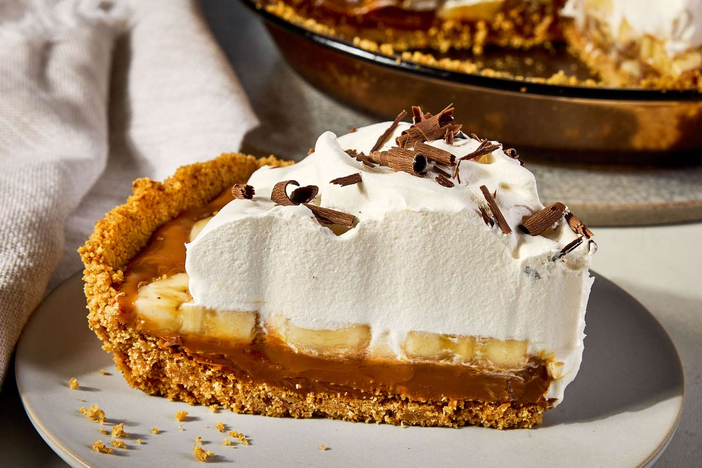

# Banoffee Pie

*The English pub classic from East Sussex, 1971. Digestive biscuit base, a thick layer of toffee made from condensed milk, sliced banana, a heap of barely-sweetened whipped cream, a dusting of cocoa. Cold from the fridge, sliced with a hot knife.*

**Serves:** 8

**Prep Time:** 25 minutes (plus 3 hours simmering the milk, plus 2 hours chilling)

**Cook Time:** 3 hours

## Overview
Banoffee pie was invented in 1971 at The Hungry Monk in East Sussex, where Nigel Mackenzie and Ian Dowding pushed an American coffee-toffee pie in a new direction by swapping in fresh banana, and the dish has been a British pub-dessert and dinner-party classic ever since. You build the toffee layer first because it's the only step that needs real time; an unopened tin of sweetened condensed milk simmered in water for three hours turns into a deep amber dulce de leche, and that slow simmer is the technique you can't rush without a pressure cooker. The biscuit base is digestives crushed and bound with melted butter, pressed firm into a tart tin and chilled hard so it holds its shape under the toffee. Sliced bananas go on just before serving so they don't brown, and the cream wants to be whipped only to soft peaks; over-whipped cream goes grainy and sits on the toffee rather than swooping across it. Dusted with cocoa or grated dark chocolate, cut cold with a knife dipped in hot water for clean slices.

## Ingredients

### The base
- 250 g digestive biscuits
- 100 g unsalted butter (melted)

### The toffee
- 1 x 397 g tin sweetened condensed milk (full-fat)

### The topping
- 3 medium-sized ripe but firm bananas
- 1 lemon (juiced, to slow browning)
- 400 ml double cream (very cold)
- 2 tablespoons icing sugar
- 1 teaspoon vanilla extract
- 1 tablespoon cocoa powder (for dusting)
- 30 g dark chocolate (for grating, optional)

## Method

### Stage 1 - Make the toffee
1. Remove the label from the condensed milk tin. Place the tin in a deep saucepan and cover with cold water by at least 5 cm.
2. Bring to a steady simmer, then turn to low so it bubbles gently. Cover loosely with a lid (not airtight; the tin must vent steam).
3. Simmer for 3 hours, topping up with boiling water as needed to keep the tin fully submerged at all times. A tin that boils dry will explode - set a timer if you wander off.
4. Lift the tin out with tongs and leave to cool completely on a wire rack. Do not open the tin while hot.
5. Once cool, the contents will be a thick caramel-coloured toffee. Open and scoop out.

### Stage 2 - Make the base
1. Crush the digestive biscuits to fine crumbs in a food processor (or seal them in a freezer bag and bash with a rolling pin).
2. Stir the crumbs into the melted butter until uniformly moist.
3. Tip into a 23 cm loose-bottomed tart tin (4 cm deep) and press firmly into the base and up the sides with the back of a spoon. The base should be packed dense and even.
4. Chill in the fridge for at least 30 minutes to firm up.

### Stage 3 - Spread the toffee
1. Spoon the cooled toffee onto the biscuit base and spread to a smooth, even layer with the back of a spoon. The toffee should reach the edges of the base but not overflow.
2. Return to the fridge while you prepare the topping (20 minutes minimum, longer is fine).

### Stage 4 - Whip the cream
1. In a chilled bowl, whisk the cold double cream with the icing sugar and vanilla. Whip just to soft peaks - the cream should hold a soft shape on the whisk but not stiffen. Overwhipped cream goes grainy and won't sit cleanly on the bananas.

### Stage 5 - Assemble
1. Peel and slice the bananas into 5 mm rounds. Toss gently in the lemon juice (this slows browning without making them taste sharp).
2. Arrange the banana slices in concentric rings over the toffee, overlapping slightly. Save the prettiest slices for the outer ring.
3. Spoon the whipped cream over the bananas and swoop into peaks with the back of the spoon. Cover the bananas completely; exposed bananas brown fastest.
4. Dust the cream with cocoa powder using a fine sieve. Scatter with grated dark chocolate if using.

### Stage 6 - Chill and serve
1. Refrigerate for at least 30 minutes before serving, longer if you have it.
2. Cut into wedges with a long, thin knife warmed in hot water and wiped dry between cuts. Carefully lift each wedge out with a flat spatula - the toffee is sticky.

## Notes
- **Tin safety**: a tin boiled dry is a real risk. Pressure builds inside and an exposed top can rupture. Keep it covered with water at all times, simmer not boil, and never open while hot.
- **Shop-bought toffee**: tinned dulce de leche or Carnation Caramel saves 3 hours but tastes slightly less rich. The home-boiled version has a deeper, more bitter caramel note. Both are correct in someone's grandmother's kitchen.
- **Cream**: must be UK double cream or equivalent (35-40% fat). Single cream won't whip; whipping cream works but yields a softer peak.
- **Bananas**: slice just before serving. The lemon juice helps but doesn't stop browning entirely; an hour in the fridge gives them time to soften the toffee a touch without going visibly brown.

## Serving
A wedge on a small plate with strong coffee. The pie holds for a few hours in the fridge before the bananas start to discolour visibly under the cream.

## Storage
- Best within 6 hours of assembly. Will keep in the fridge for 24 hours, but the bananas darken under the cream.
- The toffee + base alone keeps in the fridge for 3 days; assemble the cream and banana fresh each time.
- Freezes poorly: bananas turn slimy on thawing.
