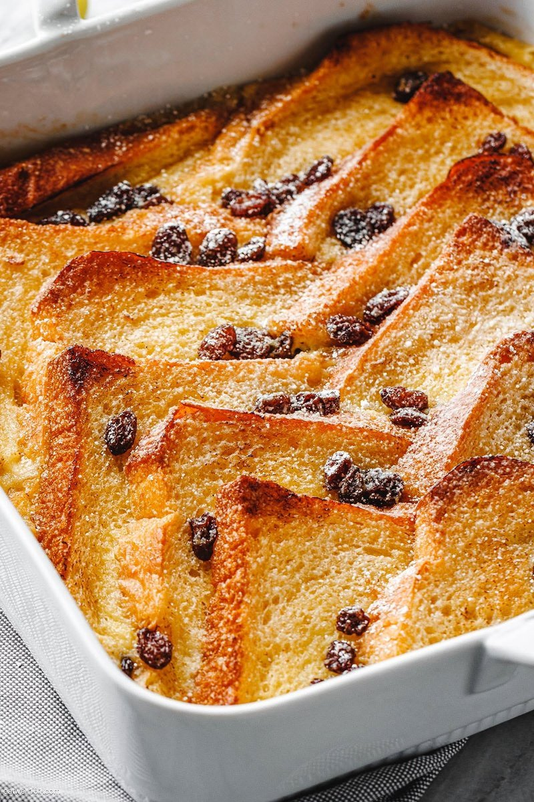

# Bread and Butter Pudding

*Stale bread soaked in vanilla custard with raisins and a sprinkle of demerara. The British nursery pudding that uses up the loaf you didn't finish; comes out with a crisp top and a soft custardy interior. Serve with cream or custard.*

**Serves:** 6-8

**Prep Time:** 15 minutes (plus 30 minutes soak)

**Cook Time:** 35 minutes

## Overview
The British nursery pudding at its plainest and most beloved: stale bread buttered and layered in a baking dish with raisins and lemon zest, drowned in a vanilla-custard of egg yolks, milk, cream and sugar, scattered with demerara for crunch and baked in a bain-marie till just-set with a crisp dark-gold top and a soft custardy interior underneath. The dish dates to the 13th century as a use-up-the-loaf economy pudding and stayed on British nursery tables (and grown-up restaurant menus) ever since. Slightly stale bread is essential; fresh bread turns to mush in the custard. White bloomer or sliced loaf is the traditional choice, though brioche gives a richer version. The custard wants to soak into the bread for 30 minutes before baking; rush this step and you get dry bread on top and a pool of unset custard below. Served with cream or thin custard.

## Ingredients

### Pudding
- 8 slices day-old white bread (slightly stale; about 250 g)
- 75 g unsalted butter (softened)
- 75 g raisins (or sultanas)
- 50 g mixed peel (optional)
- 1 lemon (zest)

### Custard
- 4 egg yolks (large)
- 1 egg (large)
- 100 g caster sugar
- 1 teaspoon vanilla extract
- 300 ml whole milk
- 300 ml double cream
- A grating of fresh nutmeg

### Topping
- 2 tablespoons demerara sugar
- A grating of nutmeg

### To serve
- Pouring cream, custard, or vanilla ice cream

## Method

### Stage 1 - Layer the bread
1. Heat the oven to 180°C (160°C fan).
1. Butter a 25 x 18 cm baking dish.
1. Butter all 8 slices of bread on one side; cut each into triangles.
1. Layer half the triangles in the dish, butter-side up.
1. Scatter half the raisins, half the peel and half the lemon zest.
1. Repeat with the second layer.

### Stage 2 - Custard
1. Whisk the yolks, egg, sugar and vanilla in a bowl until pale.
1. Heat the milk and cream in a pan until just steaming (don't boil).
1. Pour the warm milk over the eggs slowly, whisking continuously.
1. Strain through a sieve into a jug.

### Stage 3 - Soak
1. Pour the custard slowly over the bread; press the bread down gently so each slice absorbs.
1. Sit for 20-30 minutes (the bread soaks up the custard properly; rushed soaking gives uneven puddings).

### Stage 4 - Top and bake
1. Sprinkle the demerara sugar evenly across the top.
1. Grate fresh nutmeg over.
1. Place the dish in a deep roasting tin; pour boiling water into the outer tin to come halfway up the dish.
1. Bake for 30-35 minutes until the top is deep golden and the custard is just set with a slight wobble in the centre.

### Stage 5 - Serve
1. Let stand 10 minutes (the custard sets).
1. Serve warm with cream or custard.

## Notes
- **Stale bread is structural:** Fresh bread turns to mush. Day-old to two-day-old is ideal.
- **Soak before baking:** Skipping the soak gives dry bread on top with custard pooled below. 20-30 minutes is the difference.
- **Water bath:** Keeps the custard from curdling at the edges. Don't skip; even a shallow tray of water helps.

## Storage
- Keeps 2 days refrigerated. Reheat at 150°C for 15 minutes.
- Best fresh; reheated is fine.
