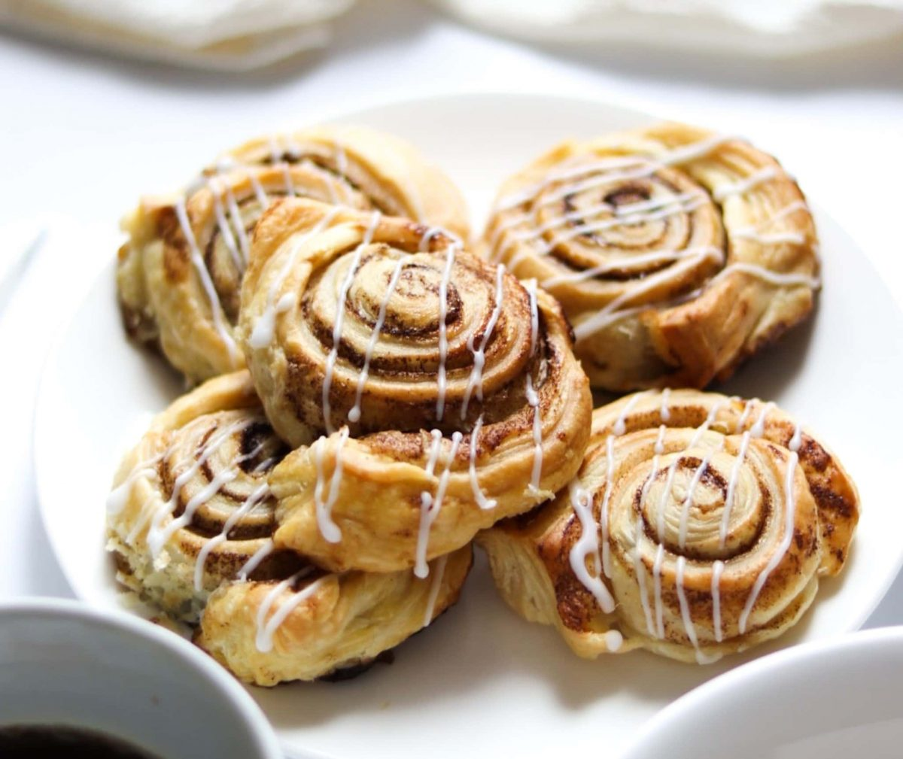

# Cinnamon Swirl Buns

*The bakery-window staple. Enriched yeasted dough spread with a brown-sugar-and-cinnamon paste, rolled into a long log, sliced into spirals, baked until deep gold and brushed with a sticky glaze. Eaten warm, pulled apart with the fingers.*

**Serves:** 12 buns

**Prep Time:** 30 minutes (plus 2 hours rising)

**Cook Time:** 25 minutes

## Overview
A milk-and-butter enriched dough, kneaded long enough to develop the gluten that gives the buns their pillow-pull texture. Rolled into a rectangle, brushed with melted butter, scattered with a brown sugar-cinnamon-salt mix. Rolled into a tight log, sliced into 12 equal spirals, set in a buttered tin with a small gap between each (so they rise into each other to give the soft pull-apart edge). Risen until puffy, brushed with egg wash, baked. The sugar inside the spiral half-melts into a soft caramel ribbon. Brushed with a warm syrup glaze as they leave the oven and dusted with icing sugar (or topped with a thick water icing) for the bakery-window finish.

## Ingredients

### The dough
- 500 g strong white bread flour
- 60 g caster sugar
- 1 teaspoon fine sea salt
- 7 g instant yeast (1 sachet)
- 250 ml whole milk (lukewarm)
- 60 g unsalted butter (softened)
- 1 large egg (plus 1 more for the wash)
- 1 teaspoon vanilla extract

### The cinnamon filling
- 80 g unsalted butter (melted, cooled)
- 150 g soft dark brown sugar
- 2 tablespoons ground cinnamon
- ½ teaspoon fine sea salt

### The glaze
- 50 g caster sugar
- 50 ml water
- 1 teaspoon vanilla extract

### The icing (optional)
- 100 g icing sugar
- 1-2 tablespoons whole milk
- ½ teaspoon vanilla extract

## Method

### Stage 1 - Make the dough
1. In the bowl of a stand mixer fitted with the dough hook, combine the flour, sugar, salt and yeast. Whisk briefly to distribute the yeast evenly.
2. Pour in the lukewarm milk, softened butter, one egg, and vanilla. Mix on low until the ingredients come together as a rough ball, about 2 minutes.
3. Increase to medium and knead for 8 minutes. The dough should look elastic, slightly tacky but not sticky. If it stays sticking to the bowl walls, add flour a tablespoon at a time.
4. Shape into a ball, place in a lightly oiled bowl, cover, and leave to rise in a warm place for 1 to 1 ½ hours, until doubled.

### Stage 2 - Make the filling
1. In a small bowl, combine the brown sugar, cinnamon and salt. Stir until uniformly distributed - no white streaks.

### Stage 3 - Roll and fill
1. Tip the risen dough onto a lightly floured surface. Roll into a rectangle roughly 40 x 25 cm, with the long side facing you.
2. Brush the entire surface with the melted butter, going right to the edges.
3. Scatter the brown-sugar-cinnamon mix evenly across the buttered surface. Press it gently into the dough with the flat of your hand so it sticks rather than falling out when rolled.

### Stage 4 - Shape
1. Starting from the long edge nearest you, roll the dough into a tight log. Roll firmly but not so hard that the dough tears.
2. With a sharp serrated knife (or a length of plain dental floss slid under and pulled tight to cut without squashing), divide the log into 12 equal pieces, each about 3 cm wide.
3. Butter a 23 x 30 cm baking tin (or two 20 cm round tins). Arrange the spirals cut-side up, leaving a 1 cm gap between each. The buns rise into each other during the second prove and bake into a soft pull-apart slab.

### Stage 5 - Second rise
1. Cover loosely with a tea towel and leave to rise in a warm place for 45 minutes to 1 hour, until visibly puffy and the spirals are touching their neighbours.

### Stage 6 - Bake
1. Heat the oven to 170°C fan / 190°C / 375°F.
2. Beat the second egg with 1 teaspoon water. Brush gently over the surface of the buns, getting into the spirals.
3. Bake for 22-25 minutes, until deep golden and the internal temperature reaches 90°C at the centre. Some sugar will leak and caramelise around the edges - that's right, eat those bits first.

### Stage 7 - Glaze and finish
1. While the buns bake, combine the glaze sugar and water in a small pan. Bring to a simmer, swirling until the sugar dissolves into a thin syrup. Stir in the vanilla off the heat.
2. As soon as the buns come out of the oven, brush all over with the warm glaze. Use all of it - the buns drink it in and the glaze sets tacky-sweet as they cool.
3. Cool in the tin for 15 minutes. Either dust with icing sugar (for the bakery look) or whisk together the icing-sugar icing and drizzle in lines across the top.
4. Pull the buns apart at the joining edges to serve.

## Notes
- **Bakery-style icing**: the optional white-icing finish makes the buns visibly bakery-window. For a thicker drizzle, use less milk; for a thin glaze, use more.
- **Make-ahead overnight**: after slicing and arranging in the tin (step 4), cover tightly with cling film and refrigerate overnight instead of the second rise. In the morning, take the tin out, leave for 1 hour at room temperature to come back to life, then bake as normal. The cold proof deepens the flavour considerably.
- **Cardamom variant**: replace 1 teaspoon of cinnamon with 1 teaspoon of ground cardamom for a Scandinavian-leaning bun.
- **Pecan or raisin scatter**: 80 g of chopped toasted pecans or plumped raisins scattered over the sugar mix before rolling. Adds texture without changing the spiral shape.

## Serving
Warm from the oven, with strong coffee or sweet tea. Eaten by pulling apart at the natural seams. Best within 6 hours of baking; refresh day-old buns by warming briefly in a low oven.

## Storage
- At room temperature in a sealed tin for 2 days. The icing softens; the buns stay tender.
- Freeze unglazed buns for 2 months wrapped tightly. Defrost at room temperature and refresh in a 150°C oven for 5 minutes, then glaze.
