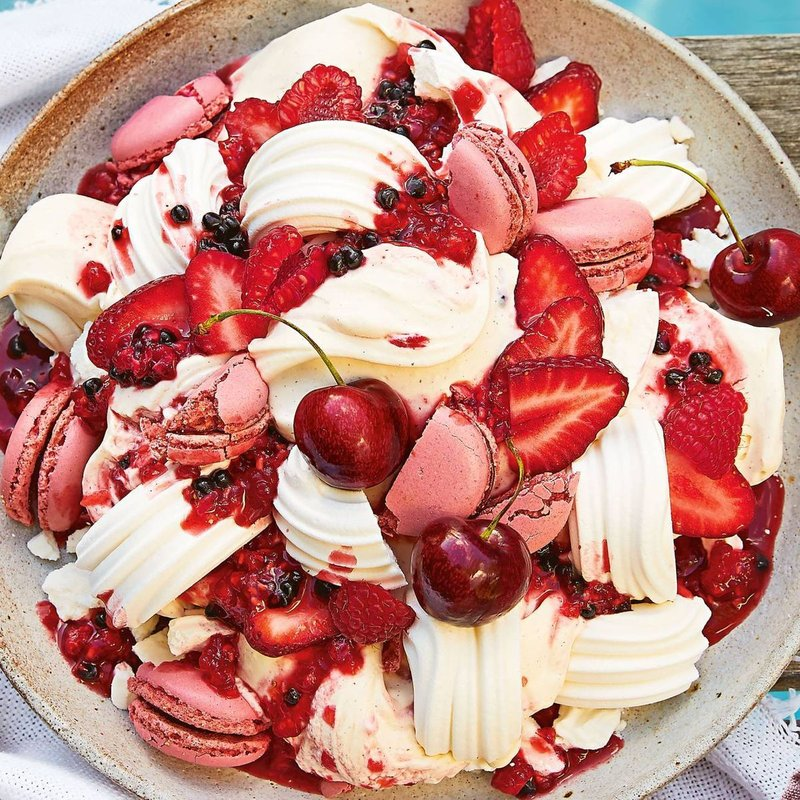

# Eton Mess

*A proper British summer pudding: crushed meringue, sliced strawberries and softly whipped cream jumbled together. A glorious mess.*

**Serves:** 4

**Prep Time:** 15 minutes (plus 30 min strawberry maceration)

**Cook Time:** 0 minutes (assuming you're using ready-made meringue nests)

## Overview
Strawberries are hulled and quartered (or sliced thick). Half macerate in a wide bowl with sugar and a splash of balsamic vinegar (or lemon juice) for 30 minutes - they release a glossy pink syrup. The other half stay whole-ish and crisp. Cream whips with vanilla and icing sugar to soft peaks (NOT stiff peaks - too firm and the mess loses its silkiness). Ready-made meringue nests (or homemade) crush into rough pieces. At the moment of serving: cream goes into a wide bowl or glasses, half the macerated strawberries and their syrup fold in with broken strokes (leaving streaks, not blended); the unmacerated berries scatter; the meringue crushes in last; everything assembles in messy layers. Eaten within 10 minutes - meringue softens fast.

## Ingredients

- 500 g ripe strawberries (the freshest, sweetest, reddest)
- 2 tablespoons caster sugar (for maceration)
- 1 tablespoon balsamic vinegar (or 1 tablespoon lemon juice)
- 1 teaspoon vanilla extract

### Cream
- 400 ml double cream (cold)
- 1 tablespoon icing sugar (sifted)
- 1 teaspoon vanilla extract

### Meringue
- 4 ready-made meringue nests (or 100 g homemade meringue cookies) - broken into rough 1-2 cm pieces

### Optional finishing
- A handful of toasted flaked almonds
- Fresh mint leaves
- An extra drizzle of strawberry coulis (blend 100 g strawberries with 1 tablespoon icing sugar and strain)

## Method

### Stage 1 - Macerate the strawberries
1. Hull and slice / quarter the strawberries. Keep them in roughly two batches - half slightly larger (about 8 strawberries left whole or just halved), half cut smaller.
1. Put the smaller-cut half in a wide bowl with the 2 tablespoons sugar, balsamic vinegar (or lemon) and vanilla.
1. Toss gently; let stand 30 minutes at room temperature - the strawberries weep and create a glossy pink syrup.
1. After macerating, lightly crush 4-5 of the macerated berries with the back of a fork (this gives more bleed-through colour).

### Stage 2 - Whip the cream
1. In a wide cold bowl, whisk the cold double cream with icing sugar and vanilla.
1. Whip to soft peaks - when the whisk is lifted, the cream forms peaks that just hold their shape but flop at the tips. Don't overwhip.

### Stage 3 - Crush the meringue
1. Place meringue nests in a bowl; crush with your hand or the back of a spoon into rough 1-2 cm pieces. Some powdery dust is fine.

### Stage 4 - Assemble (at the moment of serving)
1. In a wide serving bowl OR four individual glasses:
   - Spoon a third of the whipped cream into the bottom.
   - Drizzle a spoonful of strawberry maceration syrup over.
   - Layer half the macerated strawberries (with extra syrup).
   - Scatter a quarter of the crushed meringue.
   - Add another third of cream.
   - The remaining macerated berries.
   - Another scatter of meringue.
   - Top with whole / less-cut strawberries, the final cream, and the final crushed meringue.
1. With a spoon, give the layers a single gentle swirl - DO NOT MIX TO COMBINE; you want streaks of pink-syrup and white-cream and visible chunks.

### Stage 5 - Finish
1. Sprinkle toasted almonds (if using).
1. Scatter a few mint leaves.
1. Optional: drizzle a final spoon of strawberry coulis.

### Stage 6 - Serve
1. Serve immediately. Provide spoons.
1. The meringue softens within 10 minutes; eat fast.

## Notes
- **Don't overmix:** The "mess" in Eton Mess is the point. A uniformly mixed-pink result is wrong. Aim for streaks, layers, and visible distinct ingredients.
- **Soft peaks, not stiff:** Stiff-whipped cream gives a buttery mouthfeel. Soft peaks give the silky almost-mousse texture that's right for Eton Mess.
- **Make at the table:** Even better than making in the kitchen - bring all the components to the table, layer in front of guests. The dessert is theatrical; lean into it.

## Storage
- Eat within 10-15 minutes of assembling. The meringue absorbs moisture quickly and goes from crisp to chewy to mushy.
- Components keep separately: macerated berries 1 day in the fridge; whipped cream 1 day; meringues in an airtight jar for 1 week. Assemble fresh.
