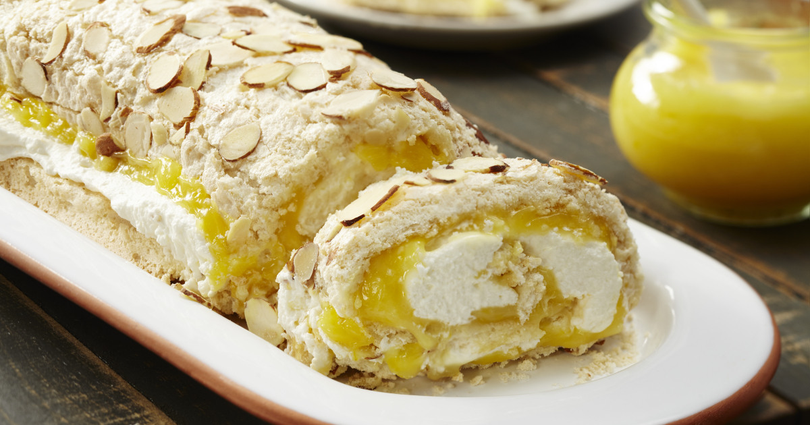

# Lemon Curd Meringue Roulade

*Britain's dinner-party dessert: a tray-baked meringue rolled around a filling of tangy homemade lemon curd and lightly whipped vanilla cream. Crisp-shelled, marshmallow-soft inside, vivid yellow at the centre. The Mary Berry classic; the dessert that gets requested at every middle-class British Sunday lunch and every dinner-party finale.*

**Serves:** 8

**Prep Time:** 30 minutes (plus 1 hour lemon curd chill, plus 1 hour roulade cooling)

**Cook Time:** 30 minutes

## Overview
Lemon curd meringue roulade is one of British baking's most enduringly popular dinner-party desserts and a Mary Berry / Great British Bake Off signature dish. Three components: a thin tray-baked meringue (egg whites and sugar with a touch of cornflour and vinegar to keep the inside marshmallow-soft, baked just long enough that the top crisps to a pale-golden shell), a tangy homemade lemon curd (egg yolks, butter, lemon and zest cooked over a bain-marie till thickened) and a layer of lightly whipped double cream. The cooled meringue is flipped onto a sheet of greaseproof paper dusted with icing sugar, spread thinly with the curd, covered with the cream, and rolled tightly from the short side using the paper to lift and tuck. Chilled 30 minutes to set, then sliced into thick discs that show the yellow lemon-curd spiral against the white cream and crisp golden outside. Gluten-free, can be made a day ahead.

## Ingredients

### Lemon curd (makes ~400ml; you'll use about 300ml in the roulade, save the rest)
- 4 large lemons (zest of 3, juice of all 4 - about 200 ml juice)
- 200 g caster sugar
- 100 g unsalted butter (cubed)
- 4 large eggs + 2 large egg yolks (the whites go into the meringue)
- ½ teaspoon fine sea salt

### Meringue roulade base
- 5 large egg whites (room temperature)
- 250 g caster sugar
- 1 teaspoon cornflour
- 1 teaspoon white wine vinegar (or distilled white vinegar)
- 1 teaspoon vanilla extract
- 2 tablespoons flaked almonds (for the top of the meringue - gives the rolled outside a delicate crunch)

### Whipped cream filling
- 400 ml double cream (cold)
- 2 tablespoons icing sugar
- 1 teaspoon vanilla extract

### To finish
- Icing sugar (for dusting the paper and the finished roulade)
- Fresh raspberries or blueberries (optional; for serving)
- A sprig of fresh mint

### Equipment
- A Swiss-roll tin (33cm × 23cm) lined with greaseproof paper
- A heatproof bowl that sits over a saucepan (bain-marie for the curd)
- An electric mixer or stand mixer with a whisk attachment
- A clean tea towel

## Method

### Stage 1 - Make the lemon curd (do first; needs to chill)
1. Set up a bain-marie: a heatproof bowl over a saucepan of barely simmering water (bowl shouldn't touch the water).
2. In the bowl, combine the lemon zest, lemon juice, caster sugar, and cubed butter.
3. Stir gently over the simmering water till the butter melts and the sugar dissolves (about 5 minutes).
4. In a separate bowl, lightly whisk the 4 whole eggs + 2 yolks + salt.
5. Slowly pour the eggs into the warm lemon mixture, whisking constantly to temper (don't dump them in or they scramble).
6. Continue whisking over the bain-marie for 10-12 minutes till the curd thickens to a heavy custard that coats the back of a spoon thickly.
7. Pour through a fine sieve into a clean bowl (catches any cooked-egg bits).
8. Press cling film onto the surface (prevents a skin).
9. Refrigerate at least 1 hour till fully cold.

### Stage 2 - Prep for the meringue
1. Preheat oven to 180°C (350°F).
2. Line a Swiss-roll tin (33cm × 23cm) with greaseproof paper, letting the paper overhang on the long sides.
3. Have a clean kitchen towel ready (you'll use it for cooling).

### Stage 3 - Make the meringue
1. In a clean dry bowl, whisk the egg whites on medium speed till frothy (about 1 minute).
2. Increase to high speed; whisk till soft peaks form (about 2-3 minutes).
3. Gradually add the caster sugar a tablespoon at a time, continuing to whisk on high.
4. After all the sugar is in, whisk another 3-4 minutes till the meringue is glossy, stiff-peaked, and the sugar has fully dissolved (rub a tiny pinch between your fingers - should feel smooth, not gritty).
5. Sprinkle the cornflour over the meringue.
6. Drizzle the vinegar and vanilla over.
7. Fold in gently with a spatula (about 6-8 folds; don't deflate).

### Stage 4 - Spread and bake
1. Spread the meringue into the lined Swiss-roll tin.
2. Smooth the top with an offset spatula or knife to make an even layer about 2cm thick.
3. Scatter the flaked almonds across the top.
4. Bake 8 minutes at 180°C.
5. Reduce oven to 160°C (320°F); bake another 10-12 minutes.
6. The top should be lightly golden and crisp; the inside should still feel marshmallow-soft.
7. Don't over-bake or the roulade will crack badly when rolled (a small crack is traditional; a deep split means over-baked).

### Stage 5 - Cool
1. Take the meringue out of the oven.
2. Lay a clean kitchen towel over a wire rack.
3. Dust the towel lightly with icing sugar.
4. While the meringue is still warm but not hot (about 5 minutes out of the oven), flip the entire tin upside-down onto the towel.
5. Peel away the baking paper (carefully; the meringue is delicate).
6. Cover loosely with a second tea towel; cool to room temperature (about 1 hour).

### Stage 6 - Whip the cream
1. Just before assembling, whip the cold cream with icing sugar and vanilla to soft-medium peaks (not stiff; you want it to spread easily without cracking the meringue).

### Stage 7 - Spread the fillings
1. Position the cooled meringue almond-side-down on the towel (so the almond crust will be on the outside of the rolled roulade).
2. Spread 300g of the cold lemon curd evenly across the meringue, leaving a 2cm border at the far edge.
3. Spread the whipped cream evenly on top of the lemon curd.

### Stage 8 - Roll
1. Position the meringue with one short side facing you.
2. Use the towel to lift and tuck the near edge - start the first turn tight, like rolling a Swiss roll.
3. Use the towel to roll the meringue tightly away from you into a long log.
4. Don't worry about small cracks; the curd and cream hide them.
5. The finished roulade is a log about 30cm long.

### Stage 9 - Chill and dust
1. Transfer the roulade carefully to a long platter or serving board (seam-side-down).
2. Refrigerate at least 30 minutes for the cream to set.
3. Dust generously with icing sugar just before serving.

### Stage 10 - Slice and serve
1. With a sharp serrated knife, slice into thick discs (about 3-4cm thick).
2. Each slice shows the yellow spiral against the white cream and crisp almond-flecked outside.
3. Serve with fresh raspberries or blueberries scattered alongside.
4. A sprig of mint on each plate.
5. Optional: a small extra spoon of lemon curd alongside for those who want more.

## Notes
- **Cornflour + vinegar in the meringue:** the secret to the soft-marshmallow-inside texture. Don't skip either.
- **Homemade lemon curd is the heart:** shop-bought is too sweet and not tart enough. The 30 minutes of curd-making is worth it.
- **Almond-side-down when assembling:** so the almonds end up on the outside of the rolled roulade.
- **Small cracks are normal:** a roulade without any cracks is a tighter roll than this one; small cracks add character. Big splits mean overbaked.
- **Make ahead:** the roulade can be made and refrigerated up to 24 hours before serving; it improves slightly as the curd seeps into the meringue.

## Variations
**Raspberry version:** swap the lemon curd for raspberry jam (or a raspberry coulis); add fresh raspberries inside the cream layer.
**Passion fruit version:** swap the lemon curd for passion fruit curd; scatter passion fruit seeds on top.
**Chocolate version:** swap the lemon curd for chocolate hazelnut spread + the meringue lightly cocoa-flecked (1 tablespoon cocoa folded in with the cornflour).
**Sponge version:** swap the meringue base for a thin Victoria-style sponge (200g flour + butter + sugar + 4 eggs + baking powder, baked at 180°C for 12 min, rolled while still warm). Less traditional but easier to roll without cracking.
**Mini individual roulades:** cut the cooled meringue into 4 long strips before assembling; roll each separately into mini logs.
**Gin-and-lemon:** add 2 tablespoons gin to the lemon curd; less traditional but excellent.
**Salted caramel version:** swap the lemon curd for a thin layer of salted caramel + whipped cream; the autumn variant.

## Serving
At a British dinner party as the dessert finale (post-roast Sunday lunch, post-pub-lunch celebration) · at a British wedding luncheon · at a Great British Bake Off-style afternoon · at a summer garden lunch with strawberries · at home with a pot of strong English breakfast tea.

## Storage
- Assembled roulade refrigerates 2 days; the meringue softens slightly but the dish is still excellent.
- Don't freeze (the cream texture suffers).
- The components separately keep longer: lemon curd refrigerates 2 weeks in a sealed jar; meringue base alone keeps in a sealed tin 24 hours at room temp; whipped cream best fresh.
- A made-the-day-before roulade is dinner-party-ready and can be sliced just before serving.
