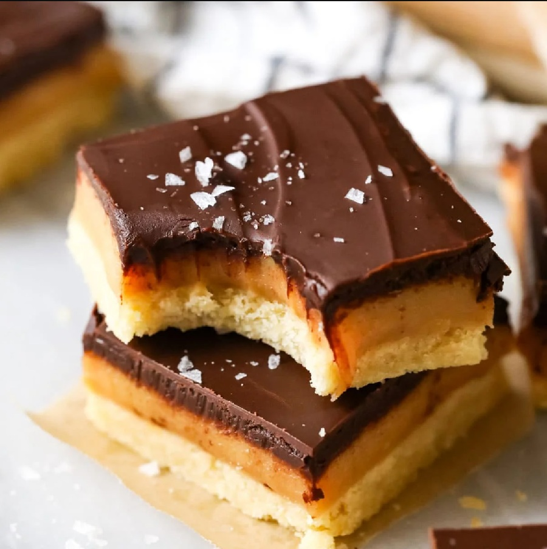

# Millionaire's Shortbread

*The Scottish three-layer slab: short, buttery shortbread base, a thick chewy caramel made from condensed milk and butter, a snappy milk-chocolate top. Cut into bars; eaten cold from the tin with strong tea.*

**Serves:** 16 squares

**Prep Time:** 25 minutes (plus 1 hour 30 minutes chilling)

**Cook Time:** 30 minutes (plus 12 minutes for the caramel)

## Overview
Millionaire's shortbread is the Scottish bakery-counter staple, the three-layer slab that turns up at every tea-room and church fête across the country and lives in tea tins from Edinburgh to Penzance. Three layers, three textures, each one demanding its own discipline. The shortbread base is rubbed-in butter and flour, pressed firm into a lined tin and baked till just-golden so it stays short and snappy under the caramel. The caramel is the stage that catches home cooks out; butter, sugar, golden syrup and condensed milk stirred slowly over a low heat for about ten minutes till it thickens to a soft-set fudge consistency, where a single moment of high heat seizes the whole pan into a grainy mess. Pour it warm over the cooled shortbread and chill till firm. The chocolate top is melted gently and poured across, then scored with a fork into wavy lines for the traditional finish (or left smooth, for the cleaner look). Chilled until set, cut into squares with a hot knife. Eat cold from the tin with strong tea.

## Ingredients

### The shortbread base
- 200 g plain flour (plus extra for dusting)
- 60 g caster sugar
- A small pinch of fine sea salt
- 175 g unsalted butter (cold, cubed)

### The caramel
- 175 g unsalted butter
- 175 g soft light brown sugar
- 4 tablespoons golden syrup
- 1 x 397 g tin sweetened condensed milk (full-fat)
- A small pinch of fine sea salt

### The chocolate top
- 200 g milk chocolate (broken into pieces)
- 50 g dark chocolate (optional, for drizzle pattern)

## Method

### Stage 1 - Make the shortbread base
1. Heat the oven to 160°C fan / 180°C / 350°F. Line a 20 x 20 cm square tin with baking paper, leaving a 2 cm overhang on two sides to lift the slab out later.
2. In a wide bowl, whisk the flour, sugar and salt. Rub in the cold butter with your fingertips until the mixture looks like coarse breadcrumbs. Keep rubbing for another minute - the mixture should start to clump and feel slightly oily on the fingertips.
3. Tip into the prepared tin. Press firmly into an even layer with your knuckles, then smooth flat with the back of a spoon. The base should be about 1 cm thick and uniformly compacted.
4. Prick all over with a fork, ten times across. Bake for 25-30 minutes, until the surface is pale gold and the edges have just turned a deeper colour.
5. Cool completely in the tin on a wire rack - at least 30 minutes. Don't pour the caramel onto a warm base; the caramel pools too thin.

### Stage 2 - Make the caramel
1. Combine the butter, brown sugar, golden syrup, condensed milk and salt in a wide heavy-bottomed saucepan.
2. Heat slowly over a low heat, stirring with a wooden spoon until the butter melts and the sugar dissolves. The mixture should be pale gold and uniform - no grit on the spoon.
3. Bring to a gentle simmer. Stir continuously now, getting into the corners of the pan - the sugar settles there and burns first. Continue stirring for 8-12 minutes. The caramel will darken from pale gold to deep amber, thicken to coat the back of the spoon, and start pulling away from the sides as you stir. Drop a small spoonful onto a cold plate; if it sets to a soft fudge consistency in 30 seconds, it's ready.
4. Pour immediately over the cooled shortbread base. Tilt the tin so the caramel covers the entire surface, smoothing with the back of the spoon if needed.
5. Cool to room temperature, then refrigerate for at least 30 minutes until firm.

### Stage 3 - Add the chocolate top
1. Melt the milk chocolate in a heatproof bowl over a pan of barely simmering water (don't let the bowl touch the water). Stir until smooth, then remove from the heat.
2. Pour over the chilled caramel layer, tilting the tin so the chocolate spreads evenly to all corners.
3. For the wavy finish: drag a fork across the surface in long S-curves before the chocolate sets. For the drizzle finish: melt the dark chocolate, pipe in straight lines across the slab, then drag a skewer perpendicular to create the feathered effect. Or leave smooth.
4. Chill for at least 1 hour, until the chocolate has set fully.

### Stage 4 - Slice
1. Lift the slab out of the tin using the baking-paper overhang. Place on a board.
2. Dip a long sharp knife in hot water, wipe dry, and cut. Wipe between cuts. The chocolate may crack if it's fridge-cold; let the slab sit at room temperature for 10 minutes before slicing to reduce cracking.
3. Cut into a 4 x 4 grid for 16 squares, or 4 x 8 for 32 small fingers.

## Notes
- **The caramel is the heart of the bake**: undercook and it slumps when cut; overcook and it sets brittle. Aim for "soft fudge" consistency on a cold-plate test. If unsure, take it off the heat sooner - caramel firms further as it cools.
- **Condensed milk grade**: full-fat sweetened condensed milk only. Reduced-fat versions don't thicken the same way.
- **Chocolate ratio**: the slab is heavy on caramel and benefits from a clean snap of milk chocolate on top. Some bakers use dark chocolate; it's less traditional but balances the sweetness.
- **Tin size**: 20 x 20 cm gives the traditional thick slab. A 20 x 30 cm tin gives thinner bars; reduce the chill times by 10 minutes.

## Serving
A square on a small plate or in a paper case, with strong tea or coffee. Travel-bake material: holds well at room temperature for days, sturdy enough for a packed lunch.

## Storage
- In an airtight tin at cool room temperature for up to a week. Refrigerate in summer or warm kitchens; the chocolate softens above 22°C.
- Freezes well for up to 2 months wrapped tightly. Defrost in the fridge to keep the caramel from sweating.
- Don't stack the squares directly - the chocolate top of one sticks to the underside of the one above. Separate with baking paper.
