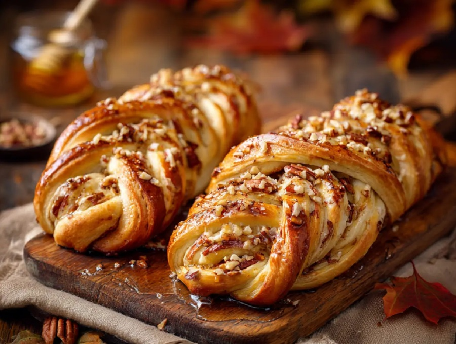

# Pecan Nut Pastry Plait

*The bakery-window pastry plait, filled with a buttery pecan-and-brown-sugar paste, glazed with apricot jam straight from the oven and finished with a thin water icing drizzle. Cut into slices, eaten with mid-morning coffee.*

**Serves:** 8 slices

**Prep Time:** 25 minutes (plus 1 hour chilling)

**Cook Time:** 30 minutes

## Overview
A puff-pastry plait built around a thick pecan filling: chopped pecans bound with brown sugar, melted butter, golden syrup, egg yolk and a splash of bourbon. The pastry is rolled into a long rectangle with the filling spread down the centre third. The two long sides are then cut into diagonal strips and folded over alternately to form the plaited top. Egg-washed, baked till deep golden, glazed with warm sieved apricot jam to set the colour and drizzled with a thin water icing across the centre.

## Ingredients

### The pastry
- 500 g all-butter puff pastry (one block or two ready-rolled sheets)
- Plain flour (for dusting)
- 1 egg (beaten, for the wash)

### The pecan filling
- 250 g pecan halves (toasted and roughly chopped)
- 80 g soft dark brown sugar
- 80 g unsalted butter (melted)
- 2 tablespoons golden syrup
- 1 large egg yolk
- 1 tablespoon bourbon (or dark rum, or 1 teaspoon vanilla extract)
- ½ teaspoon ground cinnamon
- A pinch of fine sea salt

### To finish
- 3 tablespoons apricot jam (sieved)
- 1 tablespoon water
- 80 g icing sugar (sifted)
- 1-2 teaspoons whole milk

## Method

### Stage 1 - Toast and prep the pecans
1. Heat the oven to 180°C fan / 200°C / 400°F. Scatter the pecans on a tray and toast for 5 minutes, until fragrant. Cool and roughly chop - leave some pieces chunky, take the rest to coarse crumbs.
2. Set aside 30 g of the chunkiest pieces for the top of the plait.

### Stage 2 - Make the filling
1. In a wide bowl, combine the toasted pecans (minus the reserved 30 g), brown sugar, melted butter, golden syrup, egg yolk, bourbon, cinnamon and salt.
2. Stir until uniformly combined - the mixture should hold together like wet sand. Chill in the fridge for 20 minutes while you prepare the pastry; this firms the filling so it doesn't ooze during baking.

### Stage 3 - Roll the pastry
1. On a lightly floured surface, roll the pastry into a rectangle about 35 x 28 cm and 3-4 mm thick. (If using ready-rolled sheets, lap them together with a seam and roll briefly to weld.)
2. Lift onto a baking-paper-lined tray. Visually divide the rectangle into thirds lengthways with the back of a butter knife (just press lightly - don't cut through).

### Stage 4 - Shape the plait
1. Spoon the pecan filling down the centre third in an even mound about 2 cm thick. Leave a 2 cm border at the top and bottom of the rectangle.
2. With a sharp knife, cut the two side panels into diagonal strips about 2 cm wide, angled towards the bottom of the tray. Each side should have 10-12 strips.
3. Fold the top and bottom borders up over the filling first.
4. Now fold the strips alternately from left and right, crossing them over the filling like a plait. Each new strip slightly overlaps the previous on the opposite side. The finished plait should look like a fishtail braid.
5. Press the ends down to seal.

### Stage 5 - Wash and bake
1. Brush the entire plait with beaten egg, getting into the strip seams.
2. Scatter the reserved 30 g of chunky pecans across the top.
3. Bake for 25-30 minutes, until deeply golden, crisp at the edges, and risen visibly. The pastry will have puffed and the filling should be bubbling slightly at the joints.

### Stage 6 - Glaze and ice
1. While the plait is in its last 5 minutes, warm the sieved apricot jam with the water in a small pan, stirring until smooth and pourable.
2. Take the plait out of the oven. Brush the warm apricot glaze immediately over the surface (avoiding the pecans on top - keep them visible). Let cool on the tray for 10 minutes.
3. Whisk the icing sugar with 1 teaspoon of milk to start; add more drop by drop until you have a thin pourable icing that flows from the spoon in a continuous ribbon.
4. Drizzle the icing back and forth in zigzag lines across the cooled plait. It will set in 10-15 minutes to a soft sheen.

### Stage 7 - Slice
1. Cool to barely warm before slicing - too hot and the filling slumps; cold and the pastry shatters.
2. Cut diagonally across the plait into 8 slices.

## Notes
- **All-butter puff pastry**: the flavour difference between butter puff and standard puff is significant for this kind of bake. Worth the extra cost. Frozen block puff works; ready-rolled sheets save the rolling step.
- **Pecan grade**: pecan halves toasted briefly and chopped at home give the deepest flavour. Pre-chopped pecan pieces work but stale faster.
- **Bourbon alternative**: dark rum, brandy, or 1 teaspoon of vanilla extract all work. The alcohol cooks off; the flavour stays.
- **Make-ahead**: shape the plait through Stage 4, then refrigerate (covered) for up to 8 hours before egg-washing and baking. Add 5 minutes to the bake from cold.

## Serving
Warm or at room temperature, cut into slices. Excellent with strong coffee mid-morning. Stretched as a buffet centrepiece by leaving the plait whole and letting people break sections off.

## Storage
- In an airtight tin at room temperature for 2 days. The pastry softens slightly overnight; refresh in a 150°C oven for 5 minutes.
- Freezes well after baking, before glazing - wrap tightly, freeze for up to 2 months, defrost in the fridge overnight, refresh and glaze fresh.
