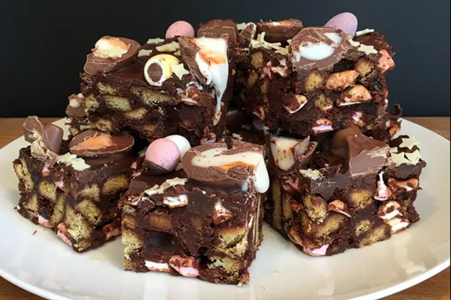

# Rocky Road Tiffin

*Rocky road wearing the tiffin coat. Crushed digestive biscuits and chopped nuts bound in cocoa-butter mixture, studded with mini marshmallows and chunks of fudge, sealed under a milk-chocolate top with a white-chocolate drizzle. No bake, fridge-set, sliceable in twenty.*

**Makes:** 16 squares

**Prep Time:** 20 minutes (plus 2 hours chilling)

## Overview
A hybrid: the no-bake biscuit base from a classic Scottish tiffin meets the marshmallow-and-nut load of an American rocky road. The base is digestives crushed mostly fine with some chunkier pieces, melted into butter-cocoa-syrup, mixed with mini marshmallows, glace cherries (optional), chopped pecans or hazelnuts, and chunks of fudge or honeycomb. Pressed into a tin, capped with milk chocolate, criss-crossed with white-chocolate drizzle. The chocolate top sets fast in the fridge; the marshmallows give the bake its characteristic uneven, rocky-looking surface where they push up against the chocolate.

## Ingredients

### The base
- 300 g digestive biscuits
- 200 g unsalted butter
- 100 g golden syrup (about 4 tablespoons)
- 40 g cocoa powder
- 30 g caster sugar
- 100 g mini marshmallows
- 80 g chopped pecans or hazelnuts (toasted, see notes)
- 80 g glace cherries (quartered, rinsed and dried)
- 80 g fudge chunks (or chopped Crunchie / honeycomb)

### The topping
- 200 g milk chocolate
- 50 g white chocolate (for drizzle)
- A small handful of extra mini marshmallows + chopped nuts (for scattering)

## Method

### Stage 1 - Prep the tin
1. Line a 20 cm square tin with baking paper, leaving overhang on two sides for lift-out later.

### Stage 2 - Crush the biscuits
1. Place the digestives in a sealed freezer bag. Bash with a rolling pin to mostly fine crumbs with a few pea-sized chunks remaining. Don't reduce to powder — the texture comes from varied biscuit sizes.

### Stage 3 - Make the cocoa-butter mix
1. Melt the butter, golden syrup, cocoa powder and sugar together in a large saucepan over a low heat, stirring constantly until smooth and glossy. The mixture should look like a thin chocolate ganache.
2. Take off the heat and let the pan cool for 3-4 minutes — adding marshmallows to a hot pan melts them into the mixture instead of keeping them whole.

### Stage 4 - Combine
1. Stir the crushed biscuits into the cooled cocoa-butter mixture until uniformly coated.
2. Add the marshmallows, chopped nuts, glace cherries and fudge chunks. Fold gently with a spatula — vigorous mixing breaks the marshmallows.
3. Tip into the prepared tin. Spread to the edges, pressing down firmly with the back of a spoon. The surface should be uneven — marshmallows and fudge poking through is part of the look.

### Stage 5 - Top with chocolate
1. Melt the milk chocolate in 30-second microwave bursts (stirring between each) or over a pan of barely simmering water. Pour over the pressed base and spread to cover. Tap the tin gently to release bubbles.
2. Melt the white chocolate the same way. Spoon into a small piping bag (or freezer bag with the corner snipped off). Pipe in random S-curves and squiggles across the milk-chocolate top.
3. While the chocolate is still wet, scatter a small handful of extra marshmallows and chopped nuts over the surface for visual texture.

### Stage 6 - Set and slice
1. Refrigerate for at least 2 hours, until fully set.
2. Lift out using the baking-paper overhang. Bring to room temperature for 10 minutes before slicing so the chocolate top doesn't crack under the knife.
3. Cut into 16 squares with a long, sharp knife dipped in hot water and wiped dry between cuts.

## Notes
- **Toasting the nuts**: 5 minutes in a 180°C oven on a tray, watching for the moment they smell fragrant. Toasted nuts crunch better and taste deeper.
- **Marshmallow timing**: the mixture must be cool enough not to melt the marshmallows when they join — about 40-45°C. A hot mix dissolves them into goo; cooled mix keeps them puffy and distinct.
- **Substitutions**: dried cherries for glace cherries (less sweet), maltesers or M&Ms instead of fudge (different crunch), white chocolate base instead of milk for an all-white version (then drizzle with dark).
- **Bigger tin**: 20 x 30 cm gives thinner squares with more pieces per slab. Reduce chill time by 30 minutes.

## Serving
On a plate at room temperature. With strong coffee or hot chocolate. Excellent travel-bake — robust enough for picnics and packed lunches.

## Storage
- In an airtight tin at cool room temperature for up to 2 weeks.
- Refrigerate in summer or warm kitchens; chocolate softens above 22°C.
- Freezes for 3 months wrapped tightly; thaw overnight in the fridge.
