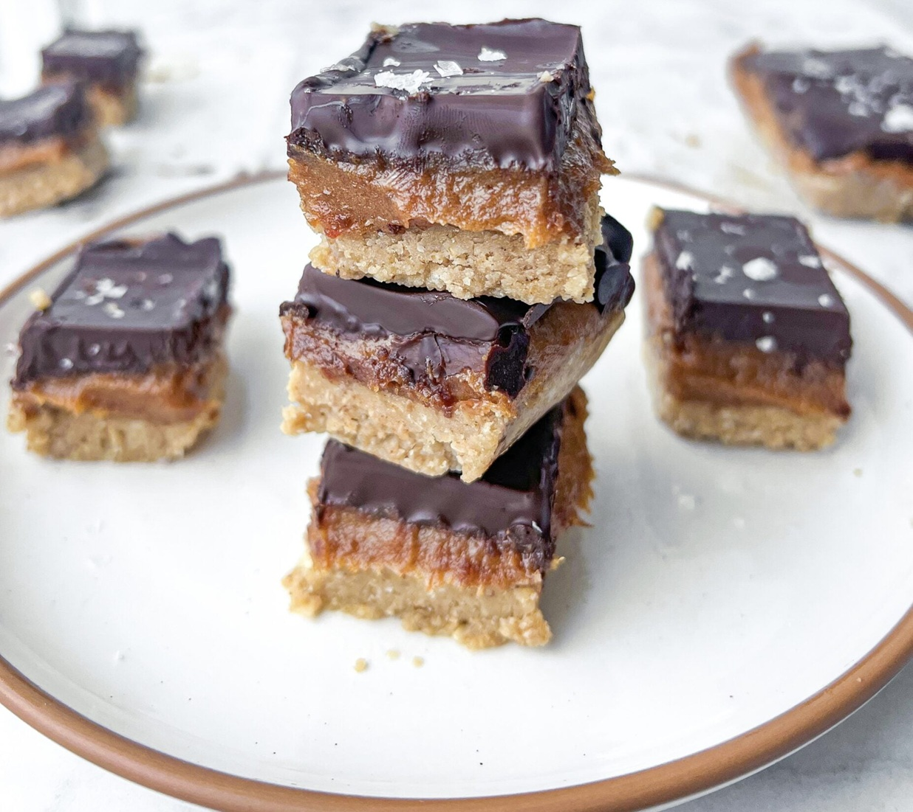

# Salted Caramel Tiffin

*The tiffin gone three-layer. Cocoa-bound biscuit base, a thick chewy salted-caramel middle, a snappy dark-chocolate top finished with flakes of sea salt. Cold from the tin, sliced thin - it's rich.*

**Makes:** 16 squares

**Prep Time:** 30 minutes (plus 3 hours chilling)

**Cook Time:** 12 minutes for the caramel

## Overview
Salted caramel tiffin is the three-layer take on the Scottish no-bake tiffin, born when the salted-caramel craze of the 2010s collided with the traditional Scottish tea-tin classic and someone had the sensible idea of sliding a chewy caramel layer between the biscuit base and the chocolate top. The base mirrors the classic tiffin: crushed digestives bound in a butter-cocoa-golden-syrup mixture, pressed firm into a lined tin. The salted caramel middle is the showstopper, cooked on the hob to soft-set from butter, brown sugar, golden syrup and condensed milk, with a pinch of sea salt stirred through at the end. Dark chocolate is the right cap (70% cocoa minimum); milk chocolate is too sweet against the caramel and the slab tips into cloying. A scatter of flaky salt across the chocolate while it's still wet so it sticks is the traditional finishing flourish. Three layers, three textures, biscuity-chewy-snappy. Eat cold from the tin, sliced thin because it's rich.

## Ingredients

### The base
- 250 g digestive biscuits
- 150 g unsalted butter
- 60 g golden syrup
- 30 g cocoa powder
- 30 g caster sugar

### The salted caramel
- 100 g unsalted butter
- 120 g soft light brown sugar
- 3 tablespoons golden syrup
- 1 x 397 g tin sweetened condensed milk (full-fat)
- ½ teaspoon fine sea salt
- 1 teaspoon vanilla extract

### The topping
- 200 g dark chocolate (70% cocoa solids)
- A small pinch of flaky sea salt (Maldon or similar)

## Method

### Stage 1 - Make the base
1. Line a 20 cm square tin with baking paper, leaving overhang on two sides for lift-out.
2. Crush the digestives to mostly fine crumbs with a few small chunks (sealed freezer bag + rolling pin).
3. In a saucepan over low heat, melt the butter, golden syrup, cocoa and sugar together, stirring until smooth.
4. Off the heat, stir in the crushed biscuits until uniformly coated.
5. Tip into the tin and press firmly into a compact, even base with the back of a spoon. Chill while you make the caramel.

### Stage 2 - Make the salted caramel
1. Combine the butter, brown sugar, golden syrup and condensed milk in a wide heavy-bottomed saucepan.
2. Heat slowly over low, stirring with a wooden spoon until the butter melts and the sugar dissolves.
3. Bring to a gentle simmer. Stir continuously now - get into the corners of the pan where sugar settles and burns first. Continue for 8-12 minutes. The caramel deepens from pale to deep amber, thickens to a fudge-like consistency, and starts pulling away from the pan walls as you stir.
4. Test on a cold plate: a small spoonful should set to a soft fudge consistency within 30 seconds. If it stays runny, give it another minute. If it sets brittle, you've gone slightly too far - still works but the cut squares will crack.
5. Off the heat, stir in the fine sea salt and vanilla.

### Stage 3 - Layer
1. Pour the caramel over the chilled biscuit base. Tilt and tap the tin to spread evenly to all corners. Smooth with the back of a spoon if needed.
2. Cool to room temperature, then refrigerate for at least 1 hour until the caramel firms up. Don't pour chocolate onto warm caramel - it ripples.

### Stage 4 - Top with dark chocolate
1. Melt the dark chocolate in 30-second microwave bursts (stirring between) or over a pan of barely simmering water. Pour over the firm caramel and tilt the tin to spread evenly.
2. Tap the tin gently to release bubbles.
3. While the chocolate is still wet (but starting to set), scatter a small pinch of flaky sea salt across the surface - about ¼ teaspoon, evenly distributed.

### Stage 5 - Set and slice
1. Refrigerate for at least 2 hours, until fully set.
2. Bring the slab to room temperature for 10 minutes before slicing - fridge-cold dark chocolate cracks under the knife.
3. Lift out using the baking-paper overhang. Cut into 16 squares with a long, sharp knife dipped in hot water and wiped dry between each cut. The clean cuts matter; this is a tidy slab dessert.

## Notes
- **Cocoa solids**: 70% dark chocolate is the right pitch for cutting through the heavy salted-caramel sweetness. Milk chocolate makes the bake feel one-note and overly sweet; very dark (85%+) goes too bitter.
- **The caramel is unforgiving**: stop at "soft fudge" on the cold plate test. Undercooked caramel oozes when cut; overcooked goes brittle and cracks. Better slightly under than over.
- **Salt timing**: flaky salt on wet chocolate fixes it in place. Sprinkled after the chocolate sets, the flakes fall off when cut.
- **Tin size**: 20 cm square gives 16 thick squares. For thinner finger-sized pieces, use 20 x 30 cm and reduce chill times by 30 minutes.

## Serving
A single square on a small plate. With strong black coffee or unsweetened tea - the caramel is already doing the heavy lifting. After dinner, with a small glass of port if you want to lean into the richness.

## Storage
- In an airtight tin at cool room temperature for up to 10 days. Refrigerate in warm kitchens.
- Freezes well wrapped tightly for 2 months. Defrost in the fridge overnight to keep the caramel from sweating.
- Stack squares separated by baking paper - the chocolate top sticks to underside of the one above otherwise.
