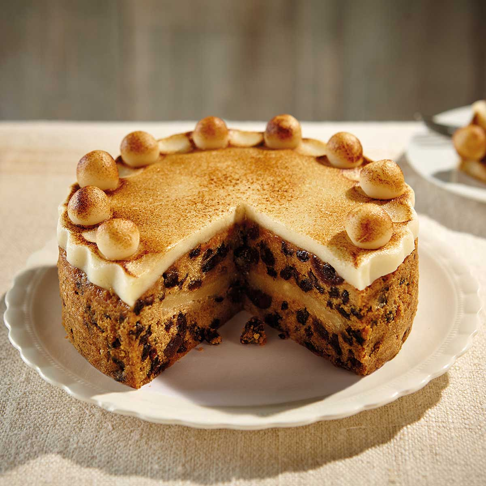

# Simnel Cake

*The British Easter cake. A spiced fruit cake with a hidden layer of marzipan baked through the middle and a second layer topped with the eleven apostle balls (Judas excluded). Caramelised under the grill so the marzipan tops go burnished gold.*

**Serves:** 12

**Prep Time:** 45 minutes

**Cook Time:** 1 hour 45 minutes (plus 30 minutes resting)

## Overview
Simnel cake is the British Easter cake, the lighter cousin of the dense Christmas fruit cake, served on Mothering Sunday or at the Easter Sunday tea table with eleven marzipan balls around the rim (one for each apostle, Judas excluded). The cake is built on a lighter fruit base than Christmas cake, flavoured with mixed peel, currants, sultanas, glacé cherries and a generous spoon of mixed spice that keeps the crumb fragrant rather than dense. The hidden marzipan layer baked through the middle is the Easter signature; half the batter goes into the lined tin, a disc of rolled marzipan lays across, the rest of the batter pours over, and a long low bake lets the marzipan half-melt into the cake without splitting through. Once cool, brush the top with warm apricot jam, set a second marzipan disc on top and arrange the eleven small balls around the rim. A quick flash under a hot grill caramelises the marzipan to a burnished amber gold. Eat with a strong cup of tea.

## Ingredients

### The cake
- 250 g unsalted butter (softened)
- 250 g soft light brown sugar
- 4 large eggs (room temperature)
- 250 g plain flour
- 1 teaspoon baking powder
- 2 teaspoons mixed spice
- 1 teaspoon ground cinnamon
- A small pinch of fine sea salt
- The zest of 1 lemon
- The zest of 1 orange
- 200 g currants
- 150 g sultanas
- 100 g glace cherries (rinsed and quartered)
- 50 g chopped mixed peel
- 2 tablespoons whole milk
- 1 tablespoon brandy or orange juice

### The marzipan
- 500 g good-quality natural marzipan (or homemade; see notes)

### To finish
- 3 tablespoons apricot jam (warmed and sieved)
- 1 small egg yolk (for glazing the apostles)

## Method

### Stage 1 - Prepare
1. Heat the oven to 140°C fan / 160°C / 320°F. Line the base and sides of a 20 cm round, deep cake tin with a double layer of baking paper, leaving a 2 cm collar above the rim.
2. Divide the marzipan into three: a 200 g portion for the middle layer, a 200 g portion for the top, and a 100 g portion for the eleven apostle balls.
3. Roll the two larger portions into 20 cm discs on a worktop dusted with icing sugar. Set aside on baking paper, covered.

### Stage 2 - Make the cake batter
1. In a stand mixer, cream the butter and sugar for 4-5 minutes until pale and fluffy.
2. Add the eggs one at a time, beating each in fully. The mixture may look curdled at the third egg; add a tablespoon of the flour to bring it back.
3. Sift the flour, baking powder, spices and salt over the mixture. Add the orange and lemon zest. Fold gently with a spatula until just combined.
4. Stir in the currants, sultanas, cherries and mixed peel. Stir in the milk and brandy - the batter should drop softly from the spoon.

### Stage 3 - Layer and bake
1. Spread half the batter into the prepared tin, smoothing the surface.
2. Lay one of the 20 cm marzipan discs on top, pressing gently to settle. Spread the rest of the batter on top, smoothing again.
3. Bake at 140°C for 1 hour 30 minutes to 1 hour 45 minutes. A skewer pushed into the centre should come out with just a few moist crumbs. If the top is browning too quickly, cover loosely with foil at the 1-hour mark.
4. Cool in the tin for 30 minutes, then turn out onto a rack to cool completely.

### Stage 4 - Top with marzipan
1. Brush the top of the cooled cake with warm apricot jam.
2. Lay the second marzipan disc on top, pressing down lightly to seal. Trim any overhang flush with the side of the cake.
3. Divide the 100 g of marzipan into eleven equal pieces. Roll each into a smooth ball about 2 cm across. Arrange them evenly around the rim, spaced about 1 cm apart.

### Stage 5 - Caramelise
1. Heat the grill to high.
2. Brush the top marzipan disc and the eleven balls with a thin coat of egg yolk.
3. Slide the cake under the grill on the second-from-top shelf for 1-2 minutes, until the marzipan turns deep amber in patches. Watch like a hawk - marzipan goes from gold to scorched in seconds. Remove the moment you have colour.
4. Cool to room temperature before slicing.

## Notes
- Homemade marzipan: blitz 250 g ground almonds with 250 g icing sugar, then add a beaten egg and a teaspoon of almond extract; knead just until smooth. Better flavour than supermarket marzipan, which can taste of synthetic almond.
- The eleven balls represent the eleven faithful apostles. Twelve is the count if you count Jesus; the convention in British baking is eleven, excluding Judas. Some bakers add a small flag-marked twelfth ball for Jesus at the centre.
- For a non-traditional twist, replace the mixed peel with chopped stem ginger and the brandy with ginger syrup; the cake becomes spicier and more grown-up.

## Serving
A thin slice on a small plate, alongside strong tea or a small glass of sweet sherry. The Easter Sunday afternoon cake.

## Storage
Wrapped in foil in a tin at cool room temperature for up to 2 weeks. Improves for the first 3-4 days; the marzipan and the cake settle into each other.
