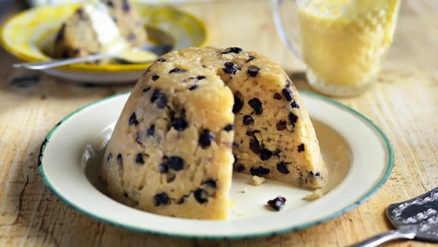

# Spotted Dick

*An old British steamed pudding: a suet sponge studded with currants and lemon zest, steamed slow in a basin and flooded with custard.*

**Serves:** 6

**Prep Time:** 20 minutes

**Cook Time:** 2 hours

## Overview
A steamed suet pudding: self-raising flour, shredded beef suet (or vegetarian suet), caster sugar and a pinch of salt mix dry. Lemon zest, currants and sultanas fold through. Whole milk binds to a soft dropping consistency. Tipped into a buttered pudding basin (1-litre); covered with a pleated baking-paper-and-foil lid (or a tied muslin cloth); placed in a steamer or a deep pot with a tea-towel under the basin and water halfway up; steamed for 2 hours, topping up water as needed. Inverted onto a plate; sliced; served warm with hot vanilla custard.

## Ingredients

### Pudding
- 250 g self-raising flour
- 125 g shredded beef suet (Atora-style, sold dried at supermarkets - vegetable suet works for vegetarian)
- 80 g caster sugar
- A pinch of salt
- ½ teaspoon ground cinnamon (optional)
- 1 lemon (zest)
- 150 g currants
- 100 g sultanas
- 200-250 ml whole milk

### Pudding basin prep
- 1 teaspoon butter (for greasing)
- 1 tablespoon caster sugar (for dusting the basin)
- 1 (1 litre) pudding basin

### To cover
- 1 piece baking paper (about 25 cm square)
- 1 piece foil (about 25 cm square)
- String

### Custard (or use shop-bought)
- 500 ml whole milk
- 4 egg yolks (large)
- 60 g caster sugar
- 1 vanilla pod (split and scraped) or 1 teaspoon vanilla extract
- 1 tablespoon cornflour

## Method

### Stage 1 - Prep the basin
1. Generously butter the inside of a 1-litre pudding basin.
1. Dust with caster sugar; tip out excess.

### Stage 2 - Mix the dry ingredients
1. In a wide bowl, combine self-raising flour, shredded suet, caster sugar, salt and cinnamon (if using).
1. Stir thoroughly.

### Stage 3 - Add fruit and zest
1. Stir in the lemon zest, currants and sultanas.

### Stage 4 - Bind
1. Pour in 200 ml of the milk; mix with a wooden spoon.
1. Add more milk 1 tablespoon at a time until the batter is a soft dropping consistency (it should fall off the spoon with one gentle shake).

### Stage 5 - Fill the basin
1. Tip the mixture into the prepared basin; don't fill to the top - leave 2 cm of headspace (the pudding rises during steaming).
1. Smooth the top.

### Stage 6 - Cover
1. Lay the baking paper on top of the foil; make a 2 cm pleat in the middle of both (gives the pudding room to expand).
1. Place over the basin paper-side-down; tie firmly with string under the rim of the basin.
1. Trim excess foil and paper.

### Stage 7 - Steam
1. Place a folded tea towel in the bottom of a deep wide pot.
1. Place the basin on the towel.
1. Pour boiling water into the pot to come halfway up the basin.
1. Cover the pot with a tight-fitting lid.
1. Bring back to a gentle simmer.
1. Steam over low heat for 2 hours.
1. Top up the water every 30 minutes with more boiling water - DO NOT let it run dry.

### Stage 8 - Make the custard
1. Heat milk with the vanilla pod (or vanilla extract) to just below a simmer.
1. Whisk egg yolks with sugar and cornflour until pale.
1. Pour the hot milk slowly onto the yolks, whisking.
1. Return to the pan over low heat; cook 3-4 minutes, stirring constantly, until the custard thickens enough to coat the back of a spoon.
1. Don't let it boil - it scrambles.
1. Strain through a fine sieve into a jug.

### Stage 9 - Turn out the pudding
1. Lift the basin out of the pot (oven mitts!).
1. Remove the foil and paper.
1. Run a thin knife around the edge of the pudding.
1. Place a wide serving plate over the basin; invert; lift the basin away.
1. The pudding should slide out as a domed shape - golden-brown on top (formerly the bottom), studded with dark currants.

### Stage 10 - Serve
1. Slice into thick wedges (about 2 ½ cm).
1. Pour generous hot custard over each slice.
1. Eat warm.

## Notes
- **Suet is the secret:** Beef suet (or vegetarian suet) is what gives spotted dick its distinctive light-but-rich texture. Substituting butter gives a denser, cake-like pudding (still good, but not authentic).
- **Don't open during steaming:** Like Yorkshire puddings, the rise depends on consistent steam. Don't lift the lid or remove the basin to check; let it steam for the full 2 hours.
- **Don't let the water run dry:** A pot that boils dry will burn the bottom of the pudding and possibly the bottom of the pan. Check water level every 30 minutes; top up with boiling water (never cold - it stops the steaming).

## Storage
- Best fresh, served warm.
- Refrigerate leftover pudding 3 days; reheat covered by re-steaming for 30 minutes, OR slice and warm portions in the microwave 60-90 seconds.
- Freeze cooked 2 months in slices; defrost in the fridge then reheat.
