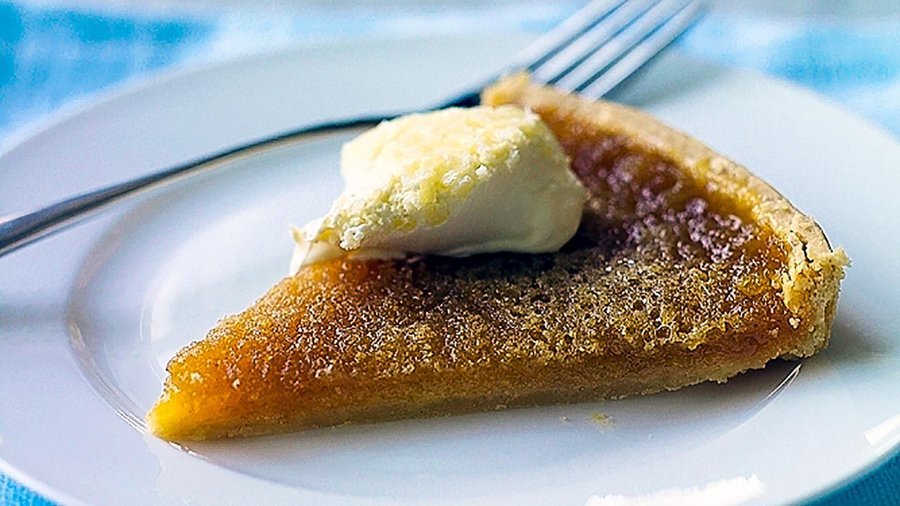

# Treacle Tart

*A proper British pudding: a sweet pastry case filled with golden syrup, breadcrumbs and lemon, baked sticky-set. Served with cream.*

**Serves:** 8 (one 22 cm tart)

**Prep Time:** 30 minutes (plus 1 hour pastry chill)

**Cook Time:** 35 minutes

## Overview
Sweet shortcrust pastry: plain flour rubs with cold butter to breadcrumb texture; icing sugar adds sweetness; an egg yolk binds with a splash of water. Rests in the fridge 1 hour. The pastry is rolled, lined into a 22 cm fluted tart tin, pricked, chilled again, and blind-baked with baking beans for 15 min, then 5 more min uncovered. Filling: warm golden syrup, lemon zest and juice, fresh breadcrumbs from a day-old loaf, a beaten egg and a small pinch of ginger / cinnamon. Stirred together; poured into the blind-baked case. Baked at 180°C 25-30 min until set with a slight wobble. Cooled to warm; served with cold clotted cream.

## Ingredients

### Sweet shortcrust pastry
- 200 g plain flour
- 50 g icing sugar (sifted)
- A pinch of salt
- 120 g cold butter (cubed)
- 1 egg yolk
- 1-2 tablespoons ice water

### Filling
- 450 g golden syrup (Lyle's Golden Syrup - a full tin)
- 100 g fresh fine breadcrumbs (from a day-old white loaf - crusts cut off, blitzed in a food processor)
- 1 egg (large, beaten)
- 50 ml double cream (optional, for extra richness)
- 1 lemon (zest)
- 2 tablespoons lemon juice
- 1 tablespoon dark golden syrup (the slightly darker amber kind, optional, for depth)
- ¼ teaspoon ground ginger (optional)
- A pinch of salt

### To serve
- Clotted cream (the British classic)
- OR vanilla ice cream
- OR hot vanilla custard

## Method

### Stage 1 - Pastry
1. In a wide bowl, whisk flour, icing sugar and salt.
1. Rub in the cold butter with fingertips until the mixture resembles fine breadcrumbs.
1. Add the egg yolk and 1 tablespoon of ice water; mix with a fork.
1. Bring together with your hands into a smooth ball - add the second tablespoon of water only if needed.
1. Press into a thick disc; wrap; refrigerate 1 hour.

### Stage 2 - Line the tin
1. Heat oven to 180°C (160°C fan).
1. Roll the pastry on a lightly floured surface to a 4 mm disc, slightly larger than your 22 cm tart tin.
1. Lift carefully (use the rolling pin to drape it) into the tin; press into the corners; trim any overhang flush with the top edge of the tin.
1. Prick the base all over with a fork.
1. Refrigerate 15 minutes.

### Stage 3 - Blind bake
1. Line the chilled pastry with baking paper; fill with baking beans (or dried rice / lentils).
1. Bake 15 minutes.
1. Remove the paper and beans.
1. Return to the oven for 5 more minutes until pale gold all over.

### Stage 4 - Filling
1. Warm the golden syrup in a saucepan over very low heat just until it's runny (not hot - gentle warmth, about 1 minute).
1. Take off heat.
1. Stir in the fresh breadcrumbs, beaten egg, double cream (if using), lemon zest, lemon juice, optional dark syrup, ground ginger and a pinch of salt.
1. Mix thoroughly.
1. Let stand 5 minutes to let the breadcrumbs soak up the syrup.

### Stage 5 - Fill and bake
1. Pour the filling into the blind-baked pastry case.
1. Smooth the top if needed (the breadcrumbs settle on standing).
1. Optional decoration: cut pastry scraps into thin strips and lay over the filling in a lattice pattern.
1. Bake at 180°C for 25-30 minutes until the filling is just set with a slight wobble in the centre and the top is deep golden-amber.

### Stage 6 - Cool
1. Cool in the tin 15 minutes (the filling firms further as it cools).
1. Don't serve hot - boiling-hot syrup is dangerous and the texture is too liquid.

### Stage 7 - Serve
1. Remove from tin; slice into wedges.
1. Serve warm with a generous spoon of cold clotted cream, OR a scoop of vanilla ice cream, OR a flood of hot vanilla custard.

## Notes
- **Fresh breadcrumbs, not dried:** Fresh soft breadcrumbs absorb the syrup smoothly and give the right tender filling. Dried breadcrumbs (the orange-coloured packet kind) give a hard, sandy texture.
- **Lemon is the secret balance:** Without the zest and juice, treacle tart is one-note sweet and cloying. The lemon doesn't taste lemony in the finished tart - it just cuts the sugar and brings the filling alive.
- **Golden syrup, not black treacle:** Lyle's golden syrup (the green tin) is the right sugar. Black treacle (molasses) is too bitter and dark; a teaspoon mixed in is fine for depth, but not as the main sweetener.

## Storage
- Refrigerate 4 days, well covered (or in an airtight container).
- Warm individual slices at 160°C 8 minutes (microwave makes the pastry soft).
- Freezes 2 months wrapped tightly; defrost in the fridge then warm.
