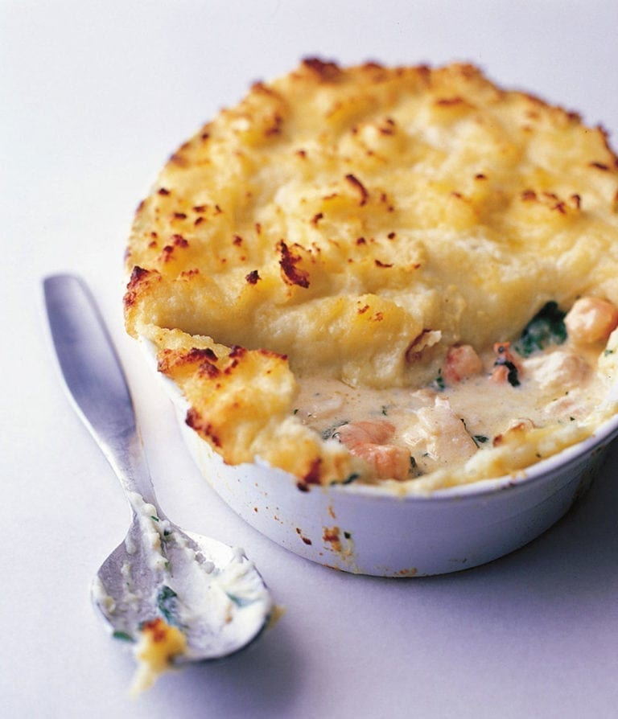

# Fish Pie

*Smoked haddock, salmon and king prawns bound in a parsley-and-cheddar béchamel, sealed under a buttery mash crust. The British answer to gratin: forgiving, freezer-friendly, and the antidote to a cold Sunday.*

**Serves:** 4-6

**Prep Time:** 30 minutes

**Cook Time:** 35 minutes

## Overview
The British family classic that turns up on a kitchen table on a cold Tuesday night, the one fish dish that even children who hate fish will eat. You poach a mix of fish (cod, smoked haddock, salmon, prawns) briefly in milk - just enough to set the flesh - then strain the milk off and turn it into a parsley-and-cheddar béchamel. The fish goes into a deep dish, the béchamel pours over to bind, and a thick layer of cheddar mash piles on top in rough peaks that catch and crisp in the oven. Bake until the top is golden and the sauce bubbles up around the edges. Eaten with peas or buttered greens, a glass of cold white wine, the kind of meal that turns the evening domestic in the best way.

## Ingredients

### Fish
- 300 g skinless smoked haddock fillet
- 300 g skinless salmon fillet
- 200 g raw king prawns (peeled)
- 500 ml whole milk
- 1 bay leaf
- A few peppercorns

### Sauce
- 50 g unsalted butter
- 50 g plain flour
- 100 g mature cheddar cheese (grated)
- 2 teaspoons Dijon mustard
- 3 tablespoons fresh parsley (chopped)
- salt
- pepper

### Mash topping
- 1 kg floury potatoes (Maris Piper), peeled and cubed
- 75 g unsalted butter
- 75 ml whole milk
- 50 g mature cheddar cheese (grated)
- Salt

## Method

### Stage 1 - Poach the fish
1. Combine the milk, bay leaf and peppercorns in a wide pan. Bring to a gentle simmer.
1. Add the haddock and salmon and poach for 4 minutes. Lift out with a slotted spoon and break into large flakes; remove any pin bones.
1. Strain the milk into a jug; discard the aromatics. Reserve.

### Stage 2 - Make the sauce
1. Melt the butter in the same pan over medium heat. Whisk in the flour and cook for 1 minute (don't colour).
1. Pour in the reserved warm milk gradually, whisking continuously, until smooth and thickened.
1. Off the heat, stir in the cheese, mustard and parsley. Season generously.
1. Fold in the flaked fish and raw prawns gently (the prawns cook through in the oven).

### Stage 3 - Make the mash
1. Boil the potatoes in salted water for 15-18 minutes until tender. Drain, steam dry, mash with the butter and warm milk. Stir in half the cheese; season.

### Stage 4 - Assemble and bake
1. Heat the oven to 200°C (180°C fan).
1. Tip the fish mixture into a 25 x 20 cm baking dish.
1. Top with the mash, fork the surface to create peaks, scatter the remaining cheese.
1. Bake for 25-30 minutes until the peaks are golden and the sauce bubbles at the edges.
1. Rest 5 minutes before serving.

## Notes
- **Smoked haddock is non-negotiable:** It carries the flavour. Using only fresh fish gives a flat, milky pie.
- **Don't fully cook the fish in the poach:** It finishes cooking in the oven; over-poaching turns it rubbery.
- **Hard-boiled eggs are traditional:** Halve 2-3 and tuck them into the fish layer before topping. Polarising; many feel strongly either way.

## Storage
- Keeps 2 days refrigerated. Reheat at 180°C for 20-25 minutes (covered, then uncovered to crisp).
- Freezes well unbaked or baked for up to 2 months.
