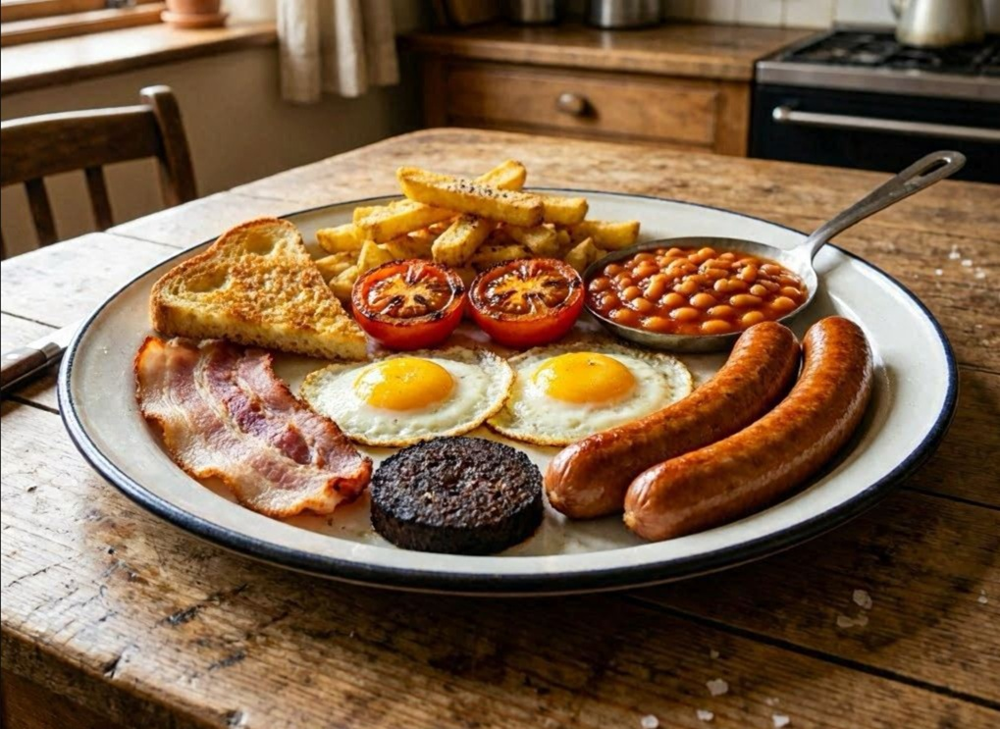

# Full English Breakfast

*The Saturday-morning plate that breaks every modern food rule and gets away with it. Sausage, egg, bacon, black pudding, fried bread, chips, grilled tomato and baked beans on one platter. The trick is staging: nothing should be cold when you sit down, and the eggs go on last.*

**Serves:** 2

**Prep Time:** 10 minutes

**Cook Time:** 35 minutes

## Overview
A Full English is a coordination exercise more than a recipe. You're cooking eight different things on one or two pans and they all need to land on the plate hot. The order below front-loads the slow items (sausages, chips) and finishes with the fast ones (eggs, fried bread) so the slowest things have a chance to rest while the quickest are still in the pan.

## Ingredients

### The plate
- 4 good-quality pork sausages (Cumberland or Lincolnshire)
- 4 rashers back bacon
- 4 slices black pudding (about 1 cm thick)
- 2 large eggs
- 2 thick slices white bloomer or sourdough (for frying)
- 2 large tomatoes (halved across the equator)
- 1 small tin (200-250 g) baked beans

### Chips
- 2 medium floury potatoes (Maris Piper or King Edward), peeled
- vegetable oil (for shallow-frying)
- fine salt

### Frying fat
- 1 tablespoon vegetable oil
- 1 tablespoon unsalted butter
- bacon fat from the rashers (saved as you go)

### To serve
- black pepper
- HP sauce or brown sauce (optional)
- buttered toast (optional, alongside the fried bread)

## Method

### Stage 1 - Chips first
1. Cut the potatoes into chunky chips about 1 cm thick. Rinse under cold water to remove surface starch and pat dry.
1. Heat 1 cm of vegetable oil in a deep heavy pan to about 140°C (a chip dropped in should bubble lazily). Fry the chips for 6-8 minutes until soft but not coloured. Lift out onto kitchen paper.
1. Increase the oil to 180°C. Return the chips and fry 3-4 minutes more until golden and crisp. Drain on fresh kitchen paper, salt generously, keep warm in a low oven.

### Stage 2 - Sausages and bacon
1. Heat the oven to 100°C (a holding oven for everything as it finishes).
1. Heat a large heavy frying pan over medium-low. Add the oil and sausages and cook for 15-18 minutes, turning every few minutes, until the skins are deep brown and the insides are cooked through. Move to an ovenproof plate and slide into the oven to keep warm.
1. In the same pan, lay the bacon flat. Cook 2-3 minutes per side until the edges are crisp and the fat is golden. Transfer to the warming plate. Leave the rendered bacon fat in the pan.

### Stage 3 - Black pudding and tomatoes
1. To the bacon pan, add the black pudding slices. Fry 2 minutes per side until the crust is dark and crisp. Transfer to the warming plate.
1. Add the tomato halves cut-side down. Cook 3-4 minutes until the cut faces are browned and the tomatoes have softened. Flip skin-side down, season with salt and pepper, cook 2 more minutes. Move to the warming plate.

### Stage 4 - Beans, fried bread, eggs
1. Tip the baked beans into a small saucepan and warm through over low heat. Don't boil; just hot.
1. Add the butter to the frying pan. When it foams, lay in the bread slices. Fry 90 seconds per side until golden and shatteringly crisp. Move to the warming plate.
1. Crack the eggs straight into the same pan. The fat should be at a medium heat, sizzling but not smoking. Spoon the hot fat over the whites for 30 seconds so they set without overcooking the yolks. Lift out when the whites are just firm and the yolks still trembling.

### Stage 5 - Plate
1. Pull everything from the oven. Plate each portion with a sausage and a half tomato up top, bacon and black pudding behind the egg, fried bread tucked under, a small heap of chips on the side, and the beans in a small ramekin or in a corner of the plate (to stop the sauce from soaking the bread).
1. Crack pepper over the eggs. Serve immediately with HP sauce on the side and a strong mug of tea.

## Notes
- A Full English lives or dies on timing. Read the whole method through before you start and have every ingredient out and prepped. The cooking itself takes about 35 minutes; the prep step keeps you from juggling tin openers mid-fry.
- A second pan in parallel cuts the total time considerably. If you have one, run the chips and sausages on the larger pan, the bacon/black pudding/tomato/eggs on the second.
- Bacon fat is the soul of the dish; don't drain the pan between stages. Each item should sit briefly in the previous one's rendered fat.
- Streaky bacon works in place of back if that's what's in the fridge, it'll just curl tighter and crisp faster.
- Mushrooms are a traditional addition many cooks include. Halve a handful of chestnut mushrooms and fry in butter alongside the tomatoes if you want them.

## Serving
- Best straight from the pan onto a warmed plate. A mug of strong builder's tea with milk is the traditional drink alongside; black coffee works too. Brown sauce or HP for the savoury bits, never on the egg.

## Storage
Doesn't reheat. The eggs go rubbery, the fried bread goes leathery, the chips soften. Cook the quantity you'll eat at the table and start fresh the next day.
