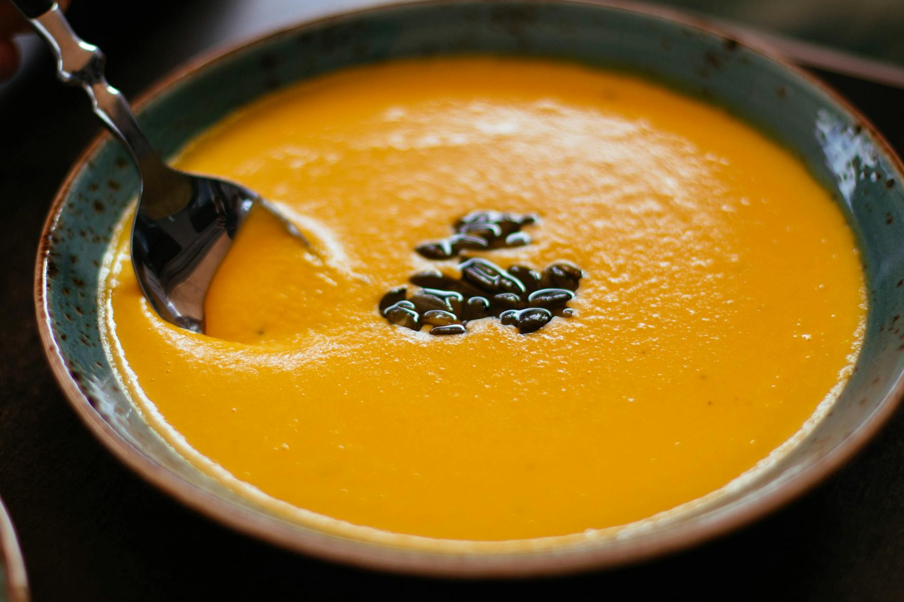

# Pumpkin Soup

*The autumn bowl. Roasted pumpkin blitzed smooth with caramelised onion, garlic and stock, finished with cream, nutmeg and a swirl of toasted pumpkin seeds. The soup of bonfire nights and Halloween suppers, when the kitchen smells of woodsmoke and the kids carve lanterns from the offcuts.*

**Serves:** 4-6

**Prep Time:** 15 minutes

**Cook Time:** 1 hour

## Overview
Pumpkin halves roasted cut-side down until the flesh collapses against the spoon. Onion and garlic sweated slow in butter, deglazed with stock. The roasted pumpkin scraped in, simmered together, and blitzed to a silken purée. Finished with a swirl of cream, a grate of nutmeg, and toasted pumpkin seeds for crunch. The roast deepens the flavour beyond what a stovetop simmer can manage; do not skip it.

## Ingredients

- 1 medium pumpkin (about 1.5 kg; or 800 g of butternut squash plus 200 g of pumpkin for colour)
- 3 tablespoons olive oil
- 1 tablespoon honey
- 60 g unsalted butter
- 2 large onions (chopped)
- 4 garlic cloves (crushed)
- 1 carrot (peeled, diced)
- 1 celery stick (diced)
- 1 sprig of thyme
- 1 bay leaf
- 1.2 litres vegetable or chicken stock
- 100 ml double cream
- ½ teaspoon ground nutmeg
- Fine sea salt and black pepper

### To finish
- 2 tablespoons pumpkin seeds (toasted)
- A drizzle of double cream
- A handful of chopped flat-leaf parsley

## Method

### Stage 1 - Roast the pumpkin
1. Heat the oven to 200°C fan / 220°C / 425°F.
2. Halve the pumpkin and scoop out the seeds. Reserve a tablespoon of seeds for toasting at the end if you want to make them yourself; rinse and dry them.
3. Brush the cut faces with 2 tablespoons of the olive oil and the honey, and season generously with salt and pepper. Place cut-side down on a baking tray lined with foil.
4. Roast for 40-45 minutes until a knife slides through the skin and into the flesh with no resistance. The bottoms should be slightly caramelised.
5. Cool until you can handle them, then scoop the flesh away from the skin. You should have about 800 g of cooked pumpkin.

### Stage 2 - Build the base
1. While the pumpkin roasts, melt the butter with the remaining tablespoon of olive oil in a heavy pot over a medium-low heat.
2. Add the onions, carrot and celery. Cook gently for 12-15 minutes, stirring often, until soft and faintly golden at the edges - the slow cook builds sweetness.
3. Add the garlic, thyme and bay leaf. Stir for 2 minutes.

### Stage 3 - Simmer
1. Tip the roasted pumpkin into the pot. Pour over the stock. Bring to a gentle simmer.
2. Cook on a low heat for 20 minutes to bring the flavours together. The carrot should be fully tender.
3. Fish out the thyme stalk and bay leaf.

### Stage 4 - Blitz
1. Blend the soup with a stick blender until completely smooth and silky. If it looks thicker than you want, add a splash more stock; thinner, simmer for another 5 minutes uncovered.
2. Stir in the cream and nutmeg. Taste and adjust salt - pumpkin needs more than you think. Grind in plenty of black pepper.

### Stage 5 - Toast and serve
1. If toasting your own seeds: warm a dry frying pan over a medium heat, add the cleaned seeds, and toast for 3-4 minutes, shaking the pan, until they pop and brown. Tip onto a plate; sprinkle with salt.
2. Ladle the soup into wide bowls. Swirl a teaspoon of cream over the top, scatter with toasted seeds and chopped parsley.

## Notes
- Butternut squash makes a smoother, sweeter soup but lacks the slightly earthy edge of true pumpkin. A blend of two-thirds butternut to one-third pumpkin is the most reliable supermarket option.
- A pinch of smoked paprika in the base gives the soup a faint bonfire warmth that suits the season.
- For a richer, autumnal version, swap 200 ml of the stock for apple juice.

## Serving
In wide warm bowls with crusty bread, a hunk of mature cheddar, and good butter. At a Halloween supper, ladled from a hollowed-out pumpkin for theatre.

## Storage
In a covered container in the fridge for up to 4 days, or freezer for 2 months. Freezes well; reheat gently with a splash of stock to loosen.
