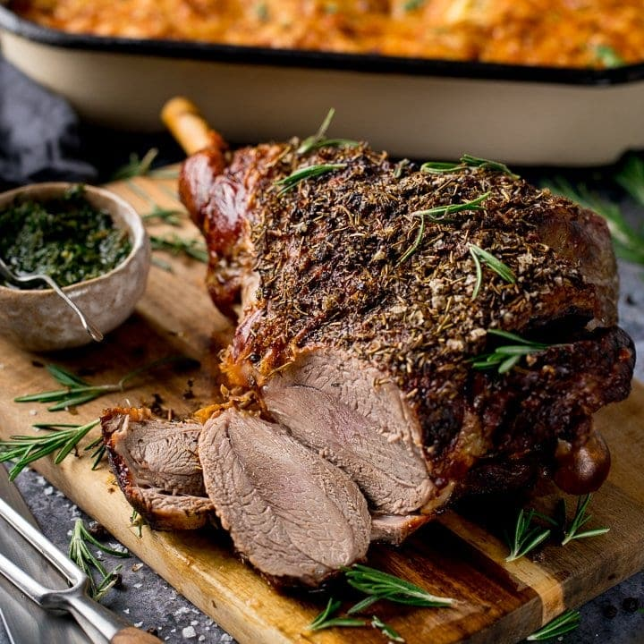

# Roast Leg of Lamb

*The Easter centrepiece. A whole leg of lamb studded with garlic and rosemary, roasted to pink at the bone, rested, sliced thick onto warm plates with the juices spooned over. The kind of roast that anchors a long table on a Sunday afternoon.*

**Serves:** 8

**Prep Time:** 20 minutes (plus 1 hour at room temperature)

**Cook Time:** 1 hour 30 minutes (plus 20 minutes resting)

## Overview
A bone-in leg of lamb, 2-2.5 kg, brought to room temperature, scored, studded with slivers of garlic and tucked with rosemary tips. Smeared with oil, salt and crushed garlic. Started hot to colour the skin, then dropped to a low roast and pulled when the centre reads 55°C for pink, 60°C for medium. Rested for a full twenty minutes so the juices settle back into the meat. A simple jus from the pan drippings, deglazed with wine and reduced.

## Ingredients

### The lamb
- 1 bone-in leg of lamb (about 2.2 kg)
- 6 garlic cloves (3 cut into slivers, 3 crushed)
- 1 small bunch of rosemary (half cut into 2 cm sprigs for studding, half left whole)
- 3 tablespoons olive oil
- 2 teaspoons flaky sea salt
- A generous grind of black pepper
- 4 small onions (quartered, for the tray)

### The jus
- 250 ml dry red wine
- 400 ml lamb or chicken stock
- 1 tablespoon redcurrant jelly
- A few sprigs of thyme
- A small knob of cold butter (about 20 g)

## Method

### Stage 1 - Prepare the leg
1. Take the lamb out of the fridge 1 hour before cooking. A cold leg roasts unevenly.
2. With the tip of a sharp knife, make 20-24 small slits all over the meat, about 1 cm deep. Push a garlic sliver and a rosemary sprig into each slit.
3. In a small bowl, mash together the crushed garlic, olive oil, salt and pepper. Rub all over the lamb.
4. Heat the oven to 220°C fan / 240°C / 475°F.
5. Scatter the quartered onions and the whole rosemary stalks in the bottom of a large roasting tin. Set the lamb on top, fat-side up.

### Stage 2 - Roast
1. Roast at 220°C for 20 minutes to colour the skin.
2. Drop the oven to 160°C fan / 180°C / 350°F. Continue roasting for 1 hour to 1 hour 10 minutes for medium-rare/pink (a meat thermometer pushed into the thickest part, not touching bone, should read 55°C). For medium, take it to 60°C, about 1 hour 20 minutes; for medium-well, 65°C, about 1 hour 30 minutes. The lamb continues to rise about 5°C during the rest.
3. Lift the lamb onto a warm board, tent loosely with foil, and rest for 20 minutes. This is not optional: a hot leg loses its juice on the board; a rested leg holds it.

### Stage 3 - Make the jus
1. While the lamb rests, set the roasting tin over a medium-high heat on the stovetop. Pour in the wine. Scrape the dark stuck-on bits off the bottom with a wooden spoon.
2. Boil hard for 3-4 minutes to reduce by half. Add the stock, redcurrant jelly and thyme.
3. Strain into a small saucepan, pressing the onions to extract their flavour. Boil to reduce by half again, until it lightly coats the back of a spoon.
4. Off the heat, whisk in the cold butter to gloss. Taste and season.

### Stage 4 - Carve and serve
1. Carve the lamb in thick slices, cutting across the grain. Start at the wide end (the knuckle end of the leg) and work down to the bone.
2. Fan the slices across warm plates and spoon the jus over.

## Notes
- A 2.2 kg leg serves 8 with a little for leftovers; for 6, look for a 1.7-1.9 kg leg and reduce the second-stage roast time by 10-15 minutes. The temperature read is the only honest measure.
- Anchovies, classical with lamb, slip into the studding slits in place of every second rosemary sprig: they melt into the meat and add depth without tasting fishy.
- A spoonful of harissa rubbed into the meat instead of salt-and-oil gives a North African slant for non-Easter cooks.

## Serving
At the centre of the Easter table with mint sauce, roast potatoes, buttered carrots and peas. A glass of full-bodied red wine alongside.

## Storage
Sliced lamb in a covered container in the fridge for up to 3 days. Reheats poorly without going dry; better eaten cold the next day in sandwiches with mint sauce.
