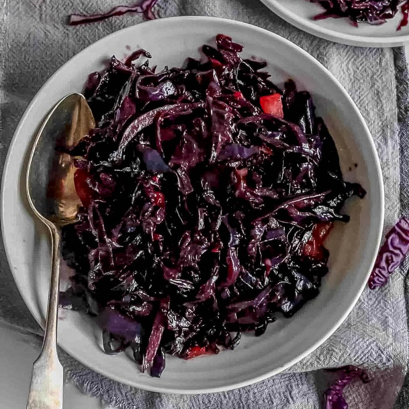

# Buttered Red Cabbage

*Sweet-and-sour braised red cabbage with apple, onion, vinegar and butter. The German / British / Eastern European Sunday-lunch staple; goes with goose, duck, pork, sausages, anything rich. Improves over a couple of days; make ahead.*

**Serves:** 6-8

**Prep Time:** 15 minutes

**Cook Time:** 1 ¼ hours

## Overview
The Sunday-lunch braise that turns up across British, German and Eastern European tables: shredded red cabbage cooked slow in butter with onion, sliced apple, brown sugar, red wine vinegar, red wine, cinnamon and cloves till the leaves go silky purple and the liquid reduces to a glossy sweet-sour glaze. The cabbage belongs alongside anything rich (goose, duck, roast pork, sausages, game) where its sharp-sweet edge cuts through the fat. Cooking apple (Bramley) is the canonical choice; it breaks down completely and disappears into the sauce while sweetening the cabbage from the inside. A long slow braise of 60 to 75 minutes is essential. Rushed red cabbage stays squeaky and the sweet-sour balance never develops. Most British home cooks make it the day before and reheat; the flavours deepen overnight and the dish improves through the freezer too, so leftovers freeze well for the next big roast.

## Ingredients

- 1 red cabbage (medium, about 1 kg, cored and finely shredded)
- 50 g unsalted butter
- 2 onions (sliced)
- 2 Bramley (or other tart apples, peeled, cored, sliced)
- 4 tablespoons red wine vinegar
- 100 ml red wine (optional)
- 100 g brown sugar
- 1 cinnamon stick
- 4 cloves
- 1 bay leaf
- ½ teaspoon salt
- ¼ teaspoon black pepper

## Method

### Stage 1 - Soften the onion
1. Melt the butter in a large heavy pan over medium heat.
1. Cook the onions for 8-10 minutes until soft and sweet.

### Stage 2 - Build the cabbage
1. Add the shredded cabbage; stir to coat in butter.
1. Add the apples, vinegar, wine (if using), sugar, cinnamon, cloves, bay, salt and pepper.

### Stage 3 - Simmer
1. Bring to a gentle simmer; cover.
1. Cook on low heat for 1-1 ¼ hours, stirring occasionally, until the cabbage is silky-tender and the liquid has reduced.
1. If still wet at the end, uncover and reduce 5-10 minutes more.

### Stage 4 - Finish
1. Discard the cinnamon stick, cloves and bay leaf.
1. Taste; adjust with more vinegar (if too sweet) or sugar (if too sharp).

### Stage 5 - Serve
1. Pile into a warm bowl; serve alongside roast meats, sausages or game.

## Notes
- **Vinegar is structural:** It locks in the red colour and balances the sweetness. Without it, the cabbage turns blue-grey.
- **Bramley apples are best:** Tart and break down into the sauce. Cooking apples in general; eating apples stay too firm.
- **Make ahead:** Improves overnight. Genuinely better the next day.

## Storage
- Improves over 2-3 days. Keeps 5 days refrigerated.
- Freezes well for 3 months.
