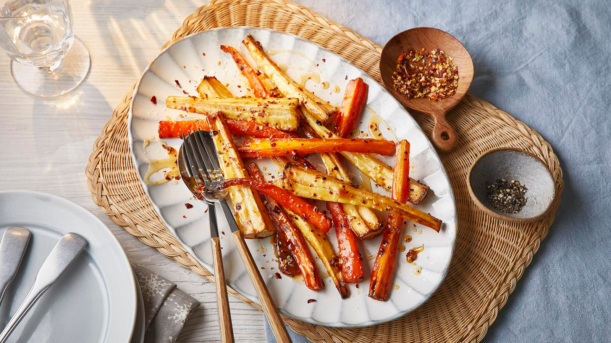

# Chanternay Carrots and Parsnips with Maple Syrup and a Mustard Glaze

*This wonderfully sweet glazed carrot and parsnip side dish compliments any hearty roast dinner with an air of elegance.*

**Serves:** 6

**Prep Time:** 10 minutes

## Overview
A British Sunday-roast vegetable side that does a lot with very little: halved Chantenay carrots (the small stubby French heritage variety, sweet and tender enough to keep their skins on) and parsnip batons roasted hard with olive oil, then tossed warm in a maple-syrup-and-wholegrain-mustard glaze brightened with orange zest and juice. The glaze reduces and caramelises in the residual heat of the tin, coating each piece in a sticky glossy lacquer. Chantenays are the traditional small carrot; regular carrots cut into batons substitute but the dish reads less elegant on the plate. Parsnip needs a few extra minutes in the oven than carrot because it caramelises slower and goes bitter if undercooked. The wholegrain mustard is non-negotiable; smooth Dijon gives a thinner less-textured glaze. Eat alongside any British roast, particularly beef, lamb, pork or goose.

## Ingredients
- 300 grams Chanternay carrots (halved)
- 300 grams parsnips (peeled and cut into batons)
- 2 tablespoons olive oil
- 3 tablespoons maple syrup
- 1 tablespoon whole grain mustard
- ½ orange (juice and zest)

## Method
1. Preheat the oven to 200°C.
1. Place the carrots and parsnips in a large roasting tin in a single layer. 
1. Drizzle with olive oil and season. 
1. Roast in the oven, turning occasionally for 30 minutes.
1. Mix the maple syrup, mustard and orange juice with zest in a jug and pour over the semi-roasted vegetables. 
1. Return to the oven and roast for a further 10-15 minutes until caramelised and sticky.

## Notes
- Spread the vegetables in a single layer in the roasting tin, overcrowding will cause them to steam rather than roast and caramelise.
- Turn the vegetables occasionally during the initial 30-minute roast to ensure even browning on all sides.
- Cut parsnip batons to a similar thickness as the halved carrots so everything cooks at the same rate.
- Watch closely during the final 10-15 minutes after adding the glaze, as the maple syrup can burn quickly at high heat.

## Serving
Serve with: roast beef, roast lamb, roast chicken, or any hearty roast dinner
Temperature: hot, straight from the oven
Amount: one portion per person as a side dish

## Storage
- Leftovers keep in the fridge in an airtight container for up to 3 days.
- Reheat in the oven at 180°C for 10 minutes, or in a frying pan over medium heat to restore some of the caramelised stickiness.
