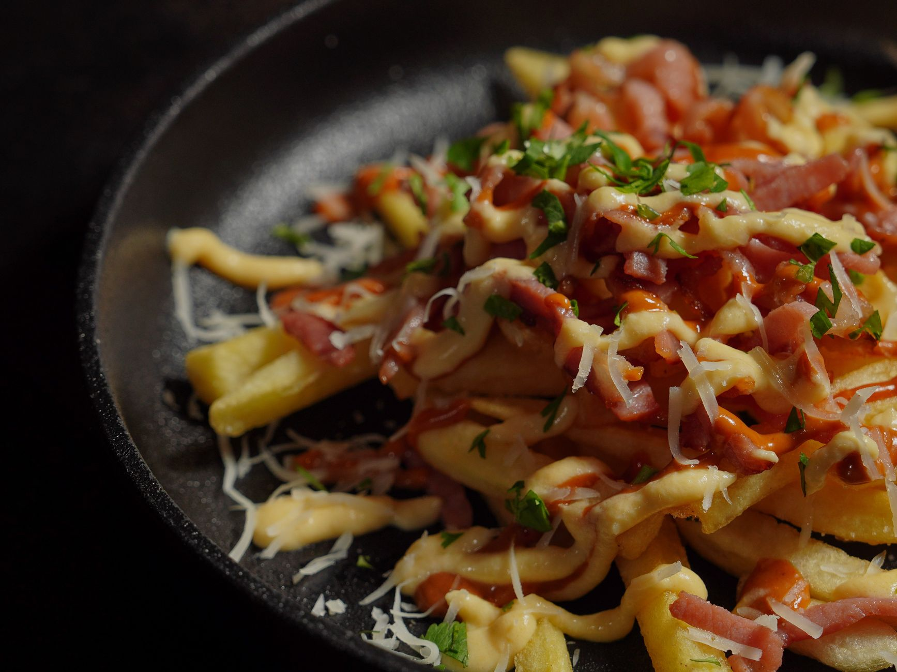

# Dirty Fries

*Britain's pub-classic loaded chips: hand-cut chips twice-fried till deeply crispy, smothered with melted cheese, crumbled crispy bacon, sliced jalapeños, sour cream, spring onions and a generous drizzle of homemade gravy or BBQ sauce. The British gastropub munchies-board favourite that's become a staple of every UK pub menu.*

**Serves:** 4

**Prep Time:** 25 minutes (plus 30 minutes potato soaking)

**Cook Time:** 25 minutes

## Overview
Dirty fries (dirty chips in UK chip-shop vernacular) is the British pub-classic loaded chip dish and a staple of every modern gastropub and chip-shop munchies menu: hand-cut thick chips twice-fried for crispness, piled on a board or in a deep dish, smothered with melted cheese (mature cheddar and mozzarella, sometimes Stilton), topped with crumbled crispy bacon, pickled jalapeños, sour cream, spring onions, a generous drizzle of warm BBQ sauce or gravy, finished with chopped chives or coriander. Became popular in British gastropubs in the 2010s as part of the munchies-board boom; now a fixture of every craft-beer pub, every late-night kebab shop and every football-matchday pub spread. The "dirty" in the name refers to the indulgently loaded toppings rather than any specific recipe; some pubs add chilli con carne, pulled pork or cheese-and-gravy poutine-style. The chips must be twice-fried (thick-cut, soaked first, fried low-and-slow to cook through, then hot-and-fast to crisp). Cheese is the traditional base layer; bacon, jalapeños, sour cream, spring onions and sauce are the minimum. More is more.

## Ingredients

### Chips
- 1200 g floury potatoes (Maris Piper, King Edward, Russet; peeled and cut into 1.5 cm × 8 cm thick batons)
- Vegetable oil for deep-frying (about 1.5 litres; or beef dripping for the proper British chip-shop chip)

### Loadings
- 250 g mature cheddar cheese (grated)
- 100 g mozzarella (grated; for melt)
- 8 rashers smoked streaky bacon (cooked crispy; crumbled)
- 100 g pickled jalapeños (sliced)
- 200 g sour cream (or crème fraîche)
- 6 spring onions (finely sliced)
- 4 tablespoons BBQ sauce (or sweet chilli sauce; or gravy)
- 2 tablespoons hot sauce (optional)
- Small handful chopped chives or coriander
- 1 small fresh red chilli (sliced, optional)

### Seasoning
- 2 teaspoons flaky sea salt
- 1 teaspoon ground black pepper
- ½ teaspoon smoked paprika

### Optional add-ons (for the maximalist version)
- 100 g chilli con carne (warmed)
- 100 g pulled pork (warmed)
- 2 tablespoons truffle oil

## Method

### Stage 1 - Soak and prep the potatoes
1. Cut potatoes into thick chips; soak in cold water 30 minutes.
2. Drain and pat thoroughly dry.

### Stage 2 - Cook the bacon
1. Heat a heavy pan over medium heat.
2. Add the bacon rashers; cook 5-6 minutes per side till deeply crispy.
3. Drain on kitchen paper; chop or crumble into small pieces.

### Stage 3 - First-fry the chips
1. Heat oil to 160°C (320°F).
2. Fry chips in batches 5-6 minutes till just cooked through but pale.
3. Lift out; drain on kitchen paper.
4. Cool 10 minutes.

### Stage 4 - Second-fry the chips
1. Heat oil to 190°C (375°F).
2. Fry chips in batches 3-4 minutes till deeply golden and crispy.
3. Drain; sprinkle with sea salt, pepper and smoked paprika immediately.

### Stage 5 - Build the dirty fries
1. Pile the hot chips on a serving board or in a deep wide dish.
2. While the chips are still hot, scatter the grated cheddar and mozzarella over (the residual heat melts them; or run briefly under a hot grill for 60 seconds to fully melt).
3. Scatter the crumbled bacon over.
4. Add dollops of sour cream over the top.
5. Scatter sliced jalapeños.
6. Scatter spring onions.
7. Drizzle generously with BBQ sauce (warmed slightly).
8. Add a few dashes of hot sauce if desired.
9. Scatter chopped chives or coriander.
10. Add sliced fresh chilli for visual.

### Stage 6 - Serve immediately
1. Bring to the table with extra napkins.
2. Eat with hands (or forks); it's meant to be messy.

## Notes
- **Twice-fried chips:** essential British technique.
- **Plenty of cheese:** the traditional base.
- **Multiple toppings:** "dirty" means loaded; don't skimp.
- **Serve immediately:** the chips lose crispness fast under hot toppings.
- **Beef dripping for the proper chippy flavour:** lard or beef dripping gives the traditional British chip-shop taste; vegetable oil is the easy substitute.

## Variations
- **Cheese-and-gravy dirty fries (poutine-style):** swap the BBQ sauce for hot brown gravy; reduce other toppings; closer to Canadian poutine.
- **Chilli-loaded dirty fries:** add a generous spoonful of chilli con carne over the top; nacho-style.
- **Pulled pork dirty fries:** pulled pork in BBQ sauce over the top; pub-classic.
- **Vegetarian dirty fries:** skip the bacon; add caramelised onions, mushrooms and extra cheese.

## Serving
- On a wooden board or in a deep dish at the centre of a pub table for sharing. Drink: craft beer (IPA, lager), or for the late-night version, anything cold. As a starter/sharing plate, late-night feed, or game-day meal.

## Storage
- Best eaten immediately; not designed for leftovers.
- Components separately keep 3 days; assemble fresh.
- Don't refrigerate the assembled dish; everything goes soggy.
- Plain chips can be reheated in a hot oven 5 minutes; toppings need to go on fresh.
