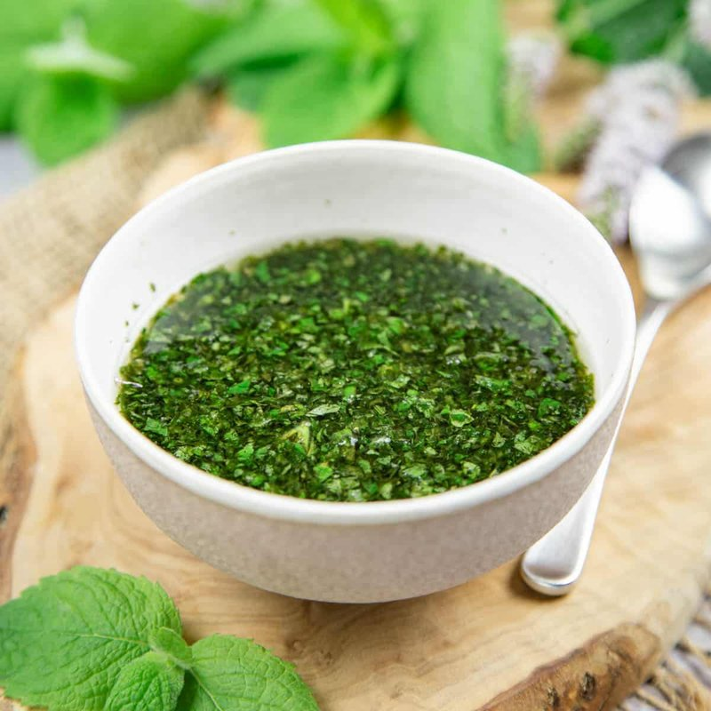

# Mint Sauce

*The British roast-lamb companion: finely chopped fresh mint stirred into sugar dissolved in hot water and a splash of malt vinegar. Bright, sharp.*

**Serves:** 6 (makes ~150 ml)

**Prep Time:** 5 minutes

**Total Time:** 20 minutes (5 active + 15 rest)

## Overview
Fresh mint leaves are chopped very fine (or pulsed in a small processor). Sugar dissolves in just-boiled water; cooled briefly; vinegar stirs in. Chopped mint is added to the cool vinegar-sugar mixture; stirred; rested for 15 minutes for the flavours to infuse. Served alongside roast lamb in a small jug or ramekin.

## Ingredients

- 1 large bunch fresh mint (about 30 g leaves only, stems discarded - spearmint is the traditional choice)
- 2 tablespoons water (just-boiled)
- 1 tablespoon caster sugar
- 3-4 tablespoons malt vinegar (traditional) - or white wine vinegar (more delicate)
- A small pinch of salt

## Method

### Stage 1 - Prep the mint
1. Pull mint leaves off their stems - you want only the soft leaves; thick stems are bitter and stringy.
1. Chop the leaves very fine on a board with a sharp knife. Pulse in a mini-food-processor for 10-15 seconds if you prefer (don't over-process to a paste - finely chopped is right).

### Stage 2 - Dissolve the sugar
1. In a small bowl or jug, dissolve the sugar in the just-boiled water - stir for 30 seconds until clear.

### Stage 3 - Combine
1. Add vinegar to the sugar-water (start with 3 tablespoons; adjust at the end if desired).
1. Add the salt.
1. Stir in the chopped mint.

### Stage 4 - Rest
1. Let stand at room temperature 15 minutes for the flavours to develop.

### Stage 5 - Taste
1. Taste. The sauce should be sharp from the vinegar, gently sweet, and aromatic with mint.
1. Adjust: more vinegar if too sweet, more sugar if too sharp, more salt for balance.
1. If using malt vinegar, the taste is darker and earthier; with white wine vinegar, more delicate. Both are correct.

### Stage 6 - Serve
1. Pour into a small jug or sauce-boat.
1. Place on the table next to the roast lamb.
1. Each diner spoons a small amount onto their lamb.

## Notes
- **Fresh mint is essential:** Dried mint won't work. Spearmint (the most common garden / supermarket mint) is the traditional choice; peppermint is too cooling and minty. Use the freshest leaves you can find.
- **Malt vinegar or white wine:** Malt vinegar is the British chip-shop classic, darker and earthier. White wine vinegar gives a more delicate, brighter sauce. Pick by preference; the malt version is more traditional with roast lamb.
- **Don't pre-make too far ahead:** Made 1 hour ahead, the sauce is excellent. Made 24 hours ahead, the mint discolours and the flavour goes flat. Make on the day of serving.

## Storage
- Best within 4 hours of making.
- Refrigerate 24 hours; the colour will dull but the flavour holds.
- Doesn't freeze.
