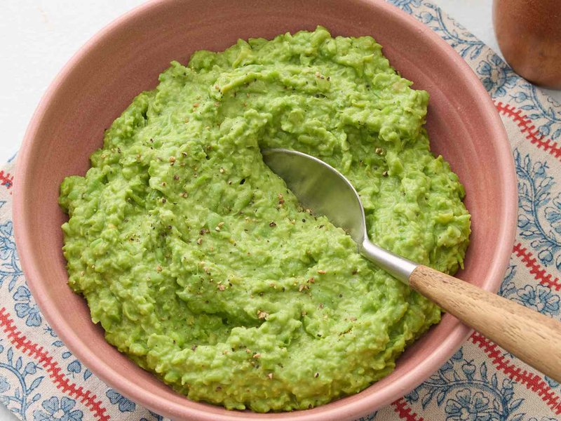

# Mushy Peas

*The defining side at a British chippy: marrowfat peas, soaked overnight with bicarbonate of soda, then simmered until they collapse into a vibrant green, slightly sweet, slightly savoury mush, finished with a knob of butter, salt and a glug of mint sauce or chopped fresh mint. Eaten alongside fish and chips, pie and chips, or with a Friday-night curry house meal. Not to be confused with French peas, mint-pea purée, or any "fresh pea" preparation - mushy peas are specifically made from dried marrowfat peas, and they should be mushy by name and texture.*

**Serves:** 4 (as a side)

**Prep Time:** 5 minutes (plus overnight soak)

**Cook Time:** 45 minutes

## Overview
Dried marrowfat peas soak overnight in cold water with bicarbonate of soda (the soda softens the skins; without it the peas stay tough). Drained, rinsed, then simmered slowly in fresh water with a pinch of salt until they break down into a thick green porridge - about 40 minutes. A teaspoon of butter, a pinch more salt and (optionally) a small spoon of mint sauce or chopped fresh mint stir through at the end. Eaten warm. Some chip-shop versions add a teaspoon of sugar; some Yorkshire households add a splash of malt vinegar at the table.

## Ingredients

- 250 g dried marrowfat peas (sold dried - Batchelors or Whitworths brands in the UK; or split green peas if you can't find marrowfat)
- 1 teaspoon bicarbonate of soda
- Cold water (for soaking and cooking)

### To finish
- 30 g unsalted butter
- 1 teaspoon salt (to taste)
- ½ teaspoon black pepper
- 1 teaspoon caster sugar (optional)
- 1 tablespoon mint sauce OR 2 tablespoons fresh mint (chopped) - optional

### To serve
- Malt vinegar (on the table - optional)
- Fish and chips, or pie and chips, or anything else

## Method

### Stage 1 - Soak
1. Place dried marrowfat peas in a large bowl.
1. Cover with cold water by 5 cm.
1. Stir in the bicarbonate of soda.
1. Soak overnight (12+ hours). The peas swell to nearly double size and the water turns greenish.

### Stage 2 - Rinse
1. Drain the peas through a sieve.
1. Rinse thoroughly under cold running water (the soda water is bitter; rinse until the water runs clear).

### Stage 3 - Cook
1. Place the rinsed peas in a saucepan.
1. Cover with fresh cold water by 2 cm.
1. Bring to a boil; skim any foam.
1. Reduce heat to a low simmer.
1. Cover loosely; cook 35-45 minutes, stirring occasionally, until the peas break down into a thick green mush. Add boiling water during cooking if the peas are getting dry before they're tender.
1. The peas are done when they collapse into a porridge consistency - no whole peas remain, the texture is uniformly mushy.

### Stage 4 - Mash
1. With a wooden spoon, beat the peas vigorously against the side of the pan to break up any remaining whole peas - or use a potato masher for a few stokes.
1. The texture should be soft, lumpy-smooth, like a thick porridge.

### Stage 5 - Season
1. Stir in butter; let melt.
1. Add salt, pepper and sugar (if using).
1. Stir in mint sauce or chopped fresh mint at the end (don't cook the mint).
1. Taste; adjust salt.

### Stage 6 - Serve
1. Spoon onto plates alongside fish and chips, pie and chips, or any roast.
1. Offer malt vinegar at the table for those who want it.

## Notes
- **Marrowfat peas, not garden peas:** Marrowfat are a specific variety of dried mature pea, larger and starchier than ordinary dried green peas. They give the right grey-green colour and starchy mush. Frozen garden peas + boiling them down gives a different, brighter dish (still good, but a "pea purée" not "mushy peas").
- **Bicarb is essential:** Without bicarbonate of soda in the soak, the skins stay tough and the peas never fully break down. The traditional method depends on it. Don't rinse so thoroughly that you remove all the soda - just enough to remove the soapy taste.
- **Mint is optional but classic:** Northern English chippies often don't add mint; southern / pubs / Sunday-roast versions often do. Both are correct. If using fresh mint, chop it fine and add at the end (heat dulls fresh mint).

## Storage
- Refrigerate 4 days; reheat with a splash of water (the peas thicken further in the fridge).
- Freezes 2 months in portion-size containers.
- Pre-cooked mushy peas reheat in a saucepan with butter for the chippy texture; microwave gives an OK result but the butter doesn't redistribute as well.
