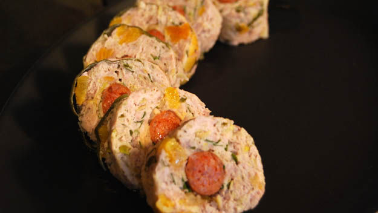

# Pork, Apricot and Pistachio Stuffing

*A British roast stuffing: pork sausagemeat with dried apricot, pistachios, onion, sage and breadcrumbs.*

**Prep Time:** 15 minutes

**Cook Time:** 5 minutes

**Serves:** 8 - 12

## Overview
This is the Christmas-table stuffing for a dinner that wants to read a little richer than the supermarket sage-and-onion default: pork sausage meat shot through with sweet dried apricots, crunchy pistachios and a generous handful of sage, with nuggets of pan-fried chorizo tucked into each ball for a smoky surprise mid-bite. The apricot is the sweet that cuts the pork richness, the pistachios give the textural crunch and the green flecks across the plate, and the chorizo is the dinner-party detail that lifts the dish above an ordinary stuffing ball. The mix works two ways: pressed into the cavity of a roasting chicken, poussin or turkey to flavour the bird from the inside, and rolled into individual balls for the tray alongside so each guest gets a crisp-edged serving. Both halves serve at the same time, and any leftover balls eat brilliantly cold the next day in a turkey sandwich.

## Ingredients
- 50 grams butter
- 1 onion (large), finely chopped
- small bunch of flat leaf parsley
- small bunch of sage leaves, chopped
- 900 grams pork sausage meat
- 75 grams fresh white bread crumbs
- 1 egg (large)
- 100 grams dried apricots, chopped
- 75 grams shelled pistachios, chopped
- olive oil to drizzle
- 2 chorizo sausages

## Method
1. Melt the butter in a large frying pan over a low heat.
1. Add the onion and cook for 5 minutes until softened, but not coloured.
1. Season well and remove from the heat, set aside to cool completely.
1. Transfer the onion to a large bowl.
1. Add the parsley, sage, sausage meat, breadcrumbs, egg, apricots and pistachios.
1. Stir to combine.
1. Season well.
1. Use a quarter of the mix to stuff the bird.
1. Cut the chorizo into 1 cm slices and fry for about 2 minutes on each side.
1. Roll the remaining stuffing into about 20 walnut sized balls around each slice of chorizo.

## Notes
- Allow the softened onion to cool completely before combining with the other ingredients, to prevent the egg from scrambling and the fat from melting prematurely.
- Season the mix at two stages, after combining and again before rolling, as sausage meat and chorizo vary in saltiness.
- Use a quarter of the mixture to stuff the bird's cavity loosely; overfilling can prevent even cooking.
- Fry the chorizo slices before encasing them in the stuffing balls so they release some of their fat and develop colour, adding depth to the finished balls.

## Serving
- Serve with: roasted chicken, poussin, or turkey; pairs well with gravy, roasted vegetables, and bread sauce
- Temperature: hot, straight from the oven
- Amount: 2-3 stuffing balls per person alongside the carved bird

## Storage
- Uncooked stuffing mix can be refrigerated for up to 24 hours before shaping and cooking.
- Cooked stuffing balls can be stored in an airtight container in the refrigerator for up to 2 days.
- Reheat in an oven at 180°C for 10-12 minutes until piping hot throughout before serving.

*This delightful warm stuffing goes particularly well with roasted game such as chicken, poussin or turkey. This recipe includes stuffing for the bird, plus 20 individual stuffing balls.*
