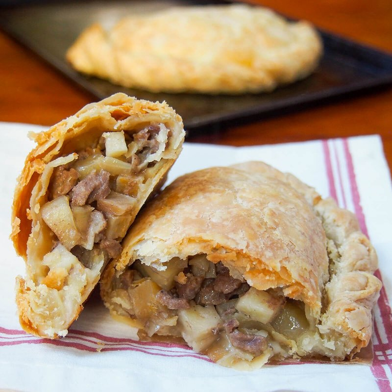

# Cornish Pasty

*The Cornish tin miner's lunch: beef, potato, swede and onion sealed raw in shortcrust pastry and baked till the steam cooks it through.*

**Serves:** 4 (4 large pasties)

**Prep Time:** 40 minutes (plus 30 min pastry rest)

**Cook Time:** 55 minutes

## Overview
The Cornish tin miner's lunch and the protected food name of Cornwall: beef, potato, swede and onion sealed raw inside shortcrust pastry and baked till the steam cooks the filling through. The all-raw filling is the Cornish detail that distinguishes the pasty from any other meat hand-pie; pre-cooked filling steams the pastry into soggy separation, where raw filling releases its juices into the crust during the bake for the signature steamy savoury interior. Beef skirt is the protected-name cut (never minced), and the 5 mm dice across all the filling ingredients gives even cooking. Swede (not turnip) is the only acceptable root; turnip is a different vegetable entirely and substituting changes the dish. The shortcrust uses a mix of lard and butter for the sturdy-but-flaky texture that takes the long bake without going hard. The rope crimp along the curved D-shape edge is the Cornish visual signature; a straight fold or fork-pressed edge isn't a Cornish pasty. Eaten warm, by hand, holding the crimp.

## Ingredients

### Pastry
- 500 g plain flour
- ½ teaspoon salt
- 125 g cold butter (cubed)
- 125 g cold lard (or vegetable shortening, cubed)
- 1 egg
- 150 ml ice water (more if needed)

### Filling
- 400 g beef skirt steak (or chuck - cut into 5 mm dice, NEVER minced)
- 400 g potato (peeled, cut into 5 mm dice - Maris Piper or other floury)
- 250 g swede (peeled, cut into 5 mm dice - known as "turnip" in Cornwall)
- 1 onion (large, cut into 5 mm dice)
- 1 ½ teaspoons salt (be generous; the meat is raw and needs seasoning to flavour through)
- 1 teaspoon black pepper (coarsely ground)
- 30 g butter (cubed - 8 small cubes, one per pasty fold)

### Glaze
- 1 egg yolk (beaten with 1 tablespoon water)

## Method

### Stage 1 - Pastry
1. In a wide bowl, whisk flour and salt.
1. Rub in the cold butter and lard with fingertips until the mixture looks like coarse breadcrumbs with some pea-sized lumps remaining.
1. Whisk the egg into 100 ml of ice water.
1. Pour into the flour; bring together with a fork. Add more ice water 1 tablespoon at a time if needed.
1. Knead briefly (5 squeezes) into a smooth ball - don't overwork.
1. Divide into 4 equal portions; wrap; refrigerate 30 minutes.

### Stage 2 - Filling
1. Cut beef into 5 mm dice (smaller is wrong; minced is wrong). Spread on a board.
1. Cut potato, swede and onion to similar 5 mm dice.
1. In a wide bowl, combine all 4 ingredients with salt and pepper.
1. Mix thoroughly with your hands - the salt and pepper should coat everything.

### Stage 3 - Roll and cut
1. Heat oven to 200°C (180°C fan).
1. Line a baking tray with paper.
1. Working with one pastry portion at a time, roll on a lightly floured surface to a circle 22-23 cm across, 4 mm thick.
1. Use a 22 cm plate as a guide; trim any uneven edges with a knife.

### Stage 4 - Fill
1. Lay the pastry disc flat.
1. Pile about a quarter of the filling onto half the disc (leaving a 1 cm border).
1. Drop a small cube of butter (~7 g) on top of the filling.
1. Brush the entire pastry rim with water (helps the seal).

### Stage 5 - Fold and crimp
1. Lift the empty half of the pastry over the filling to meet the other edge.
1. Press the edges together gently to seal.
1. Crimp the curved edge: pinch a small portion between thumb and forefinger; press-and-twist; move along; repeat. The result is a rope-like crimp along the entire curve.
1. The traditional Cornish crimp is along the SIDE (the long curve), not the top.
1. Transfer to the baking tray.
1. Repeat for all 4 pasties.

### Stage 6 - Glaze
1. Brush each pasty all over with egg yolk wash.
1. Cut a small (1 cm) steam slit in the top of each.

### Stage 7 - Bake
1. Bake at 200°C for 15 minutes.
1. Reduce heat to 180°C (160°C fan); bake another 35-40 minutes.
1. The pasties should be deep golden brown all over; the internal temperature of the filling should reach 80°C (probe through the steam hole).

### Stage 8 - Rest
1. Cool on a rack for 10 minutes (the filling is volcanic straight from the oven).

### Stage 9 - Serve
1. Eat warm or cold.
1. Traditional accompaniment: a mug of tea, or Cornish ale.

## Notes
- **Beef skirt, chopped not minced:** This is the protected/traditional rule. Beef skirt (also called flank or hanger) has the right texture and beef flavour. Chuck works as substitute. Minced beef gives a wrong texture entirely.
- **Crimp along the curve, not the top:** Real Cornish pasties have the crimp along the curved long edge, with the flat side facing up. (Devon pasties have the crimp along the top; they're a separate cousin.) Either works; only one is true to Cornwall.
- **Don't pre-cook the filling:** Cornish pasties cook from raw. The filling steams inside the pastry. Pre-cooking gives a different (and worse) texture - drier meat, mushier veg. The raw assembly is the technique.

## Storage
- Refrigerate 3 days; reheat at 180°C 12 minutes.
- Freeze cooked 2 months; reheat from frozen at 180°C 25 minutes.
- Freeze raw (assembled but unbaked) 2 months; bake from frozen at 180°C 65 minutes.
