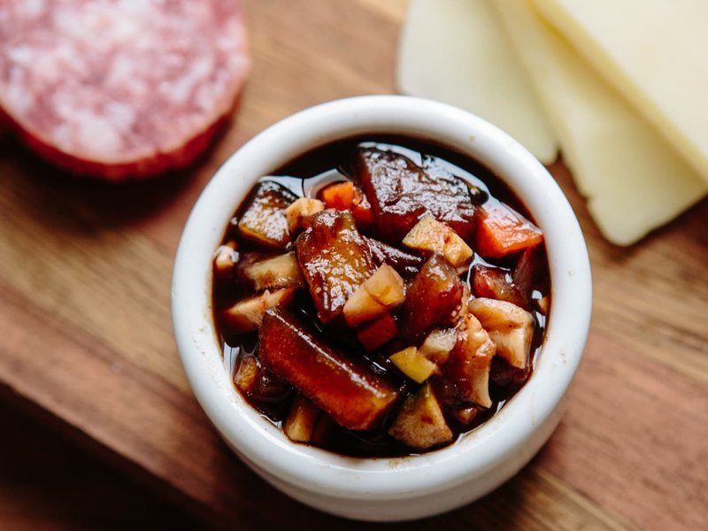

# Ploughman's Pickle

*The British pub pickle: a chunky brown relish of swede, carrot, gherkin and dates simmered in malt vinegar and treacle. With cheese.*

**Serves:** about 10 (makes 1 litre, in 2 jars)

**Prep Time:** 30 minutes

**Cook Time:** 1 hour 30 minutes

**Total Time:** 2-4 weeks (matures in the jars)

## Overview
The British pub pickle and the traditional partner to a wedge of mature Cheddar on a ploughman's lunch: a chunky brown relish of swede, carrot, gherkin, onion, cauliflower and dates simmered slow in malt vinegar, dark brown sugar, black treacle, mustard powder, cloves and allspice. The dish has its roots in the late-Victorian pub plate (the "ploughman's lunch" itself was a 1960s Milk Marketing Board invention, but the pickle that goes with it is much older) and now turns up on every gastropub board alongside cheese and pork pie. Vegetables stay distinct, in small uniform dice, even after the long simmer; pickle reduced to mush reads as chutney rather than ploughman's. The 2 to 4 weeks of maturing in the jar are the traditional step; the flavours develop dramatically with rest and a freshly opened jar tastes flat by comparison. Keeps a year unopened.

## Ingredients

### Vegetables (all diced to about 4 mm pieces)
- 200 g swede (peeled)
- 150 g carrot (peeled)
- 150 g cauliflower florets (the tighter inner ones, not the leafy stems)
- 1 onion (large, peeled)
- 80 g gherkins (drained, chopped fine, the small sweet variety)
- 100 g pitted dates (chopped fine)
- 80 g sultanas

### Pickling syrup
- 400 ml malt vinegar (NOT white vinegar; the malt is essential for the colour and depth)
- 100 ml apple cider vinegar (or extra malt)
- 250 g dark brown sugar (muscovado is ideal)
- 3 tablespoons black treacle (or molasses)
- 1 tablespoon English mustard powder
- 1 teaspoon ground allspice
- ½ teaspoon ground cloves
- 1 teaspoon ground ginger
- 1 ½ teaspoons salt
- ½ teaspoon black pepper
- ½ teaspoon ground white pepper (optional)

### To thicken
- 2 tablespoons cornflour (mixed with 4 tablespoons cold water)

### Equipment
- 2 x 500 ml glass jars with vinegar-resistant lids, sterilised
- (Sterilise: wash thoroughly in hot soapy water, rinse, dry in a 130°C oven for 15 minutes; lids in just-boiled water 5 minutes)

## Method

### Stage 1 - Prep the vegetables
1. Dice swede, carrot, cauliflower and onion to about 4 mm cubes. Smaller / bigger is wrong; ploughman's pickle should have a distinctive small-dice texture.
1. Chop gherkins to similar size.
1. Chop dates to a paste consistency (they break down into the pickle).
1. Set sultanas aside whole.

### Stage 2 - Start the pickling syrup
1. In a wide heavy-bottomed pot, combine malt vinegar, cider vinegar, brown sugar and black treacle.
1. Heat over medium-low, stirring, until the sugar and treacle have fully dissolved (about 5 minutes).
1. Stir in mustard powder, allspice, cloves, ginger, salt, black pepper and (optional) white pepper.
1. Bring to a gentle boil.

### Stage 3 - Add the vegetables
1. Add swede, carrot, cauliflower and onion.
1. Stir; bring back to a simmer.
1. Reduce heat to medium-low; cover loosely; simmer 30 minutes, stirring every 5 minutes.

### Stage 4 - Add dates and sultanas
1. Stir in chopped gherkins, dates and sultanas.
1. Continue simmering uncovered 15-20 minutes, the liquid should reduce, and the vegetables should be tender but still hold their shape. The dates dissolve into the syrup, giving the dark brown colour.

### Stage 5 - Thicken
1. Stir in the cornflour slurry; cook 2 minutes, stirring, until the syrup is glossy and thick enough to coat the back of a spoon.

### Stage 6 - Taste and adjust
1. Taste carefully (it's hot and sharp). The pickle should be tart-sweet-savoury with the molasses-treacle dominating. Adjust:
   - More vinegar for sharpness
   - More sugar / treacle for sweetness
   - More salt for balance

### Stage 7 - Jar
1. Ladle the hot pickle into the sterilised warm jars, leaving 1 cm of headspace.
1. Wipe the jar rims clean.
1. Seal tightly while still hot.

### Stage 8 - Mature
1. Cool jars to room temperature; refrigerate or keep in a cool, dark cupboard.
1. Leave 2-4 weeks before opening (essential, the flavours mature dramatically in the first 2 weeks).

### Stage 9 - Serve
1. Spoon onto a plate as part of a ploughman's lunch: mature cheddar, crusty bread, pickled onion, ½ apple, the pickle, perhaps a slice of ham or pork pie.
1. Also: layer in cheese sandwiches; spoon over baked potatoes with cheese; serve alongside cold cuts.

## Notes
- **Malt vinegar is the British signature:** It's what gives ploughman's pickle (and Branston) its characteristic dark amber colour and faintly malty flavour. White vinegar gives a paler, sharper pickle that's not quite right.
- **Small dice, not chunks:** The defining textural feature is the very small (about 4 mm) cubes of vegetable. Larger cubes give a chutney that feels rustic; smaller (or mashed) gives a paste. Aim for the size that lets each vegetable be distinguishable in a spoonful.
- **Matures over weeks:** Eating ploughman's pickle the day it's made gives a sharp, unintegrated flavour. The 2-4 week rest is when the magic happens. A jar that's been in the cupboard 3 months is at its peak.

## Storage
- Unopened sealed jars: keep in a cool dark cupboard 12 months.
- Once opened: refrigerate, eat within 6 weeks.
- The pickle thickens slightly with age; if too thick, stir in a teaspoon of hot water before serving.
