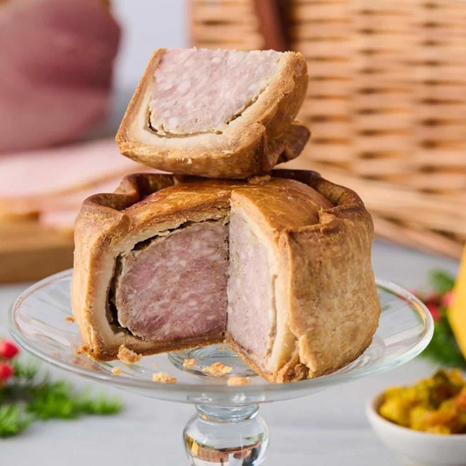

# Pork Pie

*The British picnic pie: chopped seasoned pork in a hot-water-crust pastry, filled with savoury jelly through a hole in the lid.*

**Serves:** 6 (one 18 cm pie, sliced into 6-8 wedges)

**Prep Time:** 1 hour 30 minutes

**Cook Time:** 1 hour 45 minutes

**Total Time:** 24+ hours (with the jelly-set overnight)

## Overview
Pork shoulder (uncured, fatty) and a small amount of bacon are chopped into 5 mm dice (not minced, the texture is key). Mixed with white pepper, mace, sage, salt and a touch of anchovy paste for umami. The hot-water-crust pastry: flour is mixed with hot water-and-lard mixture, kneaded warm into a pliable dough. Two-thirds of the dough lines a tall round tin (or is moulded freestanding around a glass jar); the filling is packed in tight; a lid of remaining dough is laid over the top with a 1 cm steam hole punched. Baked at 200°C for 30 min, then 160°C for another 60-75 min. Left to cool. A rich pork stock (made from trotters or with gelatin sheets) is poured through the steam hole while the pie is still warm. Refrigerated overnight to set the jelly. Sliced and eaten cold.

## Ingredients

### Filling
- 700 g boneless pork shoulder (with fat - about 25% fat)
- 150 g unsmoked thick-cut bacon
- 1 teaspoon white pepper
- 1 teaspoon salt
- 1 teaspoon ground mace (or nutmeg, slightly different)
- 1 teaspoon dried sage
- 1 teaspoon anchovy paste (optional, for depth - invisible in flavour but adds umami)
- ½ teaspoon ground allspice
- ¼ teaspoon ground ginger
- 1 tablespoon brandy (optional)

### Hot-water-crust pastry
- 450 g plain flour (strong / bread flour works too)
- 1 teaspoon salt
- 100 g lard (cubed)
- 50 g butter (cubed)
- 200 ml water

### Egg wash
- 1 egg yolk (beaten with 1 tablespoon water)

### Jelly
- 500 ml strong pork stock (from a pig trotter simmered 3 hours, or substitute: 500 ml strong chicken stock + 4 sheets of leaf gelatin)
- 1 tablespoon white wine vinegar
- Salt to taste
- (If using stock cubes: 500 ml water + 2 chicken stock cubes + 6 sheets leaf gelatin)

### To serve
- English mustard
- Branston pickle (or similar piccalilli)
- Sharp cheddar cheese
- Pickled onions

## Method

### Stage 1 - Filling prep
1. Cut the pork shoulder and bacon into 5 mm dice - don't mince (the texture is the point).
1. Mix with white pepper, salt, mace, sage, anchovy paste, allspice, ginger and brandy.
1. Cover; refrigerate while you make the pastry.

### Stage 2 - Hot-water-crust pastry
1. Place the flour and salt in a large bowl.
1. In a small saucepan, combine the lard, butter and water.
1. Heat gently until the fats melt and the mixture comes to a boil.
1. Immediately pour the hot fat-water into the flour.
1. Mix with a wooden spoon (it's hot) until you have a soft dough; once cool enough to handle, knead briefly into a smooth ball - do this while still WARM (the dough is pliable while warm; brittle when cool).
1. Cut off and reserve a third of the dough for the lid; wrap and keep warm (near the oven, not in it).

### Stage 3 - Mould
1. **With a tin**: Use an 18 cm round springform tin or a pork-pie tin. Press the larger portion of warm dough into the base and up the sides to a 5 mm thickness, ensuring no thin spots. Leave a small overhang at the top.
1. **Freestanding (traditional Melton Mowbray)**: wrap the dough around the outside of a clean glass jar (about 12 cm diameter) into a cup shape, ~5 mm thick at the base and sides. Refrigerate 20 minutes to firm. Carefully remove the jar.

### Stage 4 - Fill
1. Pack the meat filling tightly into the pastry case, pressing down firmly to eliminate air pockets and mounding it slightly above the edge.

### Stage 5 - Top
1. Roll the reserved warm dough to a 5 mm disc, slightly larger than the top.
1. Brush the rim of the pastry case with egg wash.
1. Place the lid on; pinch the edges firmly to seal; crimp decoratively if desired.
1. Punch a 1 ½ cm steam hole in the centre with the handle of a wooden spoon.

### Stage 6 - Glaze and bake
1. Brush the top all over with egg wash.
1. Heat oven to 200°C (180°C fan).
1. Bake 30 minutes (the pastry goes golden and crisp at the edges).
1. Reduce heat to 160°C (140°C fan); bake another 60-75 minutes - the internal temperature of the meat should reach 80°C on a probe thermometer.
1. The pastry should be deep mahogany gold all over.

### Stage 7 - Make the jelly
1. While the pie bakes, prepare the stock.
1. **Best**: simmer a pig trotter in 800 ml water with onion, bay and peppercorns for 3 hours; strain to 500 ml; season.
1. **Practical shortcut**: 500 ml strong chicken or pork stock + 4 sheets of leaf gelatin bloomed in cold water then stirred into the warm stock until dissolved. Add vinegar and salt to taste.

### Stage 8 - Fill with jelly
1. Cool the baked pie 30 minutes (it should still be warm, but not hot).
1. Using a small funnel, slowly pour the warm-but-not-hot jelly stock through the steam hole - pour in stages, letting the meat absorb the liquid.
1. Stop pouring when the pie is full (resistance + a tiny well of liquid visible in the hole).

### Stage 9 - Set
1. Cool to room temperature.
1. Refrigerate at least 12 hours, ideally 24 - the jelly sets between the meat and the pastry, and the flavours mature.

### Stage 10 - Serve
1. Unmould carefully (if using a tin) or slice freestanding.
1. Cut into wedges with a sharp serrated knife.
1. Serve cold, with English mustard, Branston pickle, sharp cheddar and pickled onions on the side.

## Notes
- **Chopped pork, not minced:** The textural distinction is what makes a pork pie a pork pie. Minced pork gives a smooth pâté-like filling; chopped pork gives the characteristic chunky-savoury bite.
- **Hot-water-crust pastry is unforgiving:** Work while warm. If the dough cools, it cracks and tears. If a piece breaks while moulding, patch with a small piece of warm dough.
- **The jelly is essential:** It's not just a flavour-add; it fills the gap between the cooked meat (which shrinks during baking) and the pastry case. Without the jelly, you have a hollow pie that crumbles when sliced.

## Storage
- Refrigerate 5 days, well wrapped. Eat cold.
- Pork pie freezes badly - the pastry softens and the jelly weeps on thaw.
- Best at days 2-3 when the jelly has fully set and the flavours have married.
