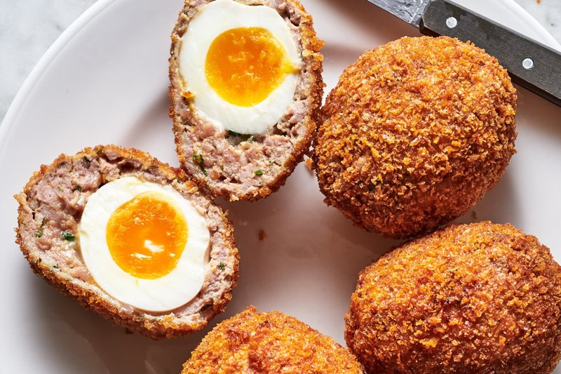

# Scotch Eggs

*Soft-yolk hard-boiled egg encased in seasoned sausagemeat, breaded and deep-fried until golden. The British pub classic; a proper one has a runny or just-set yolk in the middle, not hard-boiled to grey.*

**Makes:** 6 Scotch eggs

**Prep Time:** 30 minutes (plus 30 minutes chilling)

**Cook Time:** 15 minutes

## Overview
The British pub classic and picnic-basket regular: a soft-yolk egg encased in seasoned sausage meat, breaded and deep-fried till the outside is dark gold and shatteringly crisp while the centre stays jammy. Invented (the story goes) by London department store Fortnum & Mason in 1738 as an aristocratic travel snack for the road to Scotland, the dish was a hard-boiled affair for two and a half centuries before the gastropub revival of the 2000s rediscovered the soft-yolk version. A properly made Scotch egg has a yolk that is still runny or just-set when the egg is cut open at the table, never the chalky grey of supermarket-aisle hard-boiled versions. The eggs need a six-minute soft-boil and an ice bath to stop the carry-over cooking, and the sausage meat must wrap evenly around the egg with no thin patches that crack open in the oil. Served warm with English mustard or piccalilli.

## Ingredients

### Eggs
- 6 eggs (large, room temperature)
- Plus 2 large eggs (for the egg wash)

### Sausage layer
- 600 g good sausagemeat
- 1 tablespoon Dijon mustard
- 1 tablespoon chopped sage (or thyme)
- 2 spring onions (very finely chopped)
- 1 teaspoon ground black pepper
- ½ teaspoon salt

### Breading
- 100 g plain flour (seasoned with salt and pepper)
- 200 g panko breadcrumbs

### Frying
- Vegetable oil for deep-frying (about 1 ½ litres)

## Method

### Stage 1 - Soft-boil the eggs
1. Bring a pan of water to the boil.
1. Lower the eggs in carefully; cook for 6 minutes (timer; precise).
1. Plunge into ice water for 5 minutes.
1. Peel very gently - the whites are still soft.

### Stage 2 - Sausage layer
1. Mix the sausagemeat with mustard, herbs, spring onions, pepper and salt.
1. Divide into 6 equal portions.

### Stage 3 - Wrap
1. Flatten each portion of sausagemeat between sheets of cling film into an oval just bigger than an egg.
1. Place a peeled egg in the centre.
1. Bring the cling film up to mould the sausage around the egg, sealing all the way around.
1. Place on a tray; chill 20-30 minutes (firms up for breading).

### Stage 4 - Bread
1. Set up three plates: seasoned flour, beaten egg wash, panko.
1. Roll each sausage-wrapped egg in flour, then egg wash, then panko (pressing firmly).

### Stage 5 - Fry
1. Heat oil to 170°C in a deep pan.
1. Fry the Scotch eggs in batches of 2-3 for 6-7 minutes until deep golden.
1. Drain on a wire rack.

### Stage 6 - Serve
1. Cool 5 minutes (the inside is hot).
1. Cut in half to reveal the soft yolk; eat warm or at room temperature.

## Notes
- **6 minutes for soft-boiled, no more, no less:** Defines a proper Scotch egg. Hard-boiled is a sin.
- **Cling film for shaping:** The sausage is sticky; cling film is the cleanest way to wrap evenly. Discard before breading.
- **170°C oil:** Lower than usual frying temperature so the sausage cooks through before the panko burns.

## Storage
- Best warm. Keep 2 days refrigerated; eat cold (traditional picnic food) or reheat at 160°C for 8 minutes.
