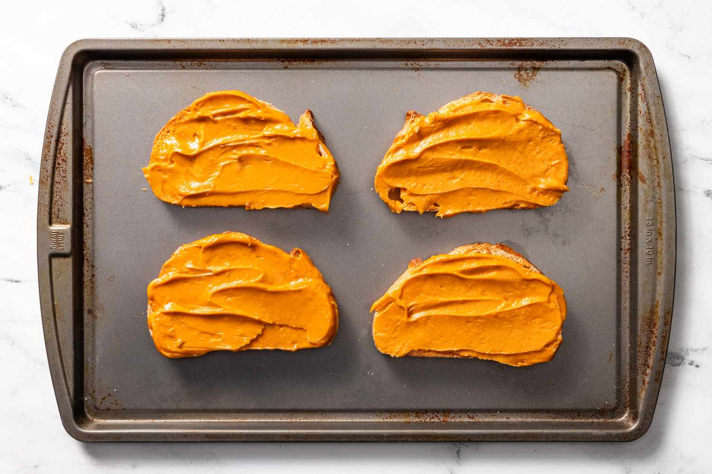

# Welsh Rarebit Paste (Make-Ahead)

*A make-ahead rarebit paste: spread on lightly buttered toast and grilled till browned and bubbling. Also good over smoked haddock under a hot grill.*

**Serves:** 16

**Prep Time:** 10 minutes

## Overview
The make-ahead version of Welsh rarebit, the British grilled cheese-on-toast in its proper form: a thick paste of mature Cheddar, fresh breadcrumbs, English mustard, Worcestershire sauce, beer and a touch of milk, cooked together over low heat into a smooth spreadable mixture that keeps in the fridge for a fortnight and grills bubbling-brown onto toast in three minutes flat. The dish has been on Welsh tables since at least the 18th century (the name was originally "Welsh rabbit", a joke at the supposed expense of poor Welshmen who couldn't afford game), and the paste form is the traditional do-ahead trick from the country-house tradition. Mature Cheddar is non-negotiable. Mild cheese makes for bland rarebit, and pre-shredded supermarket cheese seizes in the pan. Also brilliant spooned over smoked haddock or grilled tomatoes under a hot grill, the late-Victorian "buck rarebit" style with a poached egg on top.

## Ingredients
- 700 grams mature Cheddar cheese (grated)
- 150 ml milk
- 25 grams plain flour
- 50 grams fresh white breadcrumbs
- 1 tablespoon English mustard powder
- half teaspoon Worcestershire sauce
- salt
- pepper
- 2 eggs
- 2 egg yolks

## Method

### Stage 1 - Make Sauce Base
1. Put the Cheddar into a pan and add the milk.
1. Slowly melt them together over a low heat, but do not allow the mixture to boil as this will separate the cheese.
1. When the mixture is smooth and just begins to bubble, add the flour, breadcrumbs and mustard and cook for a few minutes, stirring over a low heat, until the mixture comes away from the sides of the pan and begins to form a small ball shape.
1. Add the Worcestershire sauce, salt and pepper and leave to cool.

### Stage 2 - Finish & Chill
1. When cold, transfer to a food processor and add the eggs and egg yolks, and process until combined.
1. When the eggs are mixed in, chill for a few hours before using.
1. After it has rested in the fridge, you will find the rarebit is very easy to handle.

## Notes
- **Cheese selection:** Mature Cheddar is essential, avoid mild varieties which lack the sharpness this dish needs.
- **Temperature control:** Keep heat low when melting cheese to prevent separation and grittiness.
- **Make-ahead friendly:** The chilled rarebit keeps for up to 3 days refrigerated, making this an excellent dish for entertaining.
- **Application tips:** Spread generously over buttered toast or scored fish, then grill until golden and bubbling.

## Serving
- **Serve with:** Buttered toast, smoked haddock, or steamed vegetables
- **Garnish with:** Paprika, fresh parsley, or minced fresh chives
- **Accompaniment:** Crisp salad and crusty bread

## Storage
- Keeps 3-4 days refrigerated in an airtight container
- Freezes well up to 2 months before spreading and grilling
- Best used by spreading and grilling fresh; do not reheat once cooked
- Once spread on bread and baked, serve immediately for best texture
