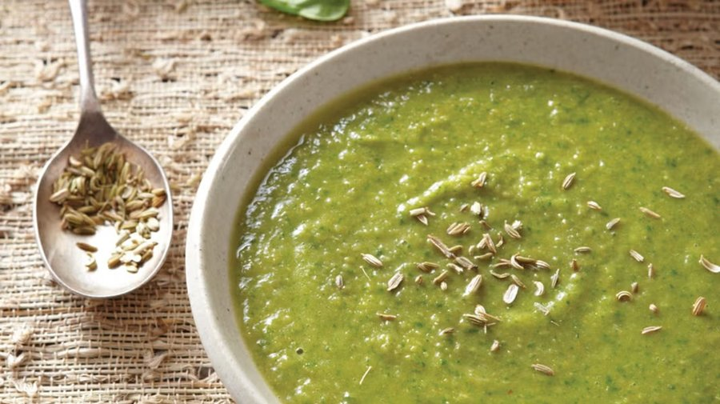

# Spinach and Fennel Soup

*A British country soup: spinach and fennel cooked just enough to stay bright green, blended smooth with stock. Eaten with crusty bread and butter.*

**Serves:** 4

**Prep Time:** 15 minutes

**Cook Time:** 50 minutes

## Overview
A delicate yet flavorful soup pairing the subtle anise notes of fennel with vibrant spinach, pureed to a smooth consistency and enriched with cream. The fresh green color and bright flavors make it a refreshing choice.

## Ingredients

### Base
- 60 grams unsalted butter

### Aromatics
- 2 onions (small, very finely chopped)
- 2 fennel bulbs (small, very finely chopped)

### Vegetables
- 1 potato (small, peeled and chopped)
- 700 grams spinach (stalks removed, leaves washed)

### Liquid/Broth
- 1 ¾ litres water

### Garnishes
- 4 tablespoons double cream
- salt
- pepper

## Method

### Stage 1 - Prepare ingredients
1. Very finely chop the onions.
2. Very finely chop the fennel bulbs.
3. Peel and chop the potato.
4. Wash the potato in water until all the starch has been removed.
5. Remove any excess stalk from the spinach, leaving only the leaves.
6. Plunge the spinach in cold water until perfectly clean.

### Stage 2 - Cook soup
1. Melt the butter in a large casserole pot.
2. Over a low heat, fry the onion and fennel together very gently for about ½ hour.
3. Add the potato to the pot, along with the water.
4. Simmer for about 20 minutes until the potato has been thoroughly cooked.
5. Stir the spinach into the soup and remove from the heat.

### Stage 3 - Puree and finish
1. Liquidize the soup in small batches until very smooth.
2. For a perfectly fine soup, push the soup through a fine meshed sieve or chinois.
3. Add a little cream to the soup, reheat gently and serve.

## Notes
- **Fennel:** Finely chop to release flavor without bitterness.
- **Spinach:** Add at end to preserve color and nutrients.
- **Pureeing:** Strain for ultra-smooth texture.
- **Cream:** Stir in just before serving to maintain vibrancy.

## Serving
Serve hot with fresh bread and butter. Garnish with extra cream if desired.

## Storage
- Refrigerate up to 2 days; reheat gently without boiling.
- Freezes well for up to 1 month (without cream; add fresh).
- Best eaten fresh for color.