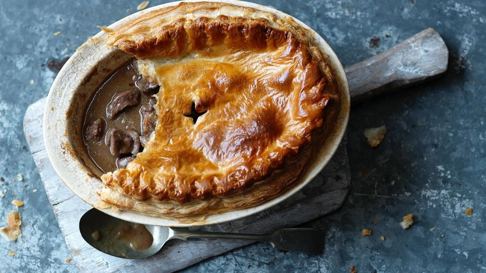

# Steak and Kidney Pie

*The British pub-pie classic: chunks of beef and ox kidney braised slow in a stout-rich gravy, sealed under a buttery shortcrust top. Kidney brings an iron-rich depth that beef alone can't manage; the long braise rewards patience.*

**Serves:** 4-6

**Prep Time:** 30 minutes

**Cook Time:** 2 ½ hours

## Overview
The defining British pub pie, the dish you order when the weather is foul and you want the gravy to do something to your evening. You brown cubed chuck steak and ox kidney hard for colour, then braise the lot slowly with onions, mushrooms, a bottle of stout and beef stock until the meat is fork-tender and the gravy has reduced down to a glossy mahogany. The filling cools completely (essential; hot gravy in a pastry case is the surest way to a soggy bottom), goes into a pie dish, gets a shortcrust top crimped sharp at the edge, and bakes until the pastry is deep gold and the gravy bubbles up around the edges. Eaten with mashed potato, peas and a pint, the gravy spooned generously over.

## Ingredients

### Filling
- 600 g chuck steak (cut into 3 cm cubes)
- 200 g ox kidney (cleaned, cut into 2 cm pieces)
- 2 tablespoons plain flour, seasoned with salt and pepper
- 3 tablespoons vegetable oil
- 1 onion (large, chopped)
- 200 g chestnut mushrooms (quartered)
- 2 tablespoons tomato purée
- 1 tablespoon Worcestershire sauce
- 250 ml stout (Guinness or similar)
- 400 ml beef stock
- 2 bay leaves
- 1 teaspoon fresh thyme leaves

### Pastry top
- 375 g all-butter shortcrust pastry
- 1 egg, beaten with 1 tablespoon water

## Method

### Stage 1 - Brown the meat
1. Toss the steak and kidney in seasoned flour.
1. Heat 2 tablespoons of oil in a heavy casserole over high heat. Brown the meat in batches; don't crowd the pan. Set aside.

### Stage 2 - Build the braise
1. Add the remaining oil. Cook the onion over medium heat for 8 minutes until soft, then add the mushrooms and cook 5 minutes more.
1. Stir in the tomato purée and Worcestershire; cook 1 minute.
1. Pour in the stout and scrape the base. Add the stock, bay leaves, thyme and the meat with any juices.
1. Bring to a simmer, cover, and braise on low heat for 2 hours, or in a 150°C oven, until the meat is fork-tender.

### Stage 3 - Top and bake
1. Tip the filling into a 1 ½ litre pie dish; let it cool a little so the pastry doesn't slump.
1. Heat the oven to 200°C (180°C fan).
1. Roll the pastry to a sheet 4 mm thick, slightly larger than the dish. Brush the rim with egg wash, lay the pastry over, press the edges to seal, trim and crimp.
1. Cut a small steam hole in the centre. Brush all over with egg wash.
1. Bake for 25-30 minutes until deep golden and bubbling around the rim.

## Notes
- **Soak the kidney:** 30 minutes in cold water with a splash of milk removes excess blood. Pat dry before flouring.
- **Stout, not lager:** Stout adds malt and roast notes that match the iron in the kidney; lager would taste hollow.
- **Cool the filling:** Adding warm filling to pastry steams it from below. A 30-minute rest avoids a soggy bottom.

## Storage
- Keeps 3 days refrigerated. Reheat at 180°C for 20 minutes covered with foil.
- Freezes well unbaked or baked for up to 2 months.
