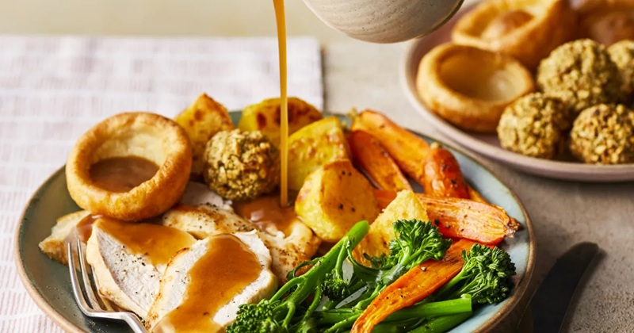

# Sunday Roast Chicken

*The full Sunday lunch: a butter-basted whole chicken with crisp skin, roast potatoes, Yorkshire puddings and pan gravy. The pub-roast template that builds week after week into a rotating set of muscle memories.*

**Serves:** 4-6

**Prep Time:** 25 minutes

**Cook Time:** 1 ¼ hours

## Overview
The British Sunday lunch, the meal that anchors the week for any household that still observes it. You rub a 1.6 kg bird with herb butter pushed under the skin, roast it hot for fifteen minutes to crisp the skin, then drop the temperature to finish through gently. The components time off the chicken's resting period: roast potatoes parboil and rough up before going into hot goose fat, Yorkshire puddings rise in screaming-hot tins of dripping, pan juices deglaze into gravy, peas warm at the last minute. The chicken comes out of the oven first, rests under a foil tent for fifteen minutes while everything else times in, then carves at the table while someone else stirs the gravy. Eat slowly, with horseradish or a wedge of lemon on the side, and seconds expected.

## Ingredients

### Chicken
- 1600 g whole chicken
- 75 g unsalted butter (softened)
- 2 garlic cloves (crushed)
- 1 tablespoon fresh thyme leaves
- 1 lemon (halved)
- salt
- pepper

### Roast potatoes
- 1 kg Maris Piper potatoes (peeled, halved)
- 4 tablespoons goose fat (or beef dripping)
- Sea salt

### Yorkshire puddings (makes 8)
- 140 g plain flour
- 4 eggs (large)
- 200 ml whole milk
- ½ teaspoon salt
- 4 tablespoons vegetable oil

### Gravy
- Roasting tray juices
- 1 tablespoon plain flour
- 300 ml chicken stock
- 1 teaspoon Dijon mustard

## Method

### Stage 1 - Prep and roast the chicken
1. Heat the oven to 220°C (200°C fan).
1. Mash the butter with the garlic, thyme, salt and pepper. Loosen the skin over the breast and push half the butter underneath; smear the rest on the skin.
1. Pop the lemon halves in the cavity.
1. Place breast-up in a roasting tin and roast for 20 minutes.
1. Drop the oven to 180°C (160°C fan) and roast another 55-65 minutes (or until a probe in the thigh reads 75°C and juices run clear; allow longer for a colder-from-fridge bird).
1. Lift the chicken to a board, loosely cover, and rest 20 minutes. Crank the oven back up to 220°C (200°C fan) for the potatoes and Yorkshires.

### Stage 2 - Roast potatoes
1. Boil the potatoes in salted water for 8 minutes. Drain and shake hard in the colander to rough up the edges.
1. About 50 minutes before the chicken is due out, heat the goose fat in a roasting tin alongside the chicken (180°C is fine for this stage). Once the chicken comes out and the oven is up to 220°C, the fat will come to smoking heat in a few more minutes.
1. Tip the potatoes into the hot fat, turn to coat, and roast at 220°C for 40-45 minutes, turning twice, until deeply golden.
1. Salt as soon as they come out.

### Stage 3 - Yorkshires
1. Whisk the flour, eggs, milk and salt to a smooth batter; rest 30 minutes (do this earlier).
1. Distribute the oil between 8 muffin-tray cups (½ teaspoon each). Heat in a 220°C (200°C fan) oven until smoking.
1. Pour batter into each cup until two-thirds full. Bake 18-20 minutes WITHOUT opening the oven, until risen and deep golden.
1. Slot these in once the chicken is resting and the potatoes are nearly done.

### Stage 4 - Gravy
1. Pour off most of the chicken-tin fat, leaving the brown juices.
1. Place the tin over medium heat. Sprinkle the flour over and stir for 1 minute.
1. Pour in the stock gradually, scraping the base. Add the mustard, simmer 5 minutes, season, strain into a jug.

### Stage 5 - Serve
1. Carve the chicken: legs first, then breasts off the bone, sliced.
1. Plate up with potatoes, Yorkshires and a generous slick of gravy. Serve greens alongside.

## Notes
- **Butter under the skin:** Insulates the breast meat from the dry heat; keeps it juicy.
- **Don't carve straight from the oven:** A 20-minute rest lets the juices redistribute; carving early gives dry meat in a wet plate.
- **Smoking-hot fat for both spuds and Yorkshires:** Cold fat steams the potatoes and prevents the puddings rising.

## Storage
- Leftover chicken keeps 3 days refrigerated; great in sandwiches, salads or curries.
- Roast potatoes don't reheat well; eat them.
- Gravy keeps 3 days refrigerated, freezes 2 months.
