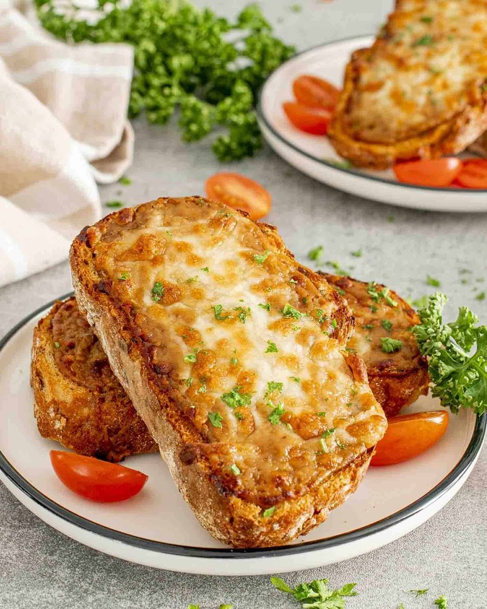

# Welsh Rarebit

*Properly built Welsh rarebit: a thick, savoury cheese sauce loosened with ale, sharpened with mustard and Worcestershire, then grilled until it puffs and blisters on toast. Not just cheese on toast.*

**Serves:** 2

**Prep Time:** 10 minutes

**Cook Time:** 10 minutes

## Overview
The Welsh take on cheese on toast, and a substantially better dish than the name suggests. You build a thick cheese sauce from a roux of butter and flour cooked together, ale and milk whisked in to loosen, then mature cheddar melted in with mustard and a hit of Worcestershire. The mixture should be thick enough to spread with a spoon, not pour. Pile it onto thick-cut toasted bread (white or wholemeal, never sourdough), and slide under a hot grill until the top is bubbling and freckled with gold. Eaten standing at the kitchen counter while it's still too hot, with a pickle or a glass of cold ale on the side. The Welsh have always taken cheese seriously; this is the simplest argument for why.

## Ingredients

- 4 slices sourdough (or good white bread)
- 30 g unsalted butter
- 30 g plain flour
- 100 ml ale (or whole milk for a softer flavour)
- 50 ml whole milk
- 250 g mature cheddar cheese (grated)
- 1 tablespoon English mustard
- 2 teaspoons Worcestershire sauce (vegetarian if needed)
- 1 egg yolk
- A grating of nutmeg
- Black pepper

## Method

### Stage 1 - Toast
1. Toast the bread until golden but not too dark; it gets a second hit under the grill.

### Stage 2 - Sauce
1. Melt the butter in a small saucepan over medium heat; whisk in the flour and cook 1 minute (no colour).
1. Whisk in the ale and milk; cook 2-3 minutes until thickened to a paste.
1. Off the heat, stir in the cheese, mustard, Worcestershire, egg yolk, nutmeg and black pepper. The mixture should be thick and spreadable.

### Stage 3 - Grill
1. Heat the grill to high.
1. Spread the cheese mixture thickly over the toast (right to the edges; the crusts will char nicely).
1. Grill 2-3 minutes until puffed, golden and blistered in spots.

## Notes
- **Thick is right:** A pourable rarebit slides off the toast. Pull the sauce off the heat the moment it stops being a paste; it firms further as the cheese melts in.
- **Egg yolk:** Adds richness and helps the surface puff under the grill. Don't skip it.
- **Vegetarian Worcestershire:** Most regular Worcestershire contains anchovy; check the label or use a vegetarian alternative.

## Storage
- Best eaten immediately. The sauce can be made an hour ahead and held off the heat; reheat gently with a splash of milk if it stiffens.
