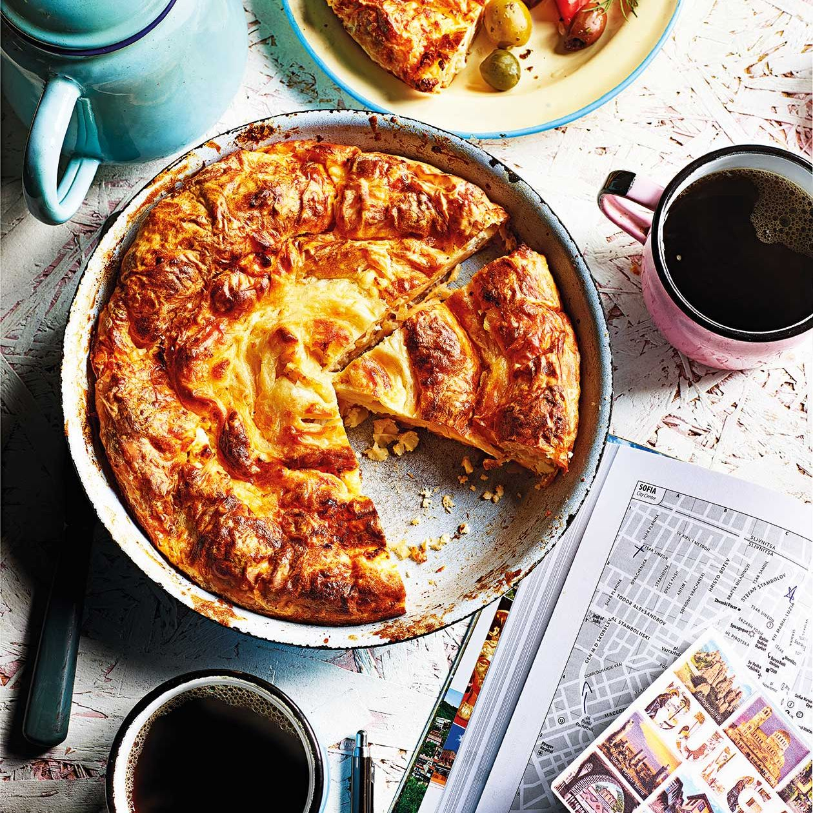

# Banitsa

*Bulgaria's morning pastry and celebration centrepiece: thin filo coiled with a sirene-egg-yoghurt filling and baked golden, eaten warm for breakfast with ayran or torn open at New Year for the fortune charm hidden inside.*

**Serves:** 8

**Prep Time:** 25 minutes

**Cook Time:** 40 minutes

## Overview
Banitsa is the pastry that wakes Bulgaria, a coil of thin filo sheets layered with crumbled sirene, beaten eggs and yoghurt, baked till the top is deep gold and the layers shatter under the knife. The home version is built fast: a sheet of filo brushed with oil, a scatter of cheese-and-egg filling, a tight roll, then coiled like a Catherine wheel into a round tin. The New Year banitsa (banitsa s kasmeti) hides small paper-wrapped fortunes inside the layers; whoever finds the one with "health" or "love" written on it carries it for the year. The Christmas version (banitsa s krasta) is round and divided into wedges for the family. The savoury cheese filling is the everyday default; sweet versions with pumpkin (tikvenik) or apple are the autumn variants. Eat warm with cold ayran from the fridge, the salty cheese against the salted yoghurt drink the Bulgarian breakfast contract.

## Ingredients

- 500 g filo pastry (about 12 to 14 sheets)
- 400 g Bulgarian sirene cheese (or feta), crumbled
- 4 large eggs
- 250 ml plain Bulgarian yoghurt (or full-fat Greek yoghurt)
- 100 ml sunflower oil, plus extra for brushing
- 1 tsp baking soda
- A generous pinch of fine salt
- 30 g butter, melted (for the top)

## Method

### Stage 1 - Make the filling
1. Crumble the sirene into a wide bowl.
2. Beat the eggs lightly with a fork in a separate bowl.
3. Stir the yoghurt and baking soda together (the soda will foam against the acidity).
4. Combine all three with a small pinch of salt; the filling should be thick and lumpy, not smooth.

### Stage 2 - Coil the banitsa
1. Heat the oven to 180°C; oil a round 28 cm cake tin or shallow baking dish.
2. Lay one filo sheet flat; brush lightly with sunflower oil.
3. Spoon a long line of filling along one long edge.
4. Roll up loosely into a thin sausage (the filling pokes through; that is correct).
5. Coil the first sausage in the centre of the tin like a snail.
6. Repeat with the remaining filo sheets, joining each new coil to the end of the last one, working outward until the tin is full.
7. Brush the whole surface with melted butter, then with a few spoonfuls of plain yoghurt thinned with water (the glaze).

### Stage 3 - Bake
1. Bake at 180°C for 35 to 40 minutes until deep gold and crisp on top.
2. Cover with a clean tea towel for 10 minutes after baking (the steam softens the top slightly; this is the Bulgarian way).
3. Cut into wedges and serve warm.

## Notes
- **The yoghurt:** thick Bulgarian yoghurt is correct. Greek yoghurt strained at home is the substitute.
- **The cheese:** must be salty enough; if using a mild feta, add an extra pinch of salt to the filling.
- **The filo:** keep covered with a damp tea towel while you work; it dries and cracks in minutes.
- **The coil:** loose coils give better layers; do not pack tight.
- **The tea-towel rest:** the post-bake cover is the Bulgarian step that softens the very top crust just enough; do not skip it.

## Variations
- **Banitsa s kasmeti (New Year fortune banitsa):** wrap small paper fortunes in foil and tuck between the coils before baking.
- **Tikvenik (sweet pumpkin banitsa):** see the desserts section; filled with grated pumpkin, walnut and sugar.
- **Banitsa s lapad (sorrel banitsa):** spring version filled with wilted sorrel leaves and cheese.
- **Banitsa s leek (banitsa s praz):** sautéed leek folded into the cheese filling.
- **Tutmanik:** the rolled-bread cousin, made with leavened dough instead of filo.

## Serving
Warm for breakfast with cold ayran · cut into wedges for an afternoon snack with sweet tea · the centre of the New Year table · with shopska salata and a glass of rakia for a light supper · room temperature in a picnic basket.

## Storage
- Keeps 2 days at room temperature wrapped in a tea towel.
- Refrigerate up to 4 days; reheat in a 160°C oven for 8 minutes to crisp the top.
- Freezes uncooked: assemble in the tin, wrap, freeze; bake from frozen at 170°C for 55 minutes.
