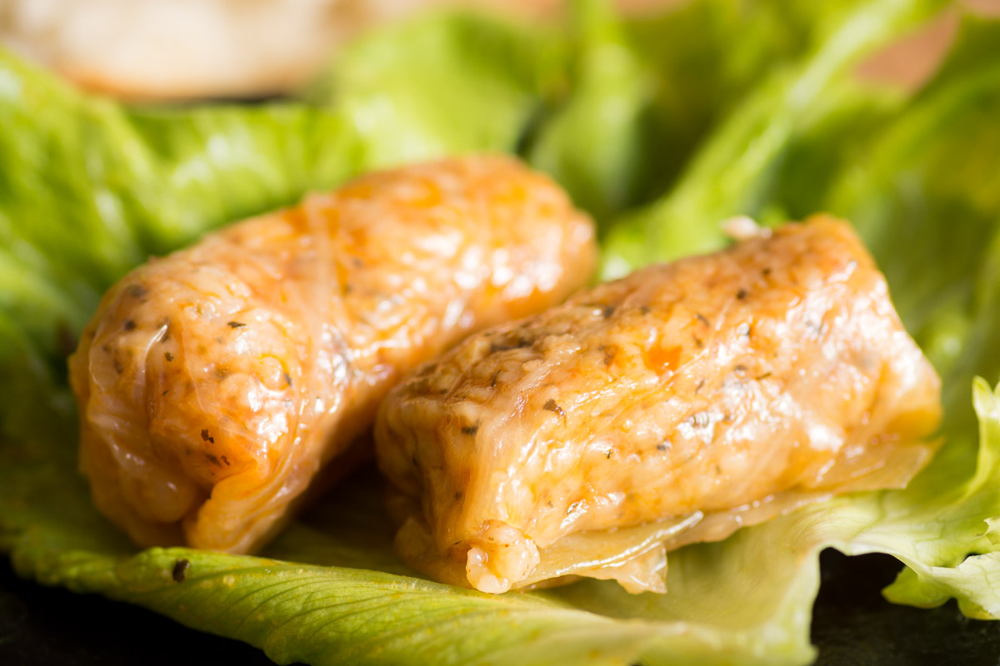

# Bulgarian Sarmi

*Cabbage leaves rolled around pork mince, rice and savory, layered in a heavy pot over a bed of bacon and slow-stewed in tomato until the leaves turn soft and the rolls fall apart on the fork.*

**Serves:** 6

**Prep Time:** 45 minutes

**Cook Time:** 2 hours

## Overview
Sarmi are the small green parcels every Bulgarian household builds for Christmas Eve, New Year and any cold Sunday in between, the soul food of the long winter. The leaves come from a whole salted cabbage (kiselo zele) that has been souring in a barrel since October, the sour leaf the whole point of the dish; in summer the fresh-cabbage version is the lighter cousin (the vine-leaf version called sarmi s lozovi listi is the third). The filling is pork mince loosened with cold rice, onion, paprika and a serious hit of dried savory (chubritsa) so the parcels smell like the Rhodope hills as they cook. The pot is layered: bacon on the bottom, sarmi packed tight in concentric rings, a tomato-and-stock liquor poured over, then a plate weighted on top so the rolls do not unwind. Two hours at low heat and the cabbage turns soft, the rice plumps, the pork goes tender, the whole pot smells of the country in winter.

## Ingredients

- 1 whole soured cabbage (about 1.5 kg) or 1 large fresh white cabbage
- 500 g minced pork (or pork-and-veal mix)
- 150 g long-grain white rice
- 2 large onions, finely chopped
- 100 g smoked bacon, in strips
- 3 garlic cloves, finely chopped
- 3 tbsp tomato puree
- 400 g chopped tomatoes (1 tin)
- 500 ml chicken or pork stock
- 3 tbsp sunflower oil
- 1 tbsp sweet paprika
- 1 tbsp dried savory (chubritsa)
- 2 bay leaves
- 1 tsp fine sea salt
- Black pepper
- Plain yoghurt, to serve

## Method

### Stage 1 - Prepare the leaves
1. If using soured cabbage, separate the leaves; rinse briefly in cold water if very salty.
2. If using fresh cabbage, core it; lower the whole head into a big pot of boiling salted water for 5 minutes; peel off the softened outer leaves; lower the head back in to soften the next layer; repeat until you have about 20 large leaves.
3. Pare the thick rib down the centre of each leaf so the leaf rolls flat.

### Stage 2 - Make the filling
1. Heat 2 tbsp of the sunflower oil in a pan; cook the onion 6 minutes until soft.
2. Add the garlic for the last minute; pull the pan off the heat and stir in the paprika.
3. Tip into a large bowl; cool 5 minutes.
4. Add the minced pork, rice, savory, salt and pepper; mix with your hands until even.

### Stage 3 - Roll the sarmi
1. Lay a cabbage leaf flat on the board, rib-end nearest you.
2. Place a small spoonful (about 30 g) of filling on the rib end.
3. Fold the rib end over the filling, fold the sides in, roll up into a tight little cigar.
4. Repeat with the rest; you should have 18 to 20 rolls.

### Stage 4 - Layer and stew
1. Heat the remaining 1 tbsp oil in a heavy casserole; scatter the bacon strips across the bottom.
2. Pack the sarmi tightly seam-down in concentric circles on top of the bacon.
3. Mix the tomato puree, chopped tomatoes, stock, bay leaves and a grind of pepper; pour over the rolls; the liquid should come halfway up.
4. Set a heatproof plate upside down on top of the rolls (to hold them under during cooking).
5. Bring to a gentle simmer; cover and transfer to a 150°C oven (or lowest hob ring).
6. Cook 1 hour 45 minutes to 2 hours, until the rice inside is fully soft and the cabbage falls apart at the touch of a fork.
7. Rest covered 15 minutes before serving.

## Notes
- **The cabbage:** soured cabbage is the proper version; fresh cabbage blanched in boiling water is the everyday substitute.
- **The savory:** chubritsa is the Bulgarian signature; do not skip. Substitute summer savory or a mix of thyme and oregano.
- **The weight:** the upside-down plate stops the rolls floating up and unwinding; do not skip.
- **The rice:** raw rice goes in (it cooks inside the rolls); do not pre-cook.
- **The bacon:** smoked bacon at the bottom gives the dish the smoky depth that defines the country version.

## Variations
- **Sarmi s lozovi listi (vine leaf sarmi):** small finger-sized rolls in vine leaves; lemon-juice finish, no smoked bacon.
- **Vegetarian sarmi (postni sarmi):** the Christmas Eve fasting version; rice with mushroom, onion and dill, no meat, no bacon.
- **Sarmi with beef:** half pork, half beef mince.
- **Stuffed peppers (palneni chushki) in the same style:** the same filling stuffed into capia peppers.
- **Sarmi in clay pot:** baked in individual gyuvech pots with a clove of garlic in each.

## Serving
- In a wide bowl with a spoonful of the cooking liquor · with a dollop of cold yoghurt on top · with country bread to mop the sauce · with a small glass of chilled rakia on the side · as the centre of the Christmas Eve table · with a sprinkle of fresh parsley.

## Storage
- Refrigerate up to 5 days; the flavour deepens overnight.
- Freezes 3 months; thaw overnight in the fridge and reheat covered.
- Reheat gently in a 150°C oven for 25 minutes or on the hob with a splash of stock.

