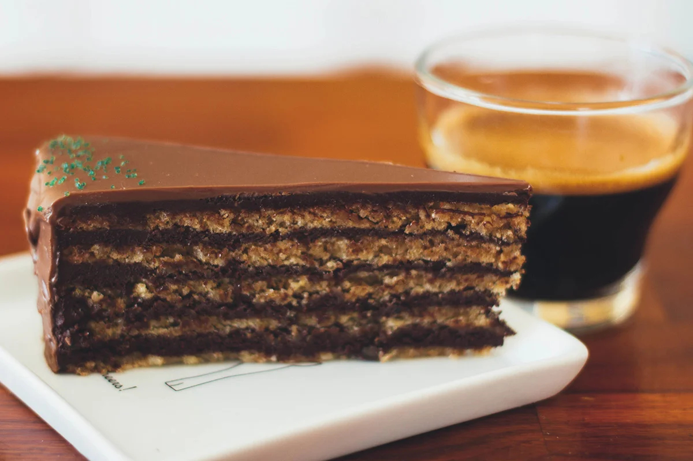

# Garash Cake (Garash Torta)

*The Bulgarian celebration cake: thin walnut sponge layers (no flour, just ground walnut and egg) bound with dark chocolate ganache and topped with a shining chocolate mirror glaze, the patisserie pride of Sofia since the 1880s.*

**Serves:** 12

**Prep Time:** 1 hour

**Cook Time:** 50 minutes (plus 4 hours chilling)

## Overview
Garash torta carries a Hungarian baker's name (Kosta Garash, who set up shop in the Bulgarian capital in the 1880s after training in Vienna) but it is the cake the whole country claims as its own, the centrepiece of every birthday and name day in Sofia for a hundred and forty years. The construction is a deliberate excess: five or six wafer-thin walnut sponge layers (made with no flour at all, just finely ground walnuts folded into a whisked-egg meringue) sandwiched with a dark chocolate ganache, the whole thing coated in more chocolate and finished with a shining chocolate mirror glaze that sets to a dark mirror. Half walnut, half chocolate, with the gentle bitterness of a strong coffee on the side. The cake needs four hours in the fridge before slicing so the layers settle into the ganache; cut with a hot wet knife into very thin wedges so the small richness goes far.

## Ingredients

### For the walnut layers (makes 5)
- 250 g shelled walnuts
- 8 large egg whites
- 200 g caster sugar
- 1 tsp vanilla extract
- A pinch of salt

### For the chocolate ganache
- 300 g dark chocolate (70%), chopped
- 300 ml double cream
- 50 g unsalted butter, soft
- 2 tbsp brandy or rum (optional)

### For the mirror glaze
- 150 g dark chocolate
- 100 ml double cream
- 30 g unsalted butter
- 1 tbsp golden syrup

### To finish
- 50 g walnut halves

## Method

### Stage 1 - The walnut layers
1. Heat the oven to 160°C; line a baking tray with paper; mark a 22 cm circle on the back of the paper.
2. Pulse the walnuts in a food processor to a fine meal (not so far that they turn to paste).
3. Whisk the egg whites with the salt to soft peaks; add the sugar a spoonful at a time, whisking to a stiff glossy meringue.
4. Fold in the vanilla and the ground walnut in three additions; the meringue will deflate slightly; this is correct.
5. Spread a thin layer of batter (about 80 g) over the marked circle.
6. Bake 10 minutes until pale gold and just set.
7. Slide off the paper; cool flat on a wire rack.
8. Repeat with the rest of the batter to make 5 layers.

### Stage 2 - The ganache
1. Bring the cream just to the boil; pour over the chopped chocolate.
2. Wait 1 minute, then stir smooth from the centre outward.
3. Stir in the soft butter and the brandy if using.
4. Cool to room temperature, then chill for 30 minutes until thick and spreadable but not set.

### Stage 3 - Assemble
1. Set a walnut layer on a flat cake plate.
2. Spread with a fifth of the ganache.
3. Top with a second layer; press lightly; spread with another fifth of ganache.
4. Repeat with the remaining layers, finishing with a layer on top.
5. Use the last of the ganache to coat the sides and top in a thin even layer.
6. Refrigerate 1 hour to set the coat.

### Stage 4 - The mirror glaze
1. Combine the chocolate, cream, butter and syrup in a small pan.
2. Warm over very low heat, stirring, until smooth and shining.
3. Cool to a thick pourable consistency (about 35°C).
4. Pour over the centre of the chilled cake; tilt the cake gently so the glaze runs to the edges and down the sides.
5. Decorate with walnut halves around the top edge.
6. Refrigerate 3 hours before slicing.

## Notes
- **The walnut meal:** pulse, do not blitz. Powdered walnut goes oily and ruins the layers.
- **The layers:** spread very thin; thicker layers turn cakey instead of crisp.
- **The ganache temperature:** cool the ganache before spreading; warm ganache slips off the layers.
- **The glaze temperature:** 35°C is the right pour temperature; cooler and it sets before it spreads, warmer and it pours through.
- **The slice:** dip a heavy knife in hot water, wipe, slice, wipe, repeat. Cold dry knife splinters the glaze.

## Variations
- **With coffee:** add 1 tbsp strong cold espresso to the ganache.
- **With hazelnut:** swap half the walnut for ground hazelnut.
- **Garash with rum syrup:** brush each layer with rum syrup before the ganache (the moister version).
- **Mini garash:** assemble as 8 cm individual rounds for tea-party portions.
- **Garash with caramel band:** a thin band of soft caramel between two of the middle layers.

## Serving
A small thin wedge with a strong Bulgarian coffee · with a glass of Mavrud red wine after dinner · at every Sofia birthday · on a name-day plate at noon · with a dab of unsweetened whipped cream on the side · with a Bulgarian rose-water petit four alongside.

## Storage
- Refrigerate up to 5 days in a covered container; the glaze keeps its shine.
- Bring to cool room temperature 30 minutes before serving (cold from the fridge dulls the walnut flavour).
- The unfrosted layers freeze 1 month between sheets of paper; thaw and assemble.

