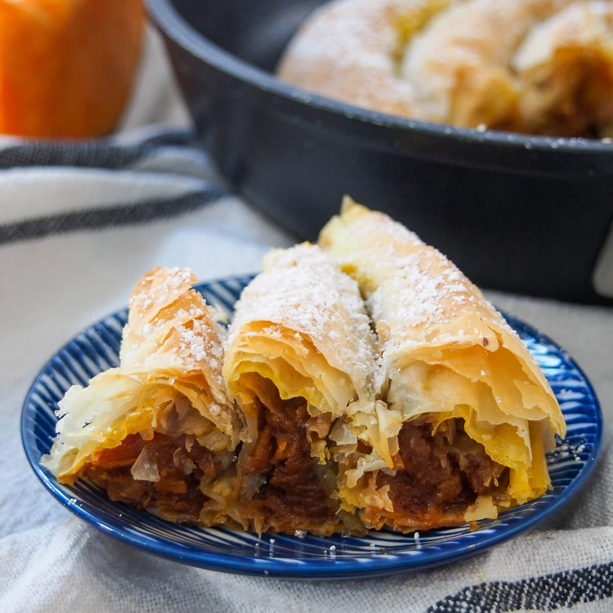

# Tikvenik

*The sweet sister of banitsa: thin filo coiled with grated pumpkin, chopped walnut, cinnamon and sugar, baked till the layers shatter and dusted with icing sugar, the Bulgarian autumn pastry that lasts till Christmas Eve.*

**Serves:** 8

**Prep Time:** 30 minutes

**Cook Time:** 40 minutes

## Overview
Tikvenik is the autumn pastry that arrives in Bulgarian households the week the first frosts cut the last melons and the orange-fleshed winter pumpkin (tikva) is split, baked and grated for the larder. It is the sweet first cousin of banitsa, built the same way (long thin filo sheets, oiled, filled, rolled, coiled into the tin), but with a filling of grated pumpkin sweated dry with sugar, scattered chopped walnut, cinnamon and a pinch of clove. The Christmas Eve table (badni vecher, the fasting meal of seven dishes) takes a vegan tikvenik with sunflower oil only and no eggs; the everyday version uses butter on top for richness. Eat warm with a coffee, or cold at midnight with a glass of mulled red. The trick is to drive the water out of the pumpkin in the pan before it goes near the filo, or the pastry steams instead of crisps.

## Ingredients

- 500 g filo pastry (about 12 to 14 sheets)
- 800 g winter pumpkin or butternut squash, peeled and coarsely grated
- 120 g caster sugar, plus extra for sprinkling
- 100 g shelled walnuts, finely chopped
- 1.5 tsp ground cinnamon
- 1/4 tsp ground clove
- 1/2 tsp grated nutmeg
- 100 ml sunflower oil, plus extra for brushing
- 30 g butter, melted (omit for fasting version)
- 2 tbsp icing sugar, for dusting
- Optional: 50 ml dark rum or brandy

## Method

### Stage 1 - Cook the pumpkin
1. Heat 1 tbsp of the sunflower oil in a wide pan over medium heat.
2. Add the grated pumpkin; sprinkle with the sugar.
3. Cook 12 to 15 minutes, stirring often, until the pumpkin is soft and most of the water has cooked off; the mixture should be jam-like, not wet.
4. Stir in the cinnamon, clove, nutmeg, chopped walnut and rum if using.
5. Tip onto a plate; cool 10 minutes (the filling must be cool, not hot, before it touches filo).

### Stage 2 - Coil the tikvenik
1. Heat the oven to 180°C; oil a round 28 cm tin or shallow baking dish.
2. Lay one filo sheet flat; brush lightly with sunflower oil.
3. Spoon a long line of pumpkin filling along one long edge.
4. Roll up loosely into a thin sausage.
5. Coil the first sausage in the centre of the tin like a snail.
6. Repeat with the remaining filo sheets, joining each new coil to the end of the last one, working outward until the tin is full.
7. Brush the top with melted butter (or more sunflower oil for the fasting version).

### Stage 3 - Bake and finish
1. Bake at 180°C for 35 to 40 minutes until the top is deep gold and the layers feel crisp.
2. Sprinkle the hot pastry with a tablespoon of caster sugar.
3. Cover with a clean tea towel for 10 minutes after baking (the steam softens the top crust to the proper banitsa-style finish).
4. Dust with icing sugar just before serving.
5. Cut into wedges and serve warm or cold.

## Notes
- **The pumpkin water:** drive it out fully in the pan; wet filling collapses the layers.
- **The cool-down:** the filling must be at room temperature before it touches filo or the pastry tears.
- **The filo:** keep covered with a damp tea towel while you work; it dries in minutes.
- **The fasting version:** sunflower oil only, no butter, no egg wash. The Christmas Eve standard.
- **The tea-towel rest:** standard banitsa-family step; do not skip.

## Variations
- **With raisin:** stir 80 g raisins into the filling.
- **With apple:** half pumpkin, half coarsely grated apple.
- **With orange zest:** the zest of one orange added to the filling (the modern Sofia version).
- **With sesame:** a sprinkle of sesame seeds across the top before baking.
- **Sirene-and-pumpkin tikvenik:** the sweet-savoury hybrid from the Rhodopes, with crumbled sirene added to the filling.

## Serving
- Warm with a strong Bulgarian coffee · cold with a glass of mulled red at midnight · the Christmas Eve table in a wedge alongside the boiled wheat (zhito) · with a dollop of plain yoghurt on the side · with a thread of honey for an everyday breakfast · cut small for a Sunday tea board.

## Storage
- Keeps 3 days at room temperature wrapped in a tea towel.
- Refrigerate up to 5 days; reheat in a 160°C oven for 8 minutes.
- Freezes uncooked: assemble in the tin, wrap, freeze; bake from frozen at 170°C for 55 minutes.

