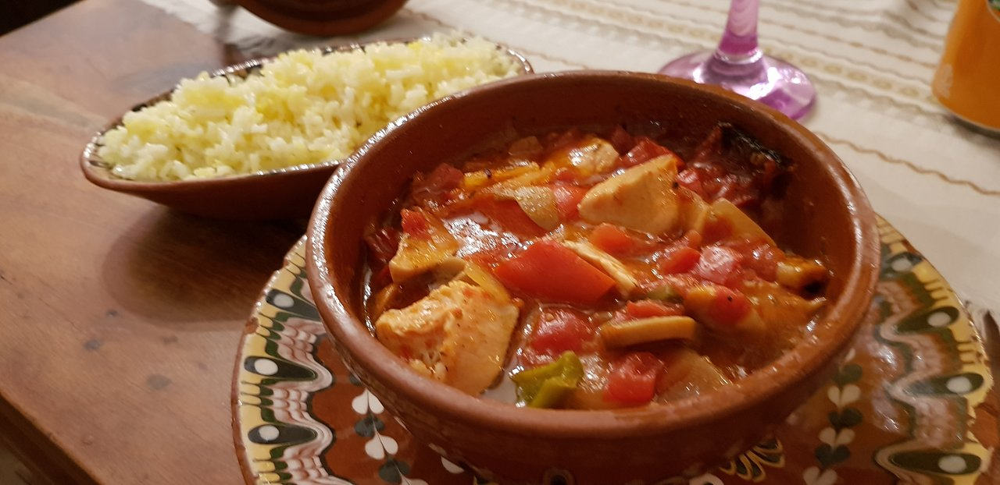

# Kavarma

*The long slow pork-and-vegetable stew of the Rhodope villages: pork shoulder browned with onion, paprika and savory, simmered for hours in a clay pot with peppers, tomato and mushroom until the meat falls into shreds.*

**Serves:** 4

**Prep Time:** 25 minutes

**Cook Time:** 2 hours

## Overview
Kavarma is the Bulgarian winter stew that lives in the small clay pots called gyuvech, baked for hours in the village oven until the pork goes soft enough to break with the spoon. The word kavarma comes from the Turkish kavurma (to fry slow), and the method is the same all the way down: pork shoulder cubed and browned hard, onions sweated in the same pot, sweet paprika stirred in off the heat (never let it burn), wine and tomato added, then peppers, mushrooms and the famous Bulgarian savory called chubritsa, the herb that smells like a cross between thyme and oregano. The pot goes into a low oven for two hours; the lid traps the steam; the pork shreds into the dark red sauce. In Plovdiv it is served in individual clay pots with an egg cracked on top in the last five minutes; in the Rhodope mountains it is served from a big pot with bread and a glass of red Mavrud wine.

## Ingredients

- 800 g pork shoulder, cut into 3 cm cubes
- 2 large onions, finely chopped
- 4 garlic cloves, finely chopped
- 2 red bell peppers, thick strips
- 300 g chestnut mushrooms, halved
- 400 g chopped tomatoes (1 tin)
- 200 ml dry red wine
- 200 ml chicken stock or water
- 3 tbsp sunflower oil
- 2 tbsp sweet paprika
- 1 tsp hot paprika
- 1 tbsp dried savory (chubritsa) or oregano
- 2 bay leaves
- 1 tsp fine sea salt
- Black pepper
- 4 eggs (optional, for the Plovdiv finish)
- Chopped parsley to serve

## Method

### Stage 1 - Brown the pork
1. Heat the sunflower oil in a heavy casserole over medium-high heat.
2. Pat the pork cubes dry; season with salt and pepper.
3. Brown the pork in batches on all sides, about 4 minutes per batch; lift out and set aside.

### Stage 2 - Build the base
1. Lower the heat; add the onions to the same pot.
2. Cook 8 minutes until soft and pale gold; add the garlic for the last minute.
3. Pull the pot off the heat; stir in the sweet and hot paprika (off the heat keeps the paprika from burning bitter).
4. Return to medium heat; add the red wine and let it bubble for 2 minutes.
5. Stir in the chopped tomatoes, stock, bay, savory and a good grind of pepper.
6. Return the browned pork and any juices to the pot.

### Stage 3 - Slow simmer
1. Bring to a gentle simmer; cover and transfer to a 150°C oven (or keep on the lowest hob ring).
2. Cook 1 hour; stir in the pepper strips and mushrooms.
3. Cover and cook a further 45 to 60 minutes until the pork is soft enough to break with a spoon and the sauce has thickened.
4. Taste for salt.

### Stage 4 - The Plovdiv egg finish (optional)
1. Divide the stew between four oven-proof clay pots or ramekins.
2. Crack an egg on top of each.
3. Slide under a hot grill for 3 to 4 minutes until the white is just set.
4. Scatter with chopped parsley and bring to the table at once.

## Notes
- **The paprika trick:** always stir paprika in off the heat; on the heat it scorches and turns the whole pot bitter.
- **The herb:** dried savory (chubritsa) is the Bulgarian signature; oregano and thyme together are the substitute.
- **The clay pot:** an unglazed clay gyuvech holds heat better than cast iron and is traditional; a Dutch oven is the modern stand-in.
- **The wine:** a Bulgarian Mavrud is the ideal pour; any dry red works.
- **Pork shoulder:** the fat and collagen are what make the long cook work; do not use lean cuts.

## Variations
- **Pileshka kavarma (chicken kavarma):** same construction with chicken thighs; cook 45 minutes total.
- **Kavarma with rabbit:** classic in the Strandzha mountains; jointed rabbit, longer cook.
- **Kavarma with veal (telezhka kavarma):** veal shoulder, lighter colour, longer cook.
- **Vegetarian kavarma:** mushrooms, peppers, courgette and aubergine in the same sauce; 45 minutes total.
- **Plovdivska kavarma:** the individual clay-pot version with egg on top.

## Serving
In small clay pots straight from the oven · with crusty country bread to mop the sauce · alongside shopska salata · with a glass of Bulgarian Mavrud or any dry red · with boiled potatoes or buttered rice · sprinkled with fresh parsley.

## Storage
- Refrigerate up to 4 days; the flavour improves on the second day.
- Freezes 3 months; thaw and reheat gently with a splash of water.
- Reheat covered at 150°C for 20 minutes or on the hob over low heat.

