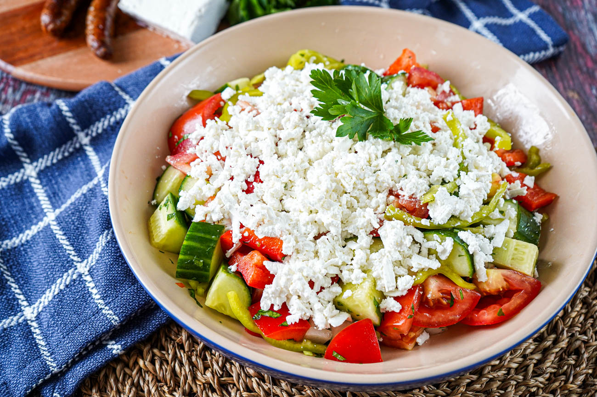

# Shopska Salata

*Bulgaria's national salad and the first plate set down at any table: tomato, cucumber, onion, roasted pepper and parsley, hidden under a snowy mound of grated sirene cheese in the colours of the country's flag.*

**Serves:** 4

**Prep Time:** 20 minutes

**Cook Time:** 10 minutes (for the pepper)

## Overview
Shopska salata is the dish every Bulgarian meal begins with, the small first plate that arrives with the rakia before anything else hits the table. The story attaches it to the Shopi people of the Sofia plain, though the modern construction (with the white-green-red of the flag deliberately quoted in the cheese, cucumber, tomato) was codified in the 1950s by the Balkantourist hotel chain as the country's calling card. The vegetables are diced (not sliced), dressed simply with sunflower oil, red wine vinegar and salt, and topped at the last moment with a thick blanket of grated Bulgarian sirene cheese, the salty crumbly brined sheep cheese closely related to Greek feta but firmer and sharper. A roasted-and-peeled red pepper underneath is the proper version; a chopped chilli on top is the Sofia touch. Eat with rakia, with bread, with everything that follows.

## Ingredients

- 4 ripe tomatoes (about 500 g), large dice
- 1 cucumber (about 300 g), large dice
- 1 small red onion, finely chopped
- 1 large red bell pepper
- 200 g Bulgarian sirene cheese (or feta), coarsely grated
- 1 small bunch flat-leaf parsley, chopped
- 3 tbsp sunflower oil
- 1 tbsp red wine vinegar
- 1/2 tsp fine sea salt
- Black pepper to taste
- Optional: 1 small fresh green chilli, sliced

## Method

### Stage 1 - Roast the pepper
1. Set the bell pepper directly over a gas flame, under a hot grill, or in a 220°C oven; turn until the skin is blackened on all sides (8 to 10 minutes).
2. Drop the hot pepper into a bowl and cover with a plate; steam 5 minutes.
3. Slip the blackened skin off, pull the stem and seeds out, tear the flesh into thick strips.

### Stage 2 - Build the salad
1. Combine the diced tomato, cucumber, onion and roasted pepper strips in a wide shallow bowl.
2. Scatter the chopped parsley over the top.
3. Whisk the sunflower oil with the red wine vinegar and salt; pour over the vegetables and toss gently.
4. Grate the sirene over the top in a thick mound that covers the whole surface (the look is a snow cap on a green-and-red hill).
5. Grind black pepper over; lay the chilli rings on top if using.
6. Bring straight to the table; let everyone scoop down through the cheese into the vegetables.

## Notes
- **The cheese:** Bulgarian sirene is firmer and saltier than Greek feta; feta is the closest substitute. Crumble or grate by hand; do not buy pre-crumbled.
- **The pepper:** the roasted-and-peeled pepper is the proper construction. Raw chopped bell pepper is the modern shortcut and acceptable in a hurry.
- **The dice:** vegetables are diced (about 1.5 cm cubes), not sliced. The fork needs to pick up all the colours together.
- **The cheese cap:** grate the cheese at the last moment so it sits high and dry on top; do not stir it in.
- **The oil:** sunflower oil is traditional; olive oil is the modern substitute and works.

## Variations
- **Shopska with raw pepper:** skip the roasting, dice a raw red pepper in with the rest.
- **Shopska with egg (Shopska s yaytse):** a sliced hard-boiled egg layered between vegetables and cheese.
- **With olives:** a handful of black olives scattered on top (Black Sea coast version).
- **With grilled cheese (Shopska na ploshcha):** the cheese is grilled briefly on top to soften.
- **With kashkaval:** half sirene, half grated kashkaval (yellow cheese) for a richer cap.

## Serving
The first plate of any meal · with a glass of cold rakia · with a basket of country bread · before kavarma, sarmi or grilled kebapcheta · on a hot summer afternoon with nothing else.

## Storage
- Eat the day it is made; the salt pulls water from the tomato and cucumber within hours.
- Dress the vegetables only at the moment of serving if making ahead.
- The cheese cap should never be applied until the table is set.
