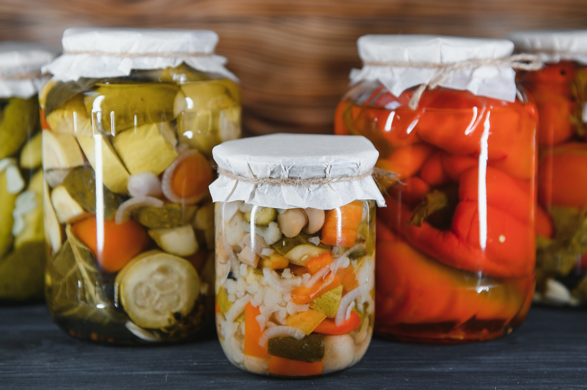

# Kashkaval Pickle (Pane-Fried Kashkaval with Garlic)

*The Bulgarian pub plate at its most reliable: thick slabs of kashkaval cheese egged, crumbed and shallow-fried gold, dressed with crushed garlic and a slick of butter, eaten hot with bread and a cold beer.*

**Serves:** 4

**Prep Time:** 15 minutes

**Cook Time:** 10 minutes

## Overview
Kashkaval pane (the everyday name on every mehana menu in Sofia) is fried cheese pulled into the realm of a small meal: the firm yellow kashkaval (the same family as Romanian cașcaval and Italian caciocavallo) is cut thick, dipped in flour, beaten egg and breadcrumbs, then fried in sunflower oil until the crust is a dark gold and the inside has just started to ooze. The Bulgarian touch is the garlic-butter dressing poured over the slices the moment they leave the pan, melted butter stirred with crushed garlic and a few flakes of parsley so the cheese arrives at the table glossy and fragrant. It is the table snack the country builds an evening around, eaten with a slice of country bread, a glass of cold Bulgarian lager and a small bowl of lyutenitsa for dipping. The trick is the cheese: it must be firm and dry, never the soft melting kind, or the whole crust slides off into the oil.

## Ingredients

- 400 g kashkaval cheese (firm yellow sheep or cow cheese, in one piece)
- 60 g plain flour
- 2 large eggs, beaten with a fork
- 80 g fine dried breadcrumbs (or panko)
- 3 tbsp sunflower oil, for frying
- 30 g butter
- 3 garlic cloves, finely chopped or crushed
- Small handful flat-leaf parsley, chopped
- Black pepper
- Lemon wedges, to serve

## Method

### Stage 1 - Prepare the cheese
1. Slice the kashkaval into thick slabs, about 1.5 cm thick and the size of a small palm.
2. Set out three shallow plates: flour on one, beaten egg on the second, breadcrumbs on the third.
3. Pass each slab through flour first (tap off the excess), then egg, then breadcrumbs (press the crumbs on firmly so they stick).
4. Repeat the egg-and-crumb step a second time on each slab for a thicker crust (the Bulgarian double-crumb).

### Stage 2 - Fry
1. Heat the sunflower oil in a wide pan over medium heat.
2. Lower the slabs in (a generous splutter is the right sound).
3. Fry 90 seconds per side until the crust is a dark golden brown; the inside should be soft but not running.
4. Lift to a warm plate; do not drain on paper (the crust loses crispness).

### Stage 3 - The garlic butter
1. Wipe the pan; drop in the butter and let it foam.
2. Add the chopped garlic; swirl 20 seconds until fragrant but not browned.
3. Stir in the parsley and a grind of pepper.
4. Spoon the hot garlic butter over the fried cheese slabs while they are still steaming.
5. Bring to the table at once with a lemon wedge alongside.

## Notes
- **The cheese:** Bulgarian kashkaval is the right cheese. Substitutes in order of preference: Romanian cașcaval, Italian caciocavallo, Greek kefalotyri, a firm halloumi. Standard cheddar will melt out of the crust.
- **The double-crumb:** the second egg-and-crumb pass gives the proper crust that holds the cheese in.
- **The temperature:** medium heat, not high; high heat browns the crust before the inside softens.
- **The garlic step:** raw garlic in melted butter, not fried garlic; 20 seconds in the pan only.
- **The salt:** kashkaval is already salty; do not add salt to the crumb.

## Variations
- **Plain pane (no garlic):** just lemon and pepper; the cleaner version.
- **With honey:** a thread of honey instead of garlic butter (the modern Sofia bar version).
- **With lyutenitsa:** served with a spoonful of lyutenitsa on top instead of garlic butter.
- **Sirene pane:** the same technique with brined sirene cubes; smaller, saltier, served as a starter.
- **Baked version:** brushed with oil and baked at 220°C for 10 minutes; less greasy, less crisp.

## Serving
Hot from the pan with a lemon wedge · alongside a cold Bulgarian lager · with country bread to wipe the garlic butter · with a small bowl of lyutenitsa for dipping · with a shopska salad on the side · as the meze plate to a long evening.

## Storage
- Eat at once; fried cheese does not keep.
- Leftover slabs can be reheated 5 minutes in a 200°C oven; the crust softens.
- The breaded uncooked slabs freeze 1 month; fry from frozen, adding 30 seconds per side.
