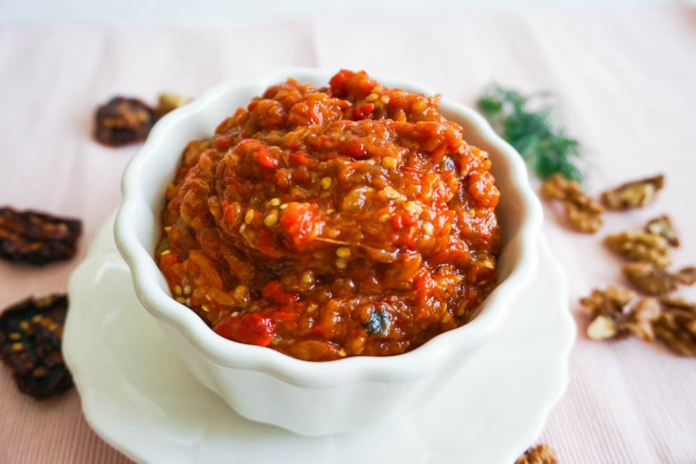

# Kyopolou

*The Bulgarian roasted aubergine-and-pepper spread: charred aubergine and red peppers chopped fine with garlic, parsley and vinegar, finished with sunflower oil, the smoky cold relish of the summer meze table.*

**Serves:** 6

**Prep Time:** 30 minutes

**Cook Time:** 40 minutes

## Overview
Kyopolou is the smoky aubergine-and-pepper salad that lands cold on every Bulgarian table next to the shopska salata in summer, a chunky, garlicky, dark-green-and-red mash of charred vegetables that gets better in the fridge overnight. The construction sounds like baba ganoush's Balkan cousin: aubergines and red peppers roasted whole until the skins blacken and the flesh collapses, then chopped fine on a board (never pureed) with garlic crushed to a paste, parsley, salt, vinegar and a generous slick of sunflower oil. The result is rough, dark, smoky and sharp, eaten on bread, with kashkaval, alongside fried fish or grilled meats. The version from the Strandzha region in the south-east adds tomato and walnut for richness; the Sofia table tends to keep it pure aubergine-and-pepper. It is the dish that proves the long Bulgarian fascination with what happens to a vegetable when you burn its skin off.

## Ingredients

- 800 g aubergine (2 large)
- 600 g red bell peppers (or capia peppers)
- 5 garlic cloves
- 1 tsp fine sea salt, plus more to taste
- 3 tbsp sunflower oil
- 2 tbsp red wine vinegar
- 1 small bunch flat-leaf parsley, finely chopped
- Black pepper to taste
- Optional: 1 tomato, finely diced (Strandzha style)
- Optional: 50 g chopped walnuts

## Method

### Stage 1 - Char the vegetables
1. Heat the oven to 230°C, or fire up an outdoor grill.
2. Prick the aubergines a few times with a knife; set them and the whole peppers on a tray.
3. Roast 35 to 40 minutes, turning once, until the skins are fully blackened and the flesh has collapsed (the aubergines should feel completely soft when poked).
4. Transfer hot to a covered bowl; steam 15 minutes (this makes peeling easier and pulls more smoke into the flesh).

### Stage 2 - Peel and chop
1. Slip the blackened skins off the peppers; remove stems and seeds; do not rinse (you lose the smoke).
2. Slit the aubergines lengthwise; scoop the flesh into a colander; press gently with the back of a spoon to drain the bitter dark juice for 10 minutes.
3. Tip the pepper flesh and drained aubergine flesh onto a large board.
4. Chop both finely with a heavy knife; aim for a coarse confetti, not a paste.

### Stage 3 - Build the salad
1. Crush the garlic with the salt in a mortar to a smooth paste.
2. Scrape the chopped vegetables into a wide bowl; stir in the garlic paste.
3. Add the chopped parsley, vinegar and sunflower oil; stir well.
4. Stir in the diced tomato and walnut if using.
5. Taste; adjust salt, pepper and vinegar.
6. Cover and refrigerate at least 2 hours, ideally overnight.

## Notes
- **The char:** the skins must be fully blackened; pale grilled vegetables make a pale flat kyopolou.
- **The chop:** chopped, not pureed; a food processor wrecks the texture.
- **The aubergine drain:** the 10-minute drain pulls out the bitter brown juice; do not skip.
- **The garlic-and-salt paste:** crushed in a mortar so it dissolves through the salad; chopped garlic leaves chunks.
- **The overnight rest:** the salad needs at least 2 hours and is better the next day; the smoke and garlic settle.

## Variations
- **Strandzhanski kyopolou:** with diced tomato and chopped walnut stirred in.
- **With hot chilli:** a finely chopped fresh red chilli for a lyuta version.
- **With cumin:** a pinch of ground cumin (a Plovdiv-Turkish twist).
- **Without aubergine:** all-pepper version, sweeter and lighter.
- **With dill:** half the parsley swapped for dill (the seaside version from Burgas).

## Serving
- Cold from the fridge on country bread · alongside fried fish · with grilled kebapcheta and shopska salata · with crumbled sirene on top · on a meze board with kashkaval pane and lyutenitsa · with a glass of chilled rakia.

## Storage
- Refrigerate in a sealed jar up to 1 week; the flavour deepens.
- Top with a film of sunflower oil to keep the surface sealed.
- Freezes 3 months in small portions; thaw in the fridge.

