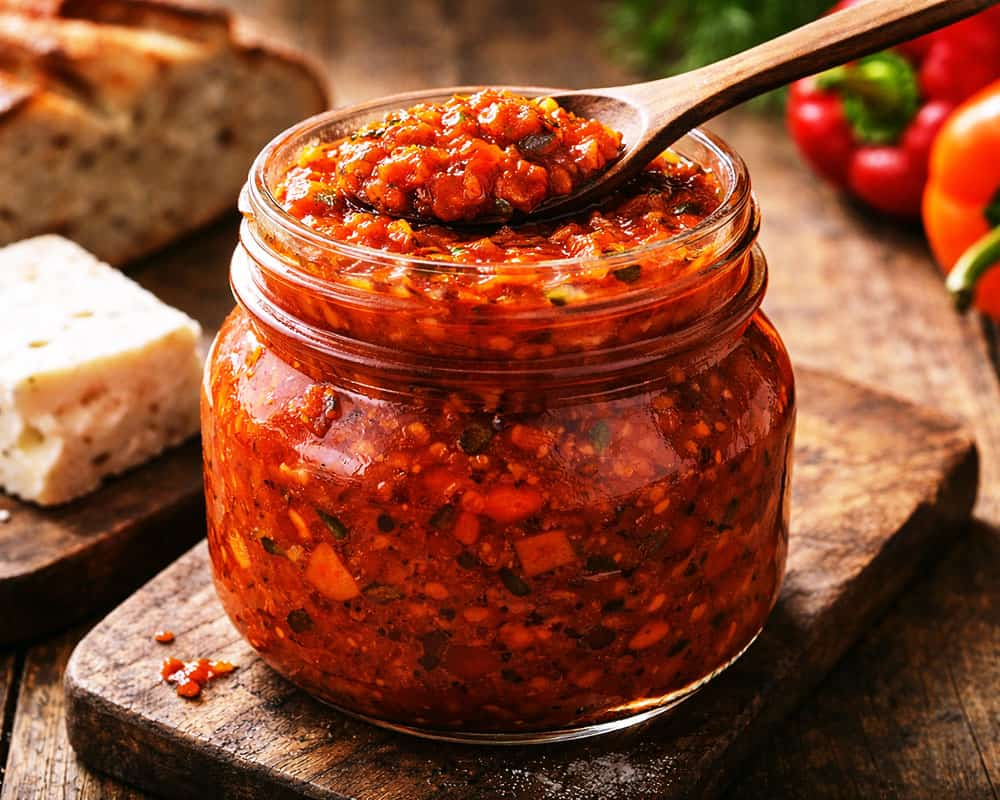

# Lyutenitsa

*The autumn red-pepper relish every Bulgarian kitchen cans by the case: roasted red peppers, aubergine, tomato and garlic, slow-cooked in sunflower oil until thick, dark and spreadable, the winter bread-topper of the whole country.*

**Serves:** Makes about 1.2 kg

**Prep Time:** 45 minutes

**Cook Time:** 2 hours

## Overview
Lyutenitsa is the Bulgarian winter pantry pillar, a thick crimson relish put down every September when the capia peppers come into the markets and the household oven smokes for a weekend straight roasting bushels of them. The construction is the Balkan cousin of Macedonian ajvar and Serbian pindjur: large fleshy red peppers and aubergines roasted whole, peeled, then chopped fine and slow-cooked with tomato, garlic and sunflower oil over the lowest heat for two hours until the relish thickens enough to hold the spoon upright. Sweet (sladka) is the default; hot (lyuta) with chillies stirred in is the everyday version named after the lyuti chillies the dish is named for. Eat on warm country bread for breakfast, on toast with a slice of sirene, next to kebapcheta off the grill, or alongside the morning egg. A jar of homemade lyutenitsa is the housewarming gift Bulgarians bring to a friend's new flat.

## Ingredients

- 2 kg fleshy red bell peppers (capia or red ramiro if you can find them)
- 600 g aubergine
- 500 g ripe tomatoes (or 1 tin chopped tomatoes)
- 6 garlic cloves, finely chopped
- 150 ml sunflower oil
- 2 tbsp red wine vinegar
- 1 tbsp caster sugar
- 1 tbsp fine sea salt
- 1 tsp sweet paprika
- 1/2 to 1 tsp hot paprika or chilli flakes (for lyuta version)
- 1 tsp dried savory (chubritsa) or oregano

## Method

### Stage 1 - Roast the vegetables
1. Heat the oven to 220°C.
2. Set the whole peppers and aubergines on a tray; roast 35 minutes, turning once, until the skins are blackened and the flesh is collapsed.
3. Transfer hot to a covered bowl; steam 15 minutes (this makes peeling easier).
4. Peel the peppers and aubergines; pull stems and seeds out of the peppers; scrape aubergine flesh from the skins.
5. Chop the peeled flesh very finely on a board, or pulse briefly in a food processor (do not blitz to a puree; texture is the point).

### Stage 2 - Reduce the tomato
1. If using fresh tomatoes, score the skins, dip into boiling water 30 seconds, peel and chop fine.
2. Cook the tomato in a small pan with a pinch of salt over medium heat for 15 minutes until thick and jammy.

### Stage 3 - Slow cook the relish
1. Heat the sunflower oil in a heavy wide pan over medium-low heat.
2. Add the chopped garlic; cook 1 minute (do not let it colour).
3. Stir in the chopped pepper-and-aubergine flesh and the reduced tomato.
4. Add the salt, sugar, sweet and hot paprika and savory.
5. Drop the heat to low; cook uncovered 90 minutes, stirring every 10 minutes to stop the bottom catching.
6. The relish is ready when a spoon dragged through leaves a trough that holds its shape and the oil rises around the edges.
7. Stir in the red wine vinegar; cook a further 2 minutes; taste for salt.

### Stage 4 - Jar
1. While hot, ladle into sterilised glass jars right to the top.
2. Pour a thin film of sunflower oil on top of each jar; seal.
3. Invert the jars 10 minutes on a cloth; right them again to cool (this draws the lid down tight).

## Notes
- **The pepper:** Bulgarian capia peppers are the proper choice (long, pointed, sweet, fleshy); red ramiro from a UK greengrocer is the closest substitute. Standard red bell peppers work but the relish is less sweet.
- **The roast:** blacken the skins fully; the smoke is half the flavour.
- **The texture:** chopped fine, not pureed; you want the pieces visible.
- **The slow cook:** the 90-minute reduction is non-negotiable; rushing leaves a watery relish that does not keep.
- **The oil seal:** the film of oil on top of each jar excludes air and lengthens the shelf life.

## Variations
- **Lyuta lyutenitsa (hot version):** double the hot paprika and add a chopped fresh red chilli with the garlic.
- **Without aubergine:** the all-pepper version, brighter red and sweeter.
- **With carrot:** half a finely grated carrot in with the peppers (Plovdiv version).
- **With walnut:** stir in 50 g ground walnut at the end for body.
- **Pindjur (smoother style):** blend half the relish for a hybrid texture.

## Serving
On warm country bread with butter for breakfast · alongside grilled kebapcheta or kavarma · stirred through scrambled eggs (the Bulgarian breakfast trick) · as a sandwich spread with sirene · on toast with a slice of smoked ham · spooned over potatoes.

## Storage
- Sealed sterilised jars: 6 to 12 months in a cool dark cupboard.
- Once opened: refrigerate; eat within 3 weeks.
- Top up the oil layer after each scoop to keep the surface sealed.

