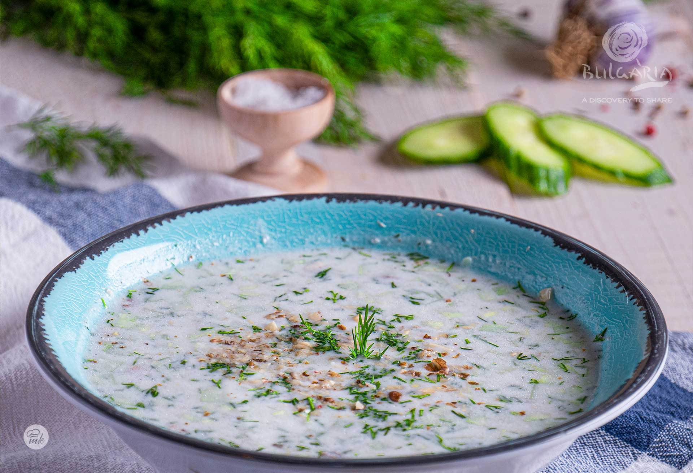

# Tarator

*The cold yoghurt-cucumber-walnut soup of Bulgarian summer: thick sour yoghurt thinned with iced water, stirred with grated cucumber, garlic, dill and crushed walnuts, the country's answer to a hot August afternoon.*

**Serves:** 4

**Prep Time:** 15 minutes

**Cook Time:** None (chilling time 1 hour)

## Overview
Tarator is the soup Bulgaria pours from the fridge when the thermometer climbs, a cold bowl of thinned yoghurt loaded with grated cucumber, garlic and dill and crowned with chopped walnuts and a glug of sunflower oil. It is the country's defining yoghurt drink in soup form, eaten with a spoon and a piece of country bread, the cool dairy and acid resetting the body after a long hot morning. The construction is simple: thick sour Bulgarian yoghurt is whisked with a glass of iced water until it pours like a thin soup, then everything goes in at once. The walnuts (some pounded into the yoghurt for thickness, some scattered on top for crunch) are not a garnish, they are the soul of the dish, the protein and richness against the sour. The garlic is grated, never chopped, so it disappears into the white. Eat as cold as possible from a wide shallow bowl in the shade.

## Ingredients

- 600 g thick Bulgarian yoghurt (or Greek yoghurt)
- 1 large cucumber (about 350 g), peeled and grated coarse
- 80 g shelled walnuts (40 g for the soup, 40 g for the top)
- 3 garlic cloves, finely grated
- 1 small bunch fresh dill, finely chopped
- 3 tbsp sunflower oil
- 1 tbsp red wine vinegar
- 300 ml very cold water (or ice cubes)
- 1 tsp fine sea salt
- Black pepper to taste

## Method

### Stage 1 - Prepare the components
1. Peel the cucumber and grate on the coarse side of a box grater into a bowl.
2. Sprinkle with half a teaspoon of salt; leave 10 minutes; squeeze out the water with your hands.
3. Pound 40 g of the walnuts in a mortar with the grated garlic and a pinch of salt to a coarse paste.

### Stage 2 - Build the soup
1. Tip the yoghurt into a wide bowl; whisk smooth with a fork.
2. Stir in the walnut-garlic paste, the squeezed cucumber, chopped dill, sunflower oil, red wine vinegar and the rest of the salt.
3. Whisk in the cold water (or ice cubes) until the soup is a pourable single cream consistency; thinner if the day is hotter.
4. Taste; adjust salt and vinegar.

### Stage 3 - Chill and serve
1. Refrigerate at least 1 hour; the flavour comes together in the cold.
2. Ladle into shallow bowls.
3. Top each with a scatter of the remaining chopped walnuts, a thread of sunflower oil and a grind of black pepper.
4. Serve with a slice of country bread or fried slices of country bread on the side.

## Notes
- **The yoghurt:** must be sour and thick; sweet supermarket yoghurts do not work. Bulgarian is the original; thick Greek strained yoghurt is the closest substitute.
- **The cucumber salt-and-squeeze:** essential, otherwise the soup turns watery as it sits.
- **The garlic:** grated on the fine side of the grater so it disappears; never chopped chunks.
- **The walnuts:** half pounded in for body, half scattered on top for crunch.
- **The ice:** the soup must be very cold; throw an ice cube into each bowl in high summer.

## Variations
- **Snezhanka (white-snow salad):** the same flavour profile served thick as a salad rather than soup; use strained yoghurt and no water.
- **Tarator with mint:** swap half the dill for fresh mint (the Plovdiv version).
- **Tarator with bread:** stir in a slice of stale bread soaked in water; the bread version is the southern variant.
- **Tarator without walnut:** the simpler everyday version; the soup is lighter.
- **Frozen tarator (sherbet-tarator):** churned briefly in an ice cream maker as a savoury palate cleanser.

## Serving
- In wide shallow chilled bowls · with a slice of country bread · with the shopska salata before it · as a starter to grilled kebapcheta · for breakfast on a hot morning · as a cold first course at any summer table.

## Storage
- Refrigerate up to 2 days; whisk again before serving (the cucumber settles).
- Do not freeze; the yoghurt splits on thawing.
- Best made the morning of serving for full freshness.

