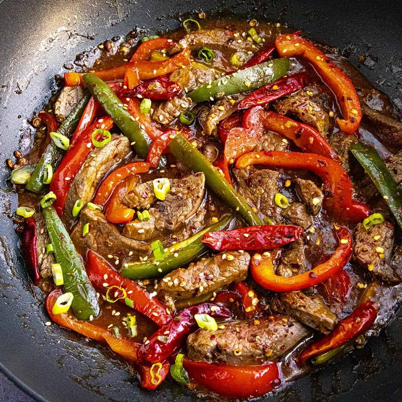

# Beef Si Byan

*Burma's brick-red beef curry: meat slow-cooked till it falls apart and the oil 'returns' to the top, built on patient browning of onion and ginger.*

**Serves:** 4

**Prep Time:** 20 minutes (plus 30 minutes marinating)

**Cook Time:** 2 hours 30 minutes

## Overview
Beef chuck or shin chunks are marinated in turmeric, fish sauce and salt. Onions are fried in oil until deep brown; the beef is browned in the same oil; ginger-garlic paste, paprika and chilli powder are added; tomato and water turn it to a stew. Two hours of slow simmer; the meat falls apart at the fork. The signature: a deep red-orange oil slick on top.

## Ingredients

- 1 kg beef shin or chuck (cut into 4 cm chunks)
- 2 teaspoons ground turmeric (split)
- 2 tablespoons fish sauce
- 1 ½ teaspoons salt (added later)
- 8 tablespoons vegetable oil (more than feels right - this is the dish)
- 3 large onions (chopped)
- 8 garlic cloves (crushed)
- 1 large thumb fresh ginger (grated)
- 3 tablespoons paprika
- 2 teaspoons Kashmiri chilli powder
- 2 dried bird's-eye chillies (broken)
- 2 fresh tomatoes (grated) or 1 small tin chopped tomatoes
- 2 tablespoons tomato puree
- 1 stick lemongrass (bruised)
- 4 makrut lime leaves (torn, optional)
- 800 ml hot water
- 1 tablespoon dark soy sauce

## Method

### Stage 1 - Marinate
1. Toss the beef with 1 teaspoon turmeric, the fish sauce, and a pinch of salt. Rest 30 minutes.

### Stage 2 - Onions
1. Heat 5 tablespoons of the oil in a heavy pot over medium heat.
1. Add the onion; cook 15 minutes, stirring often, until deep mahogany brown. Don't rush this.

### Stage 3 - Beef
1. Push the onions to the side. Add the remaining 3 tablespoons of oil to the cleared part of the pot.
1. Brown the beef hard in batches, 4-5 minutes per side.
1. Return all the beef to the pot; mix with the onions.

### Stage 4 - Spices
1. Add garlic, ginger, paprika, the remaining turmeric, chilli powder and dried chillies; cook 1 minute.
1. Stir in the grated tomato and tomato puree; cook 5 minutes until thick.

### Stage 5 - Slow cook
1. Add the lemongrass and lime leaves (if using).
1. Add dark soy and 1 teaspoon salt.
1. Pour in the hot water; bring to a simmer.
1. Cover; cook on the lowest heat 2 hours, stirring every 30 minutes, until the meat shreds.

### Stage 6 - Si byan
1. Uncover; raise heat to medium. Cook 15-20 minutes - the sauce reduces and the oil rises to the surface in a dark red-orange slick.
1. Taste; adjust salt and fish sauce.

### Stage 7 - Serve
1. Rest 10 minutes - allowing the oil to settle on top.
1. Plate with the oil layer visible. Eat over rice with raw cucumber.

## Notes
- **More oil than feels right:** Burmese curries use more oil than Western tastes initially expect. The oil layer on top is the cooking signal AND part of the flavour. Skim it on the plate if you must, but don't skip it.
- **Patient onion browning:** The colour and depth come from here. Skipping or rushing leaves a pale brown curry; doing it properly gives a deep brick-red.
- **Beef shin:** Best cut. Lots of connective tissue, falls apart at 2 hours, leaves the sauce silky. Chuck is the second choice.

## Storage
- Refrigerate 4 days. Better on day 2.
- Freezes 3 months.
