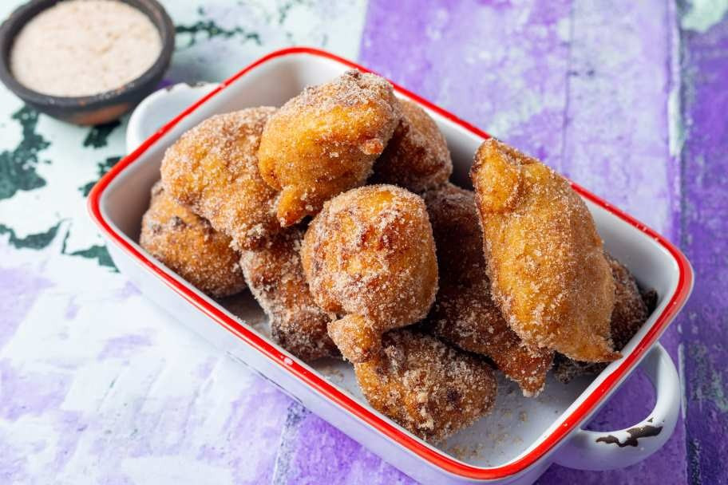

# Nga Pyaw Kyaw

*Burma's teashop banana fritter: ripe finger bananas dipped in turmeric-tinted rice-flour batter and deep-fried till the crust shatters and the fruit caramels.*

**Serves:** 4 (makes about 12 fritters)

**Prep Time:** 10 minutes

**Cook Time:** 15 minutes

## Overview
The trick is a thin, crisp batter rather than a thick doughy coat. Rice flour and a small spoon of plain flour give crackle; a pinch of turmeric supplies the gold; soda water keeps it light. The bananas must be properly ripe: spotted skins, almost too soft to slice cleanly. Frying at a steady 175°C gives a glassy shell in three minutes; any cooler and the batter sponges up oil. A sprinkle of toasted sesame at the end is traditional; a scoop of coconut ice cream alongside is a modern flourish.

## Ingredients

### Batter
- 120 g rice flour
- 30 g plain flour
- 1 tablespoon cornflour
- 2 tablespoons caster sugar
- ¼ teaspoon ground turmeric
- ¼ teaspoon salt
- ¼ teaspoon baking powder
- 180 ml cold soda water
- 1 teaspoon white sesame seeds

### Bananas
- 6 very ripe small bananas (about 600 g; finger bananas if you can find them, or short Cavendish)

### For frying
- 750 ml neutral oil (sunflower or rapeseed)

### To finish
- 2 tablespoons toasted white sesame seeds
- 1 tablespoon caster sugar (optional)
- Flaky sea salt (a pinch)

## Method

### Stage 1 - Batter
1. Whisk the rice flour, plain flour, cornflour, sugar, turmeric, salt and baking powder in a bowl.
2. Pour in the cold soda water in a steady stream, whisking, until you have a smooth batter the consistency of single cream. Add a splash more soda if it feels stodgy.
3. Stir in the teaspoon of sesame seeds.
4. Rest 5 minutes while the oil heats. Don't make this far in advance; the bubbles in the soda are part of the lift.

### Stage 2 - Prepare the bananas
1. Peel the bananas.
2. Cut each in half lengthways. If using bigger Cavendish, cut each half in half across as well so the pieces are 6-8 cm long.
3. Don't slice too far ahead or the cut surfaces oxidise.

### Stage 3 - Fry
1. Heat the oil in a wok or deep saucepan to 175°C. A drop of batter should rise and sizzle quickly without darkening at once.
2. Holding a piece of banana by one end with chopsticks or a fork, dip into the batter; let the excess run off; lower gently into the oil.
3. Fry 3 or 4 pieces at a time so the oil temperature stays up.
4. Cook 3-4 minutes, turning once, until the batter is deep gold and crisp all over.
5. Lift onto a wire rack (better than kitchen paper, which steams the underside).
6. Bring the oil back to 175°C between batches.

### Stage 4 - Finish
1. While still hot, scatter the toasted sesame seeds over the fritters.
2. If serving as dessert rather than snack, dust very lightly with caster sugar and a few flakes of sea salt. The salt against the caramelised fruit is the modern teashop twist.

### Stage 5 - Serve
1. Arrange on a plate; eat immediately, biting through the shell into the soft hot fruit. They are at their best in the first ten minutes.

## Notes
- **Banana ripeness is everything:** Yellow with brown spots, soft to gentle pressure, sweet to taste raw. Under-ripe bananas stay starchy and don't caramelise; over-ripe slump out of the batter while frying.
- **Cold soda water, light hand:** Cold, fizzy liquid plus minimal mixing gives the lacy, crisp shell. Don't whisk past smooth, and don't make the batter ahead of time.
- **Rice flour for crunch:** Rice flour is the key to the shatter texture; plain flour alone gives a heavier, doughnut-like coat. SE Asian grocers and most supermarkets stock it now.
- **Frying at 175°C, not lower:** Too cool and the batter drinks oil before it sets. Too hot and the outside burns before the banana softens.

## Variations
**Coconut-banana fritters:** Add 30 g desiccated coconut to the batter for a nuttier, more Thai-style fritter.
**Plantain version:** Slightly under-ripe plantain (yellow with patches of black) works beautifully and is more authentic to upper Burma. Slice 1 cm thick on the diagonal; fry the same way; cook 1 minute longer.
**Honey drizzle:** A modern Yangon cafe finish: drizzle with thin honey or palm sugar syrup just before serving.

## Serving
Serve with: a scoop of coconut or vanilla ice cream for a dessert plate, or a glass of cold black coffee for a teashop snack.
Garnish with: extra sesame seeds, a wedge of lime, or a scatter of toasted coconut.

## Storage
- Eat within 20 minutes of frying. The shell softens fast.
- Re-crisp leftovers in a 200°C oven for 4 minutes (not the microwave; that turns them limp).
- Batter does not keep; mix fresh each time.
