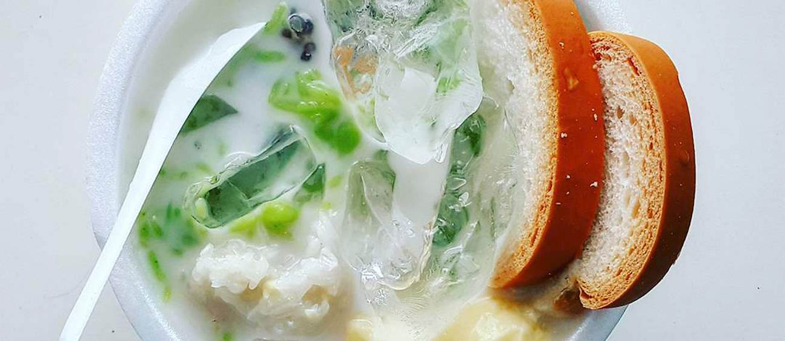

# Shwe Yin Aye

*Burma's hot-season dessert: green agar jelly, sago pearls, white bread and sticky rice cake floating in cold coconut milk with palm sugar.*

**Serves:** 4-6

**Prep Time:** 20 minutes

**Cook Time:** 25 minutes (plus 2 hours setting)

## Overview
The shaved-ice dessert of Burmese teashops, the cold sweet you order on a hot afternoon when the temperature touches 35°C. You make four textures separately and chill them: a firm green agar jelly cut into small cubes, cooked sago pearls, lightly toasted white bread cut into one-centimetre dice, and a cool sweetened coconut milk. A dark palm sugar syrup ties everything together at the bowl. The bread is the unexpected element: toasted just enough to hold its shape, it soaks up the coconut milk like a sponge and turns the bowl into something halfway between dessert and breakfast. Crushed ice piled on top is non-negotiable. Eat fast before the ice melts and floods everything.

## Ingredients

### Green agar jelly
- 8 g agar-agar powder (or 1 stick agar)
- 400 ml water
- 60 g caster sugar
- ¼ teaspoon pandan essence (or 2 pandan leaves blitzed with the water and strained)
- 2 drops green food colouring (optional; for the signature pale jade)

### Sago
- 60 g small sago pearls
- 1 litre water

### Bread cubes
- 4 thick slices white bread (slightly stale; crusts off)

### Coconut milk
- 400 ml full-fat coconut milk
- 200 ml whole milk
- 3 tablespoons caster sugar
- ¼ teaspoon salt

### Palm sugar syrup
- 120 g palm sugar (chopped) or dark muscovado
- 80 ml water

### To serve
- Crushed ice (about 500 g)
- 2 tablespoons toasted sesame seeds
- Pieces of mont lone yay paw (Burmese sticky rice balls; optional)

## Method

### Stage 1 - Agar jelly
1. Combine the agar powder with the water in a saucepan; whisk to disperse. Leave 5 minutes.
2. Add the sugar, pandan essence (or strained pandan water) and food colouring.
3. Bring to a steady simmer over medium heat, whisking constantly, and simmer 2 minutes to dissolve the agar fully.
4. Pour into a 15 x 20 cm tray lined with clingfilm; cool 10 minutes at room temperature, then chill at least 1 hour to set firm.
5. Turn out; cut into 1 cm cubes. Keep cold.

### Stage 2 - Sago
1. Bring the litre of water to a rolling boil. Sprinkle in the sago, stirring.
2. Boil 10 minutes until almost translucent. Cover, off the heat, rest 8 minutes until fully translucent.
3. Drain; rinse under cold water; hold in a bowl of cold water in the fridge.

### Stage 3 - Bread cubes
1. Cut the bread into 1 cm dice.
2. Spread on a baking tray; toast in a 160°C oven for 8-10 minutes until pale gold and dry but not coloured deep. They should still feel slightly tender, not biscuit-dry. Cool.

### Stage 4 - Coconut milk
1. Warm the coconut milk, whole milk, sugar and salt in a small pan over low heat until the sugar dissolves, just below a simmer.
2. Cool to room temperature, then chill at least 1 hour.

### Stage 5 - Palm sugar syrup
1. Heat the palm sugar with the water in a small pan, stirring, until dissolved.
2. Simmer 3 minutes to a thin, dark syrup. Cool.

### Stage 6 - Assemble
1. Drain the sago.
2. In wide bowls, layer: 2 tablespoons agar cubes, 2 tablespoons sago, a small handful of bread cubes, and a piece or two of sticky rice cake if using.
3. Pour the cold coconut milk over to half-fill the bowl.
4. Spoon a generous tablespoon of palm syrup over the top.
5. Heap crushed ice on top until it stands proud of the bowl.
6. Finish with toasted sesame seeds.

### Stage 7 - Serve
1. Serve immediately with a long spoon. Stir down through the ice as you eat so each spoonful collects something different.

## Notes
- **Agar, not gelatine:** Agar sets at room temperature, holds its cubes against melting ice, and gives the distinctive snap. Gelatine softens too fast in the cold coconut milk.
- **Why bread:** The bread is the curveball. It soaks up the coconut milk and gives a soft, custard-like mouthful between the jelly and the sago. White sandwich loaf, lightly toasted, is what is sold from carts. Sourdough or any seedy bread is wrong here.
- **Pandan:** The jade colour and the soft grassy aroma both come from pandan. Frozen pandan leaves from SE Asian grocers (blitzed with water and strained) give the cleanest result. Bottled pandan essence works as a substitute.
- **Sticky rice ball garnish:** Optional, but if you can find frozen mont lone yay paw (small green rice balls filled with palm sugar) at a Burmese grocer, a couple per bowl raises it from impressive to special.

## Variations
**Vegan version:** Drop the whole milk; use 600 ml coconut milk. The agar and bread are already vegan; check the bread label.
**With jackfruit:** Some Yangon vendors add a few slices of fresh ripe jackfruit. The musky perfume marries well with palm sugar.

## Serving
Serve with: a small glass of cold black coffee or strong tea on the side.
Garnish with: a pandan leaf knotted on the side of the bowl, or a small wedge of lime.

## Storage
- All components keep separately in the fridge for 2 days. Bread cubes keep in an airtight tin at room temperature 3 days.
- Don't assemble in advance. The ice melts; the bread goes pasty.
- Leftover dessert from the bowl is unappealing the next day. Make to order.
