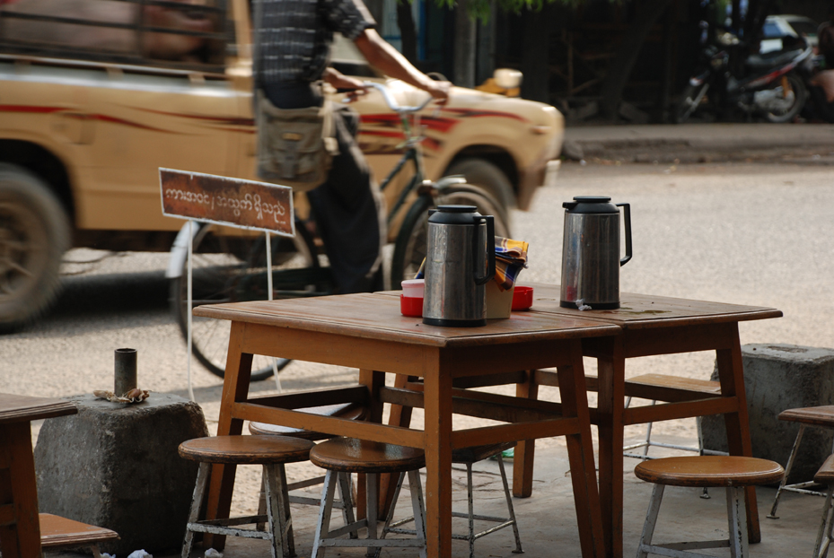

# Burmese Cuisine

Myanmar's cooking, distinct from its Thai and Indian neighbours. Mohinga (catfish-and-noodle breakfast soup) is the unofficial national dish; lahpet thoke (fermented tea leaf salad) sits at every social gathering. Hallmarks: fish sauce, ngapi (fermented shrimp paste), turmeric, fried-shallot oil, raw garlic, tamarind, and the love of crispy-fried things, split peas, garlic, shallots, added at the table.
