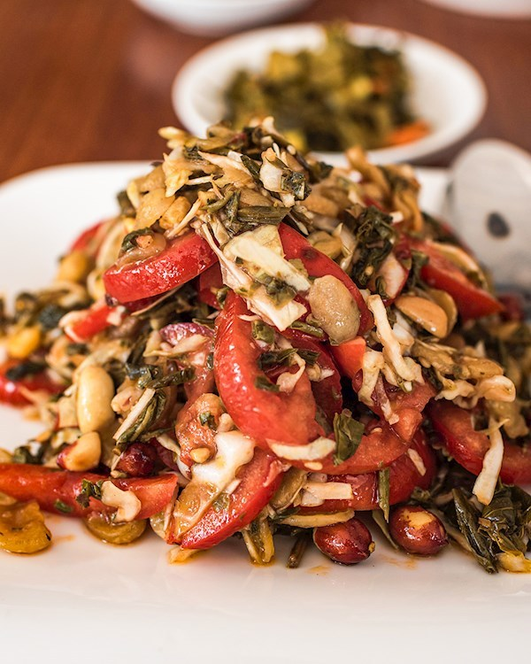

# Lahpet Thoke

*Burma's fermented tea-leaf salad: pickled tea leaves tossed with cabbage, tomato, fried garlic, fried split peas, peanuts, sesame, dried shrimp and lime.*

**Serves:** 4 as a side / starter

**Prep Time:** 15 minutes

**Cook Time:** 5 minutes

## Overview
Myanmar's national salad and one of the most distinctive dishes in Southeast Asia: a tossed plate built around lahpet, fermented tea leaves with a sour-bitter pungency unlike anything else you've eaten. You start with pre-pickled tea leaves (sold at South-East Asian grocers; rinse to mellow if they're very sour), pile on shredded white cabbage and diced tomato for crunch and sweetness, then a generous handful of crispy fried things: fried garlic, fried peanuts, fried yellow split peas, sesame seeds. Fish sauce and lime juice toss it all together. Each spoonful is a contrast of soft-bitter tea against crunchy fried things and bright lime. Eaten as a snack at a teashop, an appetiser before dinner, or at the close of a meal as a sign of welcome and reconciliation.

## Ingredients

### Salad base
- 100 g pickled tea leaves (lahpet; sold at Burmese / SE Asian grocers in jars or vacuum packs)
- 200 g white cabbage (very finely shredded)
- 2 tomatoes (medium, deseeded and diced 5 mm)
- 2 garlic cloves (sliced thin)
- 4 tablespoons vegetable oil (for frying)
- 50 g unsalted peanuts (raw)
- 50 g yellow split peas (soaked 4 hours, drained)
- 2 tablespoons sesame seeds
- 2 tablespoons dried shrimp (optional; rinsed, soaked 5 min, finely chopped)
- 1 long green chilli (finely chopped)

### Dressing
- 3 tablespoons fish sauce
- 1 lime (juice)
- 1 teaspoon sesame oil
- 1 teaspoon brown sugar

## Method

### Stage 1 - Tea leaves
1. If the pickled tea leaves taste very sour or salty, rinse them briefly in cool water; squeeze out excess liquid. Chop roughly.

### Stage 2 - Fry the crispy bits
1. Heat the oil in a small frying pan over medium heat.
1. Add the sliced garlic; fry 1-2 minutes until pale gold; lift onto kitchen paper.
1. Add the peanuts; fry 2-3 minutes until golden; lift out.
1. Add the drained split peas; fry 4-5 minutes, stirring, until crispy and golden; lift out.
1. Toast the sesame seeds in the residual oil 30 seconds.
1. Reserve the oil - it's flavour-rich and goes back into the salad.

### Stage 3 - Dressing
1. Whisk the fish sauce, lime juice, sesame oil and brown sugar.

### Stage 4 - Assemble
1. Pile the cabbage on a wide plate.
1. Top with the chopped tea leaves in a separate mound.
1. Around them, arrange small mounds of: tomato, fried garlic, fried peanuts, fried split peas, sesame seeds, dried shrimp (if using), chopped chilli.
1. Drizzle the dressing and 1-2 tablespoons of the frying oil over the tomato side.

### Stage 5 - Toss at the table
1. The traditional Burmese way: serve with the components separate, then toss together at the table with chopsticks (or hands) just before eating. The crispy bits stay crispy until the last moment.

## Notes
- **Pickled tea leaves are essential:** No substitute really works. Burmese / SE Asian grocers carry them in vacuum packs (look for "lahpet" or "pickled tea leaf"). Some packs are pre-flavoured with garlic and oil; if so, reduce extras accordingly.
- **Fry your own crispy bits, or buy them ready-made:** Several Burmese-product brands sell ready-fried split peas and peanuts. Worth a try if you can find them.
- **Dried shrimp adds depth but is optional:** A vegetarian version drops them; substitute extra fried shallots or peanuts.

## Storage
- Best eaten right after assembly. Components keep separately: tea leaves and dressing in the fridge for a week, fried bits in airtight tin at room temp for 3-4 days.
