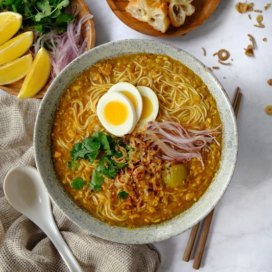

# Mohinga

*Myanmar's national breakfast: a fish-and-rice-noodle soup scented with lemongrass, ginger and shallot, thickened with toasted chickpea flour.*

**Serves:** 6

**Prep Time:** 30 minutes

**Cook Time:** 1 hour

## Overview
Catfish (or any firm white fish) cooks first in spiced water; the cooked flesh shreds; the cooking liquid becomes the base. A spice paste of shallot, garlic, ginger, lemongrass and turmeric fries in oil; chickpea-flour slurry thickens the broth; banana-stem (or hearts of palm / cabbage as substitute) softens in. Fish sauce, paprika and lime balance. Rice vermicelli portions into bowls; broth ladles over; a heavy plate of garnishes, crispy split peas, boiled egg, lime, herbs, go on top.

## Ingredients

### Fish
- 600 g firm white fish (catfish, basa, sea bream; whole or fillets)
- 1 onion (small, quartered)
- 2 cm ginger (sliced)
- 1 stalk lemongrass (bashed)
- 1 teaspoon salt
- 1.8 litres water

### Spice paste
- 4 shallots
- 6 garlic cloves
- 4 cm ginger
- 2 stalks lemongrass (white parts)
- 2 cm fresh turmeric (or 1 teaspoon ground)
- 1 long red chilli

### Soup
- 4 tablespoons vegetable oil
- 100 g chickpea (gram) flour
- 1 teaspoon ground paprika
- 200 g banana stem (peeled and sliced; or hearts of palm; or shredded white cabbage)
- 4 tablespoons fish sauce
- 1 teaspoon brown sugar
- 1 teaspoon salt (or to taste)
- 1 lime (juice)

### Noodles + garnishes
- 500 g dried thin rice vermicelli (or fresh round rice noodles)
- 6 hard-boiled eggs (halved)
- 80 g split yellow peas (deep-fried; sold ready-to-eat at SE Asian grocers, or fry your own)
- A small bunch of coriander (chopped)
- 4 spring onions (sliced)
- 2 limes (cut into wedges)
- 2 long red chillies (sliced)
- Extra fish sauce
- Crispy fried onions

## Method

### Stage 1 - Cook the fish
1. Combine the fish with the small onion, sliced ginger, lemongrass, salt and water in a heavy pot.
1. Bring to a simmer; cook 15-20 minutes until the fish is just-cooked through.
1. Lift the fish out; cool slightly. Strain the broth through a fine sieve into a clean pot. You should have about 1 ½ litres.
1. Pull the fish from any bones; flake into chunks. Set aside.

### Stage 2 - Spice paste
1. Blend the shallots, garlic, ginger, lemongrass white parts, turmeric and chilli to a smooth paste.

### Stage 3 - Fry the paste
1. Heat the oil in a large pot over medium heat.
1. Add the spice paste; cook 6-8 minutes, stirring, until darkened and the oil separates around the edges.

### Stage 4 - Build the soup
1. Whisk the chickpea flour with 200 ml of the strained fish broth in a bowl until smooth.
1. Pour the rest of the strained broth into the spice-paste pot; bring to a steady simmer.
1. Whisk in the chickpea-flour slurry steadily.
1. Add the paprika; cook 8-10 minutes, stirring often, until the broth has thickened to a soup with body.

### Stage 5 - Banana stem and fish
1. Add the sliced banana stem (or substitute); simmer 10 minutes until tender.
1. Stir in the flaked fish, fish sauce and brown sugar.
1. Cook 3-4 minutes more.
1. Off the heat, squeeze in the lime juice. Taste; adjust fish sauce.

### Stage 6 - Noodles
1. Cook the rice vermicelli per packet (usually 3-4 minutes in boiling water); drain and rinse briefly.
1. Divide between 6 bowls.

### Stage 7 - Serve
1. Ladle the hot broth (with the fish chunks and banana stem) over the noodles.
1. Top each bowl with ½ hard-boiled egg, a heap of crispy split peas, coriander, spring onions, sliced chilli and fried onions.
1. Pass lime wedges and extra fish sauce at the table.

## Notes
- **Banana stem:** Sold at SE Asian grocers (sometimes pre-sliced in brine). Hearts of palm is the closest sub; shredded white cabbage is fine if you must.
- **Crispy split peas:** Sold ready-to-eat as pea crackers at SE Asian grocers. To make: deep-fry soaked-then-drained yellow split peas at 170°C for 4-5 minutes until golden and crisp.
- **Chickpea-flour body:** Mohinga should be thicker than typical broth - almost soupy-stew. Don't skip the slurry.

## Storage
- Broth keeps 3 days refrigerated; reheat gently. Cooked noodles don't keep - boil fresh.
- Freezes 2 months.
