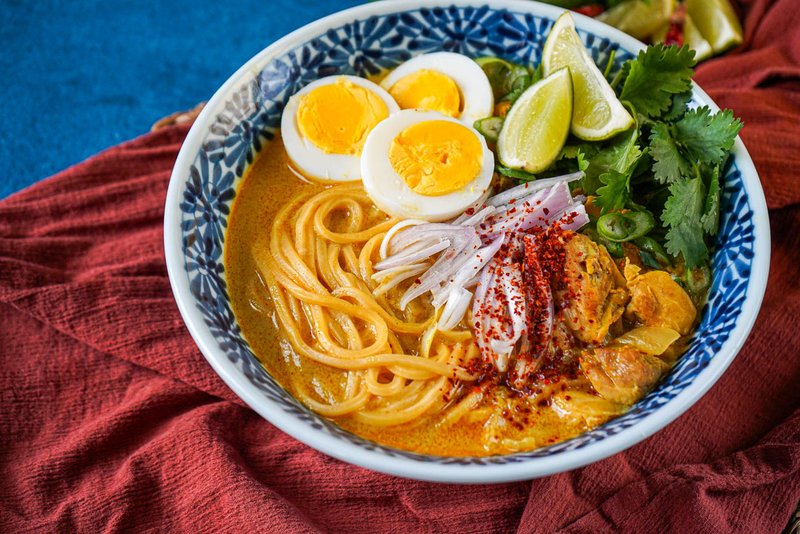

# Ohn No Khao Swè

*Burma's chicken-coconut noodle soup: yellow egg noodles in a turmeric-tinted coconut broth thickened with chickpea flour. Heaped with garnishes.*

**Serves:** 4

**Prep Time:** 25 minutes

**Cook Time:** 50 minutes

## Overview
Myanmar's coconut-chicken noodle soup, the dish closest in spirit to a Thai khao soi but with its own Burmese identity. You poach chicken thighs in stock with shallot, garlic, ginger and turmeric for twenty-five minutes, lift them out and shred the meat. The stock cooks down with coconut milk, fish sauce and paprika, thickened with a slurry of chickpea flour and water into a silky soup. Yellow egg noodles cook separately. Everything piles into the bowl at the end: noodles first, soup ladled over, shredded chicken in the middle, then heaping garnishes (sliced shallot, crispy fried shallot, halved boiled egg, lime wedges, cilantro, chilli flakes). The garnishes are half the dish; eat with chopsticks in one hand and a spoon in the other.

## Ingredients

### Chicken and broth
- 8 bone-in chicken thighs
- 2 tablespoons vegetable oil
- 2 onions (medium, chopped)
- 6 garlic cloves (crushed)
- 1 thumb fresh ginger (sliced)
- 2 teaspoons ground turmeric
- 1 tablespoon paprika
- 1 ½ teaspoons salt
- 1 ½ litres water

### Broth finish
- 1 (400 ml) tin coconut milk
- 2 tablespoons fish sauce
- 4 tablespoons gram (chickpea) flour
- 100 ml cold water (for slurry)
- ½ teaspoon ground black pepper

### Noodles
- 400 g fresh egg noodles (or dried yellow egg noodles, or thin Chinese egg noodles)

### Garnish (essential)
- 4 hard-boiled eggs (halved)
- 100 g crispy fried shallots (from a packet, or home-fried)
- 1 red onion (small, sliced thin)
- 1 small handful fresh cilantro (chopped)
- 4 spring onions (sliced)
- 2 limes (cut into wedges)
- 4 dried red chillies (small, broken into flakes)
- Dried red chilli oil (or chilli flakes)
- 4 tablespoons gram flour fried into a chickpea-flour crunch (optional but classic)

## Method

### Stage 1 - Poach chicken
1. Heat the oil in a wide pot over medium heat.
1. Soften the onion 8 minutes; add garlic, ginger, turmeric and paprika; cook 1 minute.
1. Add the chicken thighs, salt and water. Bring to a simmer; cover; cook 25 minutes until tender.
1. Lift the chicken out. When cool enough to handle, shred the meat off the bones; discard skin and bones.

### Stage 2 - Build the soup
1. Strain the broth into a jug (you should have about 1.2 litres - top up with hot water if short).
1. Wipe the pot; return the strained broth.
1. Add the coconut milk and fish sauce; bring to a simmer.

### Stage 3 - Thicken
1. Whisk the 4 tablespoons of gram flour with the 100 ml of cold water until smooth (no lumps).
1. Pour slowly into the simmering broth, whisking. Simmer 5 minutes until the broth visibly thickens to a silky consistency.
1. Stir in the shredded chicken; warm through. Adjust salt and pepper.

### Stage 4 - Noodles
1. Cook noodles in boiling water according to packet instructions (usually 2-3 minutes for fresh).
1. Drain.

### Stage 5 - Plate
1. Divide noodles between four wide bowls.
1. Ladle the hot soup with shredded chicken over the top.
1. Top each bowl with ½ boiled egg, a small handful of fried shallots, sliced raw onion, cilantro and spring onion.
1. Sprinkle with chilli flakes; place a lime wedge alongside.

### Stage 6 - Eat
1. Squeeze in the lime; mix it all together; eat.

## Notes
- **Garnishes are the dish:** Don't skip the toppings - they're not optional. The contrast of soft soup, fresh raw onion, crispy fried shallot, sharp lime is what makes this Burmese rather than generic chicken noodle.
- **Gram flour thickener:** Gives the broth a body different to roux or cornflour - slightly grainy, deeply savoury. Chickpea flour and gram flour are the same thing.
- **Substitutes:** Yellow egg noodles are ideal. Thin Chinese wheat noodles work. Don't use rice noodles - the broth won't cling.

## Storage
- Soup and chicken keep 3 days refrigerated.
- Don't combine noodles with soup ahead. Boil fresh noodles for each meal.
