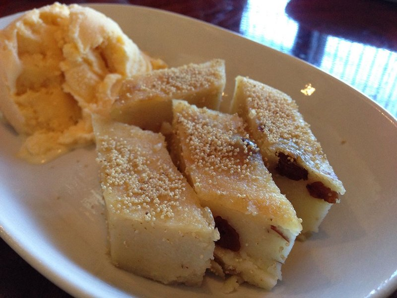

# Sanwin Makin

*Burma's semolina cake: butter-rich and lightly sweetened, scented with cardamom and topped with poppy seeds and raisins. Eaten in teashops with milk tea.*

**Serves:** 12

**Prep Time:** 15 minutes

**Cook Time:** 50 minutes

## Overview
The Burmese semolina cake that turns up at every holiday and family gathering, the dessert that locals will tell you their grandmother made best. You toast coarse semolina in butter and ghee until it's lightly fragrant, then cook it with coconut milk and water into a thick porridge. Sugar dissolves in, eggs whisk in off the heat (off the heat is critical; hot semolina will scramble them), and the mixture pours into a baking tin with a final sprinkle of poppy seeds and raisins. Bake until set, then finish with a short hit under the grill that gives the cake its defining deep mahogany, slightly bitter, crackling top. Sliced into squares and eaten with tea.

## Ingredients

- 60 g unsalted butter
- 30 g ghee
- 250 g coarse semolina
- 400 ml coconut milk
- 250 ml whole milk (or water)
- 200 g caster sugar
- ½ teaspoon salt
- 1 teaspoon ground cardamom
- 1 teaspoon vanilla extract
- 4 eggs (large, lightly beaten)
- 50 g raisins (or sultanas)

### Topping
- 2 tablespoons poppy seeds
- 1 tablespoon black sesame seeds (optional)
- 30 g flaked almonds (optional)

## Method

### Stage 1 - Toast the semolina
1. Melt the butter and ghee in a wide heavy pan over medium heat.
1. Add the semolina; cook 5-6 minutes, stirring constantly, until very lightly toasted and fragrant - don't take it brown.

### Stage 2 - Cook
1. Heat the coconut milk and whole milk gently in a separate pan until just warm.
1. Pour the warm milks into the semolina, whisking to prevent lumps.
1. Add the salt and cardamom.
1. Cook over medium-low heat 8-10 minutes, stirring often, until thick like porridge.

### Stage 3 - Sweeten
1. Stir in the sugar; cook 2-3 minutes more until the sugar has dissolved.
1. Off the heat, stir in the vanilla and raisins.
1. Cool 5 minutes (so the eggs don't scramble).

### Stage 4 - Eggs
1. Whisk the beaten eggs in slowly, in three additions, mixing thoroughly between each.
1. The batter should be thick but pourable.

### Stage 5 - Bake
1. Heat the oven to 180°C (160°C fan).
1. Butter a 23 x 23 cm baking tin; line with parchment.
1. Pour the batter in; smooth the top.
1. Sprinkle the poppy seeds, sesame seeds and almonds evenly across.
1. Bake 35-40 minutes until set and a knife inserted into the centre comes out clean.

### Stage 6 - Char the top
1. Switch to grill (broiler) on medium-high.
1. Grill 3-5 minutes, watching closely, until the top is deep mahogany - almost black in places. The slight bitterness against the sweet cake is the signature.

### Stage 7 - Cool and slice
1. Cool 30 minutes in the tin.
1. Lift out using the parchment overhang; cut into small squares (the cake is rich; small portions are right).

## Notes
- **Coarse semolina, not fine:** Coarse holds its texture; fine semolina turns the cake gluey.
- **Don't skip the grill:** The dark crust is what makes it unmistakably sanwin makin. Without it, you have an ordinary semolina pudding cake.
- **Eat warm or at room temperature:** The cake firms slightly as it cools, which is correct. Cold from the fridge tastes flat.

## Storage
- Keeps 4 days at room temperature, covered.
- Don't refrigerate (drying issue); freezes 2 months.
