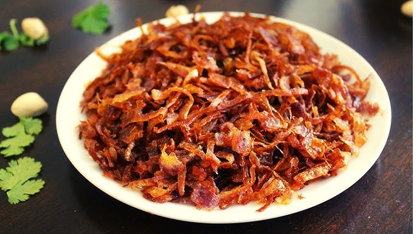

# Balachaung

*The Burmese table condiment: dried shrimp fried into a deeply savoury, sticky chilli-and-garlic relish that's spooned over rice, mixed into noodles, eaten with cucumber or scooped onto a plain wedge of bread. Intense, salty, fishy, sweet-hot. A spoon goes a long way. Made in batches; kept in a jar; lasts weeks.*

**Serves:** 12 (small jar)

**Prep Time:** 15 minutes

**Cook Time:** 25 minutes

## Overview
Dried shrimp pulse-grind to a coarse floss. A pile of sliced garlic and shallot fry in oil until deeply golden and crisp. The dried shrimp adds in; toasts to a fragrant rust colour. Chilli powder, fish sauce, tamarind, sugar and a splash of water turn it into a sticky relish. Cooked until the oil clears (12-15 minutes); cooled; stored.

## Ingredients

- 150 g dried shrimp (small, available from East Asian shops)
- 200 ml vegetable oil
- 1 onion (large, very finely sliced)
- 12 garlic cloves (very finely sliced)
- 2 tablespoons ginger (julienned)
- 4 tablespoons Kashmiri chilli powder (or 2 tbsp paprika + 2 tbsp chilli flakes)
- 4 tablespoons fish sauce
- 2 tablespoons tamarind paste (or 1 ½ tablespoons tamarind concentrate)
- 2 tablespoons palm sugar (or brown sugar)
- 80 ml hot water
- ½ teaspoon salt (to taste)

## Method

### Stage 1 - Prep the shrimp
1. Soak the dried shrimp in warm water 5 minutes; drain.
1. Pat dry on kitchen paper.
1. Pulse in a small food processor or mortar to a coarse floss (not a paste).

### Stage 2 - Fry the aromatics
1. Heat 4 tablespoons of the oil in a wide heavy pan over medium heat.
1. Add the sliced onion; fry 8 minutes until deep gold and just starting to crisp at the edges.
1. Lift onto kitchen paper; reserve.
1. Add the sliced garlic; fry 4-5 minutes until pale gold (it crisps as it cools - don't take it too far).
1. Lift onto paper; reserve.

### Stage 3 - Toast the shrimp
1. Pour in the remaining oil. Add the julienned ginger; fry 30 seconds.
1. Add the shrimp floss; toast 6-7 minutes, stirring constantly, until aromatic and dark rust-coloured.

### Stage 4 - Build the relish
1. Whisk chilli powder, fish sauce, tamarind, sugar and water in a small bowl.
1. Pour into the pan with the toasted shrimp; stir hard.
1. Cook 6-8 minutes, stirring often, until the relish is glossy and a clear oil rises to the surface.

### Stage 5 - Combine
1. Stir in the reserved fried onion and garlic.
1. Cook another 2 minutes to combine.
1. Taste; adjust salt - the relish should be salty, hot, slightly sour, slightly sweet.

### Stage 6 - Cool and store
1. Cool completely. Tip into a clean glass jar; cover with the oil that has risen to the surface (this preserves it).

### Stage 7 - Use
1. A teaspoon spooned over rice. A tablespoon stirred into noodles. As a topping for plain hard-boiled eggs.

## Notes
- **Dried shrimp quality:** Pinkish-orange shrimp from a Chinese, Vietnamese or Thai shop are best. Beige or grey ones are old and smell off-fishy rather than clean.
- **Garlic to gold not brown:** Brown garlic is bitter. Take it to pale gold and lift out; it darkens to amber as it cools.
- **Storage and longevity:** Properly made balachaung lasts 3 weeks refrigerated. The oil cap keeps the relish covered; if you lose the cap, top up with fresh oil.

## Storage
- Refrigerate up to 3 weeks in a sealed jar with an oil cap on top.
- Don't freeze - the texture goes claggy.
